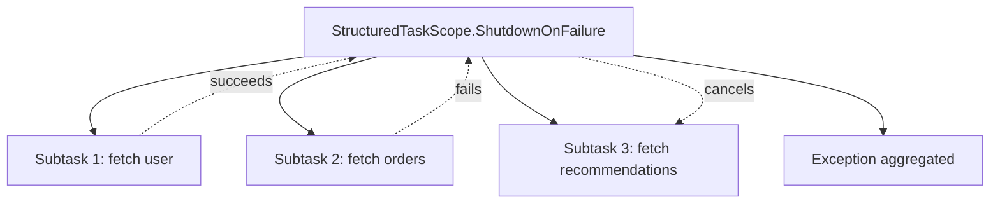

# Structured Concurrency

> Part of [[README|Java MOC]] • `Java/01_Core-Java`
> 🎨 **Visual diagram:** Create Excalidraw drawing from template: `Cmd+P → Excalidraw: New from template → Java Diagram`

## Intent

**Structured Concurrency** (JEP 453, preview in Java 21, finalized in Java 23) treats concurrent subtasks as **children of a scope** with **automatic lifecycle management**: if one fails, others are cancelled; scope waits for all; exceptions are aggregated.

## Why it Matters

- **No more orphaned threads**: `ExecutorService` leaks on exceptions; scopes guarantee cleanup
- **Error handling**: fail-fast or fail-slow policies; all exceptions visible
- **Observability**: thread dumps show hierarchy; `StructuredTaskScope` in debugger
- **Virtual threads ready**: millions of children with minimal overhead
- **Replaces**: `CompletableFuture.allOf`, `ExecutorService.invokeAll`, manual `try-finally` shutdown

## Diagram



## Code / Example

```java
// Java 25: Structured Concurrency (JEP 453), Virtual Threads, Pattern Matching
// Requires: --enable-preview (Java 21-22), standard in Java 23+

import java.util.concurrent.*;
import java.util.concurrent.StructuredTaskScope.*;

record User(String name) {}
record Order(String id) {}
record Recommendation(String item) {}

void structuredConcurrencyBasics() throws InterruptedException {
    try (var scope = new StructuredTaskScope.ShutdownOnFailure()) {
        Subtask<User> user = scope.fork(() -> fetchUser(123));
        Subtask<Order> order = scope.fork(() -> fetchOrder(123));
        Subtask<Recommendation> rec = scope.fork(() -> fetchRec(123));
        
        scope.join();           // wait for all
        scope.throwIfFailed();  // rethrow first exception if any
        
        System.out.println(user.get() + ", " + order.get() + ", " + rec.get());
    } // scope closes, cancels any remaining
}

// ShutdownOnSuccess: race - first success wins, others cancelled
void raceExample() throws InterruptedException {
    try (var scope = new StructuredTaskScope.ShutdownOnSuccess<String>()) {
        scope.fork(() -> fetchPrimary());
        scope.fork(() -> fetchBackup());
        scope.fork(() -> fetchCache());
        
        String result = scope.join().result(); // first successful result
    }
}

// Custom policy: collect all results, fail only if all fail
void customPolicy() throws InterruptedException {
    try (var scope = new StructuredTaskScope<Object>() {
        @Override protected void handleComplete(Subtask<?> subtask) {
            // custom: log each completion
        }
    }) {
        scope.fork(() -> fetchA());
        scope.fork(() -> fetchB());
        scope.joinUntil(Instant.now().plusSeconds(5)); // deadline
        // handle partial results
    }
}

// Virtual threads + StructuredTaskScope = massive concurrency
void virtualThreadScope() throws InterruptedException {
    try (var scope = new StructuredTaskScope.ShutdownOnFailure()) {
        for (int i = 0; i < 10_000; i++) {
            final int id = i;
            scope.fork(() -> processItem(id)); // each runs on virtual thread
        }
        scope.join();
        scope.throwIfFailed();
    }
}

// Exception aggregation
void exceptionHandling() {
    try (var scope = new StructuredTaskScope.ShutdownOnFailure()) {
        scope.fork(() -> { throw new IOException("network"); });
        scope.fork(() -> { throw new SQLException("db"); });
        scope.join(); // both run to completion
    } catch (Exception e) {
        // e is MultiException with both causes
        if (e instanceof MultiException me) {
            me.exceptions().forEach(System.out::println);
        }
    }
}

// Helper methods
User fetchUser(int id) { return new User("User-" + id); }
Order fetchOrder(int id) { return new Order("ORD-" + id); }
Recommendation fetchRec(int id) { return new Recommendation("Rec-" + id); }
String fetchPrimary() { throw new RuntimeException("primary down"); }
String fetchBackup() { return "backup-data"; }
String fetchCache() { throw new RuntimeException("cache miss"); }
Object fetchA() { return "A"; }
Object fetchB() { return "B"; }
void processItem(int id) { /* ... */ }
```

### Concrete Example

- **Input:** Fetch user profile, orders, and recommendations concurrently for a dashboard
- **Output:** All three results or aggregated exception if any fails; no leaked threads
- **Explanation:** `ShutdownOnFailure` cancels siblings on first failure; `join()` waits; `throwIfFailed()` rethrows

## When to Use / When NOT

| **Use When** | **Avoid When** |
|--------------|----------------|
| - Multiple related subtasks with shared lifetime | - Fire-and-forget tasks (use `ExecutorService`) |
| - Need automatic cancellation on failure | - Long-running independent services |
| - Deadline/timeout for a group of tasks | - Simple parallel streams (use `.parallel()`) |
| - Virtual thread workloads (10k+ concurrent) | - Blocking I/O without virtual threads |

## Trade-offs

| Dimension | StructuredTaskScope | ExecutorService | CompletableFuture |
|-----------|---------------------|-----------------|-------------------|
| Lifecycle | Automatic (scope) | Manual (shutdown) | Manual (allOf) |
| Cancellation | Automatic on failure | Manual | Manual (cancel) |
| Exceptions | Aggregated (MultiException) | First only | First only |
| Virtual threads | Native support | Via factory | Via executor |
| Deadlines | `joinUntil(Instant)` | `awaitTermination` | `get(timeout)` |

## Vs Table

| Aspect | StructuredTaskScope | ExecutorService | Parallel Stream |
|--------|---------------------|-----------------|-----------------|
| Failure policy | ShutdownOnFailure/Success | Manual | Fail-fast |
| Result aggregation | Subtask.get() | Future.get() | Stream collect |
| Thread dump | Hierarchy visible | Flat | ForkJoinPool |
| Virtual threads | Yes (default) | Via factory | Yes (21+) |

## Pitfalls

- **Preview API**: Java 21-22 need `--enable-preview --source 21`; Java 23+ standard
- **Blocking in subtasks**: use virtual threads or `ExecutorService` for blocking I/O
- **Scope leakage**: don't pass `Subtask` outside scope; use `join()` then `get()`
- **InterruptedException**: `join()` throws if current thread interrupted
- **MultiException handling**: catch `Exception`, check `instanceof MultiException`

## Interview Q&A (Senior Depth)

**Q1. What is the core insight of Structured Concurrency, and why does it work?**
**A:** Concurrency should follow lexical scope: children live within parent's scope. When scope exits, all children are guaranteed done or cancelled. This eliminates the "thread leak" problem where exceptions orphan sibling tasks. The scope becomes the synchronization point.

**Q2. When would you choose `ShutdownOnFailure` vs `ShutdownOnSuccess`?**
**A:** `ShutdownOnFailure` (default): all must succeed (e.g., dashboard loading user+orders+recs). `ShutdownOnSuccess`: racing redundant sources (e.g., primary/backup/cache). Custom policies for complex logic.

**Q3. How does StructuredTaskScope work with Virtual Threads?**
**A:** Each `fork()` starts a virtual thread by default (since Java 21). Millions of subtasks are feasible. The scope manages their lifecycle without thread pool sizing concerns.

**Q4. Walk me through a non-obvious problem that reduces to Structured Concurrency.**
**A:** **Fan-out with deadline**: query 10 microservices, need 5 responses within 200ms. Custom scope policy: count successes, cancel rest when 5 reached or deadline hit. **Pipeline stages**: each stage is a scope; stage N+1 forks only after stage N completes.

**Q5. What is the memory/performance implication at scale?**
**A:** Virtual threads: ~1KB stack vs 1MB platform thread. 10k subtasks = ~10MB vs 10GB. `StructuredTaskScope` overhead: one `CompletableFuture`-like object per subtask. JIT optimizes scope state machine.

## Flashcards (Spaced Repetition)

#flashcard
**Q:** What is StructuredTaskScope? :: **A:** A scope that manages child subtasks: auto-cancels on failure, waits for all, aggregates exceptions. #flashcard

#flashcard
**Q:** ShutdownOnFailure vs ShutdownOnSuccess? :: **A:** Failure: cancels siblings on first failure. Success: cancels siblings on first success (race). #flashcard

#flashcard
**Q:** How to set a deadline for a scope? :: **A:** `scope.joinUntil(Instant.now().plusSeconds(5))` instead of `scope.join()`. #flashcard

#flashcard
**Q:** What exception is thrown when multiple subtasks fail? :: **A:** `MultiException` containing all causes; access via `me.exceptions()`. #flashcard

#flashcard
**Q:** StructuredTaskScope with virtual threads? :: **A:** Each fork() runs on virtual thread by default; millions of children feasible. #flashcard

## Practice Tasks (Tasks Plugin)

- [ ] Restate the intent from memory 📅 {{date:YYYY-MM-DD, +1}}
- [ ] Code the snippet without looking 📅 {{date:YYYY-MM-DD, +3}}
- [ ] Answer all Interview Q&A aloud 📅 {{date:YYYY-MM-DD, +7}}
- [ ] Review flashcards (Spaced Repetition) 📅 {{date:YYYY-MM-DD, +1}}

```tasks
not done
path includes Java/01_Core-Java
sort by due
limit 10
```

## Related

- [[README|Java MOC]]
- [[01_Core-Java/README|Core Java MOC]]
- [[Java/09_Java-21-LTS/01 Virtual Threads|Virtual Threads]]
- [[Java/04_Concurrency/CompletableFuture|CompletableFuture]]

---

*Category: Java/01_Core-Java • Part of [[README|Java MOC]] • Java 25*

## Problem

Managing multiple concurrent subtasks with `ExecutorService` or `CompletableFuture` leads to leaked threads, manual cancellation, and poor error aggregation.

## Solution

`StructuredTaskScope`: lexical scope for concurrency. `fork()` starts children, `join()` waits, `throwIfFailed()` rethrows. Policies: `ShutdownOnFailure` (all must succeed), `ShutdownOnSuccess` (race), custom.

## When not to use

| Instead | Use |
|---------|-----|
| Fire-and-forget background tasks | `ExecutorService` / `CompletableFuture.runAsync` |
| Simple parallel collection ops | `.parallelStream()` |
| Long-lived independent services | Dedicated thread pools |
| Blocking I/O without virtual threads | Platform thread pool + manual management |