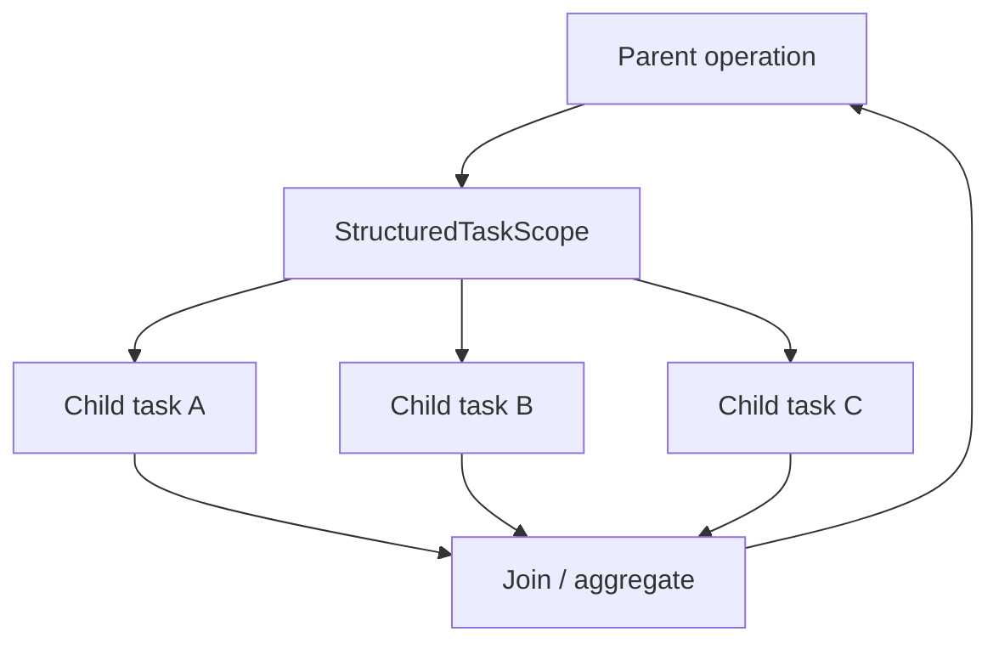

# Structured Concurrency

> Java 25: preview API (JEP 505, fifth preview). The API changed across previews, so examples must be pinned to the JDK version being studied.

## Intent

Structured concurrency makes related concurrent work follow the lifetime of the operation that created it. A parent scope owns child subtasks, waits for them, and prevents work from silently escaping its lifetime.

## Why it Matters

- Makes task lifetime explicit.
- Gives cancellation and failure a defined boundary.
- Composes naturally with virtual threads.
- Improves reasoning about fan-out/fan-in operations.
- Works naturally with ScopedValue context propagation.

## Java 25 API

In Java 25, StructuredTaskScope is preview and is opened with StructuredTaskScope.open(...). Do not copy older examples that use new StructuredTaskScope.ShutdownOnFailure() or ShutdownOnSuccess; those belong to earlier previews.

The default open() scope creates virtual threads. fork() creates subtasks and join() waits for them.

```java
// Compile and run with Java 25 preview enabled.
import java.util.concurrent.StructuredTaskScope;

record Dashboard(String user, String orders) {}

class DashboardService {
    Dashboard load(long userId) throws InterruptedException {
        try (var scope = StructuredTaskScope.open()) {
            var user = scope.fork(() -> fetchUser(userId));
            var orders = scope.fork(() -> fetchOrders(userId));

            scope.join();
            return new Dashboard(user.get(), orders.get());
        }
    }

    String fetchUser(long id) { return "user-" + id; }
    String fetchOrders(long id) { return "orders-" + id; }
}
```

For custom aggregation or cancellation policies, use the Java 25 Joiner API documented for the preview release. Always read the JDK 25 API rather than relying on examples written for older previews.

## Mental Model



The key invariant is **no child outlives the structured scope that owns it**.

## When to Use / When NOT

| Use when | Prefer something else when |
|---|---|
| Related subtasks form one operation | Work is intentionally independent and long-lived |
| You need fan-out/fan-in | A sequential call is enough |
| Child lifetime should end with the parent | A message queue is the ownership boundary |
| Cancellation/deadline applies to a group | A single async callback is sufficient |

## Structured Concurrency vs Alternatives

| Concern | Structured concurrency | ExecutorService | CompletableFuture |
|---|---|---|---|
| Lifetime | Lexical/structured | Manually managed | Graph of stages |
| Cancellation | Scope policy | Manual | Explicit |
| Composition | Parent/child | Tasks/futures | Stages |
| Best fit | Related concurrent subtasks | Explicit execution policies | Async pipelines |

## ScopedValue Relationship

ScopedValue is final in Java 25 and can be inherited by threads created through a StructuredTaskScope. This is useful for immutable request metadata such as correlation IDs when the value is bounded by the operation.

## Pitfalls

- Using an old preview API. JDK 25 uses open(...) and Joiner; older sources may show different types.
- Treating preview code as stable API.
- Using structured concurrency for independent background jobs.
- Assuming virtual threads make CPU-bound work faster.
- Ignoring deadlines and cancellation policy.

## Senior Interview Q&A

**Q1. What problem does structured concurrency solve?**

It gives related concurrent tasks a shared lifetime and ownership boundary, reducing orphaned work and making cancellation and failure part of the operation model.

**Q2. Why is the Java 25 example different from Java 21 examples?**

StructuredTaskScope evolved through several previews. Java 25 uses the open/Joiner API, so examples must be version-specific.

**Q3. Does structured concurrency replace ExecutorService?**

No. It addresses structured groups of related subtasks. Executors remain useful for explicit execution policies, long-lived workers, and unstructured background processing.

**Q4. Why pair it with virtual threads?**

The scope provides lifecycle structure while virtual threads make large numbers of blocking subtasks cheap to schedule. They solve complementary problems.

## Practice Tasks

- [ ] Write a Java 25 preview example from memory.
- [ ] Compare it with ExecutorService for the same fan-out problem.
- [ ] Add a deadline/failure policy using the JDK 25 API.
- [ ] Explain why a ShutdownOnFailure example from an older preview is not a Java 25 example.

## Related

- [[README|Core Java]]
- [[Java/01_Core-Java/../04_Concurrency/README|Concurrency]]
- [[Java/01_Core-Java/../04_Concurrency/Threads|Threads]]
- [[Java/01_Core-Java/../08_Modern-Java/06 ScopedValue|Scoped Values]]
- [[Java/01_Core-Java/../00_Java-25-Overview/Whats New in Java 25|What is New in Java 25]]
