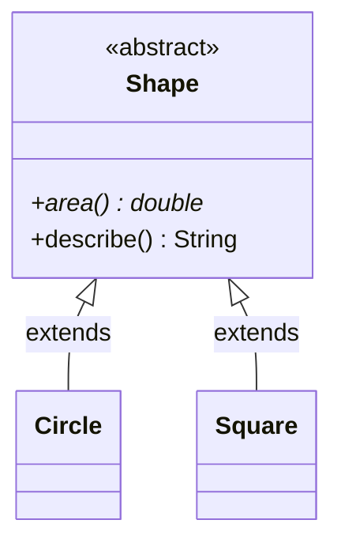

# Abstract Class
> Part of [[Java/01_Core-Java/README|Core Java]]

> An abstract class is an incomplete class, declared with `abstract`, it may have abstract methods (without body) and concrete methods. It cannot be instantiated; it must be subclassed, and subclasses implement the abstract members to become concrete.

- Has one or more abstract methods (or even zero, still non-instantiable).
- Can have constructors, `static`/`final` methods, fields, and initializers.
- Constructor runs when a subclass is instantiated.

## Why it Matters

Share common state and partial implementation across a family of related classes while forcing subclasses to fill in the varying parts.

## Diagram



## Code

> **Java 25:** Abstract classes can be `sealed` (`sealed abstract class Shape permits Circle, Rectangle`) enabling exhaustive `switch` with pattern matching. Constructors/`final`/`static` members unchanged; prefer `sealed` for closed hierarchies.

Runnable Java 25, abstract class with constructor, concrete + abstract members:
```java
abstract class Shape {
 int color;
 Shape(int color) { this.color = color; System.out.println("Shape ctor color=" + color); }
 abstract void draw();
 final void info() { System.out.println("Color: " + color); }
 static void describe() { System.out.println("Shapes are drawable"); }
}

// Concrete subclass
class Circle extends Shape {
 double radius;
 Circle(int color, double radius) { super(color); this.radius = radius; }
 @Override void draw() { System.out.println("Drawing Circle r=" + radius); }
}
```
**Key observations:**
1. `Base b = new Derived()`, references of abstract type are allowed.
2. Abstract class constructors are called via `super()` when subclass is created.
3. Can have `final` methods (not overridable) and `static` methods.
4. Without abstract methods it still prevents direct instantiation, useful as intentional base.

## When to use / not

| Use | Avoid |
|-----|-------|
| Related hierarchy sharing state + code (e.g., `Shape` → `Circle`, `Rectangle`) | Unrelated types sharing only a capability, use interface |
| Need constructors, fields, non-public members | Need multiple inheritance of type, use interfaces |
| Want to add new methods without breaking subclasses (via concrete methods) | Want pure contract with no state |

## Trade-offs

- Shares state + code; enforces subclass obligations.
- Can evolve with concrete methods without breaking subclasses.
- Constructors initialize common state.

## Vs

| Aspect | Abstract Class | Interface | Concrete Class |
|--------|---------------|-----------|----------------|
| Instantiable | No | No | Yes |
| State / constructors | Yes | No (no instance state/ctor) | Yes |
| Abstract methods | May have | All abstract (plus default/static) | None (all implemented) |

## Pitfalls

- Trying `new AbstractClass()`, compile error.
- Forgetting to implement all abstract methods, subclass remains abstract.
- Deep abstract hierarchies become rigid; prefer composition + interfaces for large systems.
- Calling overridable methods from abstract constructor can invoke subclass code before subclass fields are initialized.

---
*Category: Core-Java • java25*

## Interview q&a

**Q1. Can an abstract class have a constructor? When is it called?**
Yes. Called when a concrete subclass is instantiated via `super()` chain.

**Q2. Can we create an abstract + final class? An abstract method in a final class?**
No to both. `abstract` requires subclassing; `final` forbids it, contradictory. A `final` class cannot have abstract methods.
Can an abstract class have a constructor? When is it called?:: Yes. Called when a concrete subclass is instantiated via `super()` chain. #flashcard
Can we create an abstract + final class? An abstract method in a final class?:: No to both. `abstract` requires subclassing; `final` forbids it, contradictory. A `final` class cannot have abstract methods. #flashcard

## Related

- [[Classes]]
- [[Interface]]
- [[Java/01_Core-Java/Types/Concrete Class|Concrete Class]]
- [[Java/01_Core-Java/Types/Abstract Class|Abstract Class]], vs [[Java/01_Core-Java/Types/Final Class|Final Class]]
