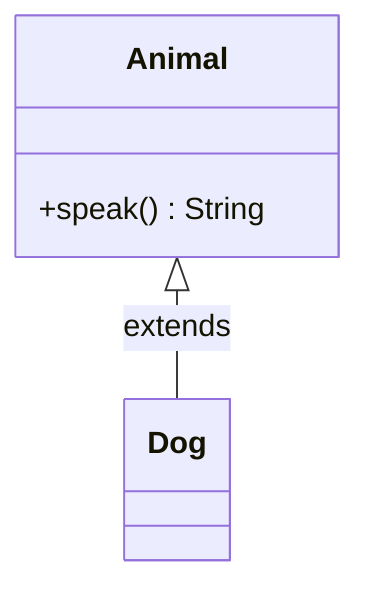

# Concrete Class
> Part of [[Java/01_Core-Java/README|Core Java]]

> A normal, complete class with concrete implementations for all its methods. It can be instantiated with `new` and may inherit from abstract classes or implement interfaces.

## Why it Matters

Represent a fully usable type, the workhorse of Java programs. If abstract classes and interfaces define *contracts*, concrete classes deliver the *implementation*.

## Diagram



## Code

> **Java 25:** Concrete classes benefit from Compact Object Headers (8-byte headers) and compact sources (`void main() + IO.println`). Prefer `record` for pure data carriers; `var` for locals; `sealed` when hierarchy should be closed.

Runnable Java 25:
```java
// Interface + abstract base → concrete implementation
interface Summable { int total(int a, int b); }

abstract class BaseSummable implements Summable {
 // could add shared helpers here
}

public class ConcreteClassDemo extends BaseSummable {
 @Override public int total(int a, int b) { return a + b; }

 static int totalStatic(int a, int b) { return a + b; }

 public static void main(String[] args) {
 }
}
```

## When to use / not

| Use | Avoid |
|-----|-------|
| Need an instantiable, complete type | Need to enforce subclassing, make it abstract |
| Implementing an interface / extending abstract base | Want to forbid extension, declare `final` |

## Trade-offs

- Directly instantiable; full behavior available.
- Can be extended and tested straightforwardly.
- If too many responsibilities, violates SRP, split into smaller classes.

## Vs

| Aspect | Concrete Class | Abstract Class | Interface |
|--------|---------------|----------------|-----------|
| Instantiable | Yes | No | No |
| Abstract methods | None | May have | All (pre-Java 8) |
| Constructors | Yes | Yes | No |

## Pitfalls

- Declaring a class concrete but leaving abstract methods unimplemented → compile error.
- Instantiating with `new` while forgetting to initialize `final` fields.
- Letting concrete classes grow into God objects, refactor via composition.

---
*Category: Core-Java • java25*

## Interview q&a

**Q1. Can a concrete class be abstract?**
No, by definition a concrete class has no abstract methods remaining unimplemented. If it leaves any abstract method unimplemented, it must be declared `abstract`.

**Q2. Must a concrete class implement every interface method?**
Yes, unless it is declared `abstract` itself.
Can a concrete class be abstract?:: No, by definition a concrete class has no abstract methods remaining unimplemented. If it leaves any abstract method unimplemented, it must be declared `abstract`. #flashcard
Must a concrete class implement every interface method?:: Yes, unless it is declared `abstract` itself. #flashcard

## Related

- [[Classes]]
- [[Java/01_Core-Java/Types/Abstract Class|Abstract Class]]
- [[Java/01_Core-Java/Types/Final Class|Final Class]]
- [[Interface]]
