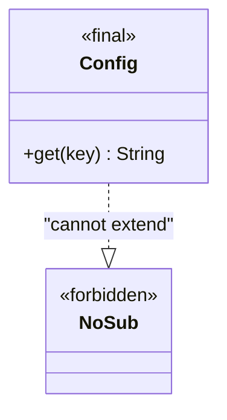

# Final Class
> Part of [[Java/01_Core-Java/README|Core Java]]

> A class declared `final` cannot be subclassed. Once marked final it is a closed design, no child class can extend it.

- `final` class → no inheritance; `final` method → no overriding; `final` field → single assignment.

## Why it Matters

Lock a design against extension, for security, immutability, or API stability (e.g., `String`, `Integer`).

## Diagram



## Code

> **Java 25:** `final` vs `sealed`, `final` still forbids all extension; `sealed permits` allows controlled extension with exhaustive switch. Compact headers reduce instance footprint; semantics unchanged.

Runnable Java 25:
```java
final class BaseClass {
 void display() { System.out.println("BaseClass::display()"); }
}

// class Derived extends BaseClass {} // COMPILE ERROR: cannot inherit from final BaseClass

class Unrelated {
 void display() { System.out.println("Unrelated::display()"); }
}

public class FinalClassDemo {
 public static void main(String[] args) {
 BaseClass b = new BaseClass();
 }
}
```

## When to use / not

| Use | Avoid |
|-----|-------|
| Immutable types (`String`, wrappers) | Need extensibility / mocking via subclassing |
| Security-sensitive or performance-critical closed types | Framework expects proxy subclassing (Hibernate, Mockito inline mock makes this less relevant) |
| Utility classes that should never be extended | Domain types likely to be specialized |

## Trade-offs

- Enables immutability guarantees, thread-safety, safe publishing.
- Allows JVM inlining optimizations.
- Clear contract: "do not extend."

## Vs

| Modifier | Class | Method | Variable |
|----------|-------|--------|----------|
| `final` meaning | Cannot be subclassed | Cannot be overridden | Assigned once |
| `abstract` + `final` | Illegal together | Illegal together | N/A |

## Pitfalls

- Thinking `final` field = immutable object (only reference is final).
- Trying to extend JDK final classes like `String`, compile error.
- Marking everything `final` prematurely, use where design truly calls for closure.

---
*Category: Core-Java • java25*

## Interview q&a

**Q1. Can a final class have abstract methods?**
No, abstract requires subclassing to implement; final forbids subclassing.

**Q2. Does `final` make an object immutable?**
No. `final` reference cannot be reassigned, but the object's internal state can still mutate unless the class is designed immutable.
Can a final class have abstract methods?:: No, abstract requires subclassing to implement; final forbids subclassing. #flashcard
Does `final` make an object immutable?:: No. `final` reference cannot be reassigned, but the object's internal state can still mutate unless the class is designed immutable. #flashcard

## Related

- [[Java/01_Core-Java/Types/Immutable Class|Immutable Class]]
- [[Java/01_Core-Java/Types/Concrete Class|Concrete Class]]
- [[Classes]]
