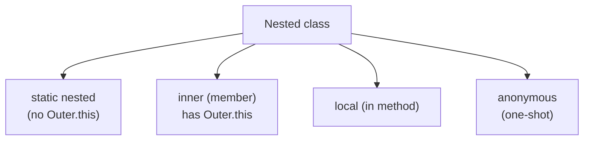

# Nested Classes Overview
> Part of [[Java/01_Core-Java/README|Core Java]]

> A class defined inside another class. It is a member of its enclosing class, used to logically group classes that are only used in one place and to increase encapsulation.

Just as a class has fields and methods as members, it can have a class as a member.

## Why it Matters

Group helper types with their owner, hide implementation details, and give the inner type privileged access to the outer type's private members.

## Diagram



## Code

> **Java 25:** Nested vs inner taxonomy unchanged, `static nested` (no `this`), `inner` (has `Outer.this`), `local`/`anonymous`. Use `sealed` to close hierarchies and pattern-matching `switch` for dispatch; `import module java.base` simplifies imports.

Runnable Java 25, outer + inner interaction:
```java
public class NestedClassDemo {
 private String outerMsg = "outer-private";

 // Member inner class, has implicit reference to outer instance
 class Inner {
 void innerPrint() {
 System.out.println("Inner sees: " + outerMsg); // accesses private
 }
 }

 static class StaticHelper {
 void help() { System.out.println("Static nested helper"); }
 }
}
```
**Subtypes:**
- [[Java/01_Core-Java/Types/Nested/Nested Inner Class|Nested Inner Class]], non-static member class
- [[Java/01_Core-Java/Types/Nested/Static Nested Class|Static Nested Class]], static member class
- [[Java/01_Core-Java/Types/Nested/Method Local Inner Class|Method Local Inner Class]], inside a method
- [[Java/01_Core-Java/Types/Nested/Anonymous Inner Class|Anonymous Inner Class]], unnamed inline class

## When to use / not

| Use | Avoid |
|-----|-------|
| Helper tied to one outer type (e.g., `Map.Entry`) | Helper used independently, make it top-level |
| Need access to outer instance's private state | Unnecessary coupling, keep classes separate |
| Builder / iterator / state holder scoped to owner | Deep nesting that hurts readability |

## Trade-offs

- Encapsulation; logical grouping; access to private members.
- Extra coupling; non-static inner holds hidden reference to outer (memory/serialization cost).

## Vs

| Kind | Has outer reference | Can have static members | Instantiation |
|------|-------------------|------------------------|---------------|
| Member inner | Yes | No (except constants pre-Java 16) | `outer.new Inner()` |
| Static nested | No | Yes | `new Outer.Static()` |
| Local inner | Yes (captures locals) | No | Inside method only |

## Pitfalls

- Accidentally using non-static inner when static nested suffices, retains outer reference.
- Serialization of inner classes serializes outer too.
- Inner class naming confusion, keep nesting shallow.

---
*Category: Core-Java • java25*

## Interview q&a

**Q1. Difference between static nested and inner class?**
Static nested has no implicit reference to outer instance; inner does. Static can be instantiated without an outer instance.

**Q2. Can an inner class access private members of outer?**
Yes, compiler generates synthetic accessors.
Difference between static nested and inner class?:: Static nested has no implicit reference to outer instance; inner does. Static can be instantiated without an outer instance. #flashcard
Can an inner class access private members of outer?:: Yes, compiler generates synthetic accessors. #flashcard

## Related

- [[Java/01_Core-Java/Types/Nested/Nested Inner Class|Nested Inner Class]]
- [[Java/01_Core-Java/Types/Nested/Static Nested Class|Static Nested Class]]
- [[Java/01_Core-Java/Types/Nested/Method Local Inner Class|Method Local Inner Class]]
- [[Java/01_Core-Java/Types/Nested/Anonymous Inner Class|Anonymous Inner Class]]
- [[Classes]]
