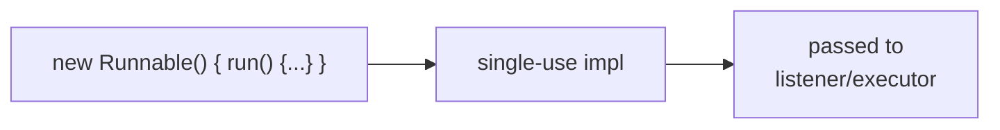

# Anonymous Inner Class
> Part of [[Java/01_Core-Java/README|Core Java]]

> An inner class without a name, declared and instantiated at the point of use. It is a one-off subclass or interface implementation.

A special case of inner class, no `class` name, created as an expression: `new Interface() { ... }` or `new SuperClass() { ... }`.

## Why it Matters

Inline a short-lived implementation without creating a named file, listeners, callbacks, comparators.

## Diagram



## Code

> **Java 25:** Anonymous inner classes unchanged, prefer lambda for SAM; `var` and pattern matching available in enclosing code; no header change beyond Compact Object Headers.

Runnable Java 25, anonymous inner class vs lambda:
```java
import java.util.*;

public class AnonymousInnerClassDemo {
 public static void main(String[] args) {
 // Anonymous inner class for Comparator
 Comparator<String> cmpAnon = new Comparator<String>() {
 @Override public int compare(String a, String b) {
 return Integer.compare(a.length(), b.length());
 }
 };

 // Lambda equivalent (functional interface)
 Comparator<String> cmpLambda = Comparator.comparingInt(String::length);
 }
}
```

## When to use / not

| Use | Avoid |
|-----|-------|
| Single-use callback / listener | Reused logic, create a named class |
| Need to override multiple methods inline | Functional interface, prefer lambda (more concise) |
| Before lambdas (or non-functional interfaces) | Complex bodies, readability suffers |

## Trade-offs

- Quick inline customization without new file.
- Can override any class/interface, multiple methods.
- Verbose vs lambda for functional interfaces.

## Vs

| Aspect | Anonymous Inner Class | Lambda | Named Inner Class |
|--------|----------------------|--------|-------------------|
| Target | Any class / interface | Functional interfaces only | Any |
| `this` | Refers to anonymous instance | Refers to enclosing instance | Own instance |
| State / ctor | Instance initializer only | No state | Full |

## Pitfalls

- Holding implicit reference to enclosing instance → memory leak for long-lived listeners.
- Overusing anonymous for multi-line logic, make it a named inner/static nested class.
- Cannot define `static` members (except constants).

---
*Category: Core-Java • java25*

## Interview q&a

**Q1. Lambda vs anonymous class, key difference?**
Lambda: no new type scope, `this` is enclosing instance, only functional interfaces. Anonymous: real subclass, own `this`, can have state/initializers, any interface.

**Q2. Can anonymous class capture local variables?**
Yes, if final or effectively final.
Lambda vs anonymous class, key difference?:: Lambda: no new type scope, `this` is enclosing instance, only functional interfaces. Anonymous: real subclass, own `this`, can have state/initializers, any interface. #flashcard
Can anonymous class capture local variables?:: Yes, if final or effectively final. #flashcard

## Related

- [[Java/01_Core-Java/Types/Anonymous Class|Anonymous Class]] (top-level overview)
- [[Java/01_Core-Java/Types/Nested Classes Overview|Nested Classes Overview]]
- [[Interface]], functional interfaces
