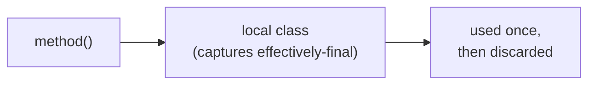

# Method Local Inner Class
> Part of [[Java/01_Core-Java/README|Core Java]]

> An inner class declared inside a method (or any block). Its scope is limited to that method, visible and instantiable only within it.

## Why it Matters

Encapsulate logic that is needed only inside one method, with access to the method's effectively-final locals and the outer instance.

## Diagram



## Code

> **Java 25:** Method-local inner classes unchanged, still inside method scope with effectively-final capture; compact sources allow `void main()` outside; prefer lambda/`record` where possible.

Runnable Java 25:
```java
public class MethodLocalInnerClassDemo {
 private String outerField = "outer";

 void process(String prefix) {
 int count = 3; // effectively final — capturable by inner class
 // Method-local inner class — scoped to this method only
 class Helper {
 void help() {
 for (int i = 0; i < count; i++) {
 System.out.println(prefix + "-" + outerField + " #" + i);
 }
 }
 }
 new Helper().help();
 }
}
```
> **Note:** Prior to Java 8, captured locals had to be explicitly `final`. Since Java 8 they need only be *effectively final* (not reassigned).

## When to use / not

| Use | Avoid |
|-----|-------|
| Helper needed in exactly one method | Logic reused across methods, use member inner / top-level |
| Need to capture method locals cleanly | Complex helper, extract to named class for testability |

## Trade-offs

- Tightest scoping, not visible outside method.
- Clean capture of method parameters/locals.
- Cannot have access modifiers (`public`/`private`) or `static` members.

## Vs

| Aspect | Method-Local Inner | Member Inner | Static Nested |
|--------|-------------------|--------------|---------------|
| Scope | Method only | Whole outer class | Whole outer class |
| Outer reference | Yes | Yes | No |
| Modifiers | None allowed | `public`/`private` etc. | `static`, access mods |

## Pitfalls

- Reassigning a captured local variable → compile error (not effectively final).
- Defining the class after its use in the same method → compile error (declare before instantiation).
- Expecting the class to be visible outside the method, it isn't.

---
*Category: Core-Java • java25*

## Interview q&a

**Q1. Can a method-local inner class be `public`?**
No, no access modifier allowed; scope is already the method.

**Q2. Can it access method parameters?**
Yes, if they are final or effectively final.
Can a method-local inner class be `public`?:: No, no access modifier allowed; scope is already the method. #flashcard
Can it access method parameters?:: Yes, if they are final or effectively final. #flashcard

## Related

- [[Java/01_Core-Java/Types/Nested Classes Overview|Nested Classes Overview]]
- [[Java/01_Core-Java/Types/Nested/Nested Inner Class|Nested Inner Class]]
- [[Java/01_Core-Java/Types/Nested/Static Nested Class|Static Nested Class]]
