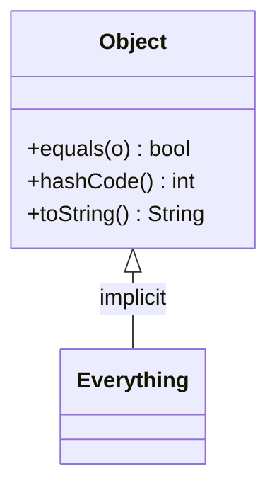

# Object Class
> Part of [[Java/01_Core-Java/README|Core Java]]

> `java.lang.Object` is the root of the Java class hierarchy. Every class implicitly extends `Object`; every object (including arrays) inherits its methods.

Located in `java.lang`, no import needed.

## Why it Matters

Provide the universal operations every Java object needs: identity (`equals`/`hashCode`), string representation (`toString`), lifecycle (`getClass`, `clone`, `finalize` deprecated), and concurrency (`wait`/`notify`).

## Diagram



## Code

> **Java 25:** `Object` unchanged, Compact Object Headers reduce header to 8 bytes for every `Object` (heap savings 15-20%). Use pattern-matching `instanceof`/`switch` (`if (obj instanceof String s)`) and `var` instead of explicit casts.

Runnable Java 25, correct `equals`/`hashCode` contract:
```java
import java.util.*;

class Point {
 final int x, y;
 Point(int x, int y) { this.x = x; this.y = y; }

 @Override public boolean equals(Object o) {
 if (this == o) return true;
 if (!(o instanceof Point p)) return false;
 return x == p.x && y == p.y;
 }
 @Override public int hashCode() { return Objects.hash(x, y); }
 @Override public String toString() { return "Point(" + x + "," + y + ")"; }
}
```
**Key `Object` methods:** `toString()`, `equals(Object)`, `hashCode()`, `getClass()`, `clone()` (protected), `wait()`/`notify()`/`notifyAll()`, `finalize()` (deprecated since Java 9, use `Cleaner`).

## When to use / not

| Use | Avoid |
|-----|-------|
| Override `equals`/`hashCode`/`toString` for value types | Call `wait`/`notify` directly in modern code, prefer `java.util.concurrent` |
| Use `getClass()` for reflective checks | Over-rely on `Object` as parameter type, prefer generics |

## Trade-offs

- Uniform root enables `Object` collections before generics; polymorphic handling.
- `clone()` and `wait`/`notify` are error-prone legacy APIs.
- Using raw `Object` loses type safety.

## Vs

| Method | Purpose | Override? |
|--------|---------|-----------|
| `equals` / `hashCode` | Logical equality, hash collections | Yes, together (contract) |
| `toString` | Debugging / logging | Yes |
| `getClass` | Runtime type | No (`final`) |

## Pitfalls

- Overriding `equals` without `hashCode` → `HashMap` lookups fail silently.
- Using `instanceof` incorrectly in `equals` breaks symmetry with subclasses, be deliberate (use `getClass()` for strict type).
- Calling `wait()` outside `synchronized` → `IllegalMonitorStateException`.
- Relying on `finalize()`, deprecated/unreliable; use try-with-resources / `Cleaner`.

---
*Category: Core-Java • java25*

## Interview q&a

**Q1. `equals` vs `==`?**
`==` compares references; `equals` compares logical content (if overridden; default `Object.equals` is `==`).

**Q2. Contract between `equals` and `hashCode`?**
Equal objects *must* have equal hash codes. Violating this breaks `HashMap`/`HashSet`. Always override both together.
`equals` vs `==`?:: `==` compares references; `equals` compares logical content (if overridden; default `Object.equals` is `==`). #flashcard
Contract between `equals` and `hashCode`?:: Equal objects *must* have equal hash codes. Violating this breaks `HashMap`/`HashSet`. Always override both together. #flashcard

## Related

- [[Classes]]
- [[Java/01_Core-Java/Types/Wrapper Class|Wrapper Class]]
- [[Java/01_Core-Java/Types/Immutable Class|Immutable Class]], `equals`/`hashCode` for immutable keys
