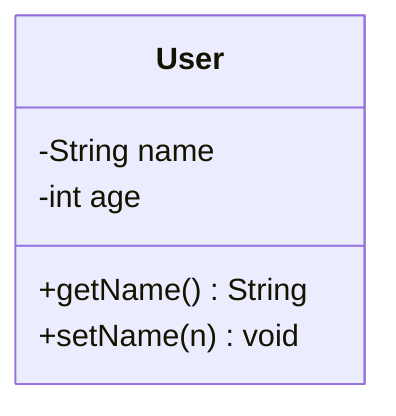

# POJO Class
> Part of [[Java/01_Core-Java/README|Core Java]]

> Plain Old Java Object, a simple class with private fields and public getters/setters, free of framework-specific inheritance, annotations, or required interfaces. No behavior mandated; may override `equals`/`hashCode`/`toString`.

**Classic POJO properties:**
- Private instance fields.
- Public getters and setters.
- No-arg constructor (recommended for frameworks like Jackson/JPA).
- Does not extend or implement prespecified framework types; no prespecified annotations required (in the strict definition).

> In practice, "POJO" is used loosely, any simple data carrier qualifies; modern Java often uses `record` for immutable POJOs.

## Why it Matters

Carry data with minimal ceremony, DTOs, entities, form beans, and configuration holders.

## Diagram



## Code

> **Java 25:** Prefer `record` for immutable POJOs (`record Employee(int id, String name) {}`) with compact headers; classic mutable POJO still needed for Jackson/JPA (requires no-arg ctor + setters). Use `var` and `IO.println` in compact sources.

Runnable Java 25, POJO with correct `equals`/`hashCode` + modern `record` alternative:
```java
import java.util.Objects;

class EmployeePojo {
 private int id;
 private String name;

 public EmployeePojo() {} // required by many frameworks
 public EmployeePojo(int id, String name) { this.id = id; this.name = name; }

 public int getId() { return id; }
 public void setId(int id) { this.id = id; }
 public String getName() { return name; }
 public void setName(String name) { this.name = name; }
}
```

## When to use / not

| Use | Avoid |
|-----|-------|
| DTOs, request/response models, JPA entities (simple) | Need immutable value type, use `record` or immutable class |
| Simple data grouping without behavior | Want to enforce invariants without setters |
| Interop with frameworks that expect getters/setters | Domain objects with rich behavior, model properly |

## Trade-offs

- Simple, framework-friendly, widely understood.
- Easy serialization/mapping.
- Mutable setters weaken invariants; verbose compared to `record`.

## Vs

| Aspect | POJO (classic) | Record (Java 16+) | JavaBean |
|--------|---------------|-------------------|----------|
| Mutability | Mutable (setters) | Immutable | Mutable (strict Bean spec) |
| Boilerplate | High | Minimal (auto `equals`/`hashCode`/`toString`) | High + naming conventions |
| Framework support | Excellent | Growing | Excellent (introspection) |

## Pitfalls

- Missing no-arg constructor → Jackson/JPA deserialization fails.
- Mutable POJOs used as `HashMap` keys with changing fields → lost entries.
- Exposing mutable fields (e.g., `Date`, `List`) without defensive copy.
- Anemic domain model, stuffing all logic into services while POJOs hold only data.

---
*Category: Core-Java • java25*

## Interview q&a

**Q1. POJO vs JavaBean?**
Every JavaBean is a POJO, not vice-versa. JavaBean also requires `Serializable`, no-arg constructor, and follows naming conventions for introspection.

**Q2. Is a POJO allowed to have methods beyond getters/setters?**
Yes, strictly it may override `equals`/`hashCode`/`toString` and have convenience methods; the point is no forced framework contract.
POJO vs JavaBean?:: Every JavaBean is a POJO, not vice-versa. JavaBean also requires `Serializable`, no-arg constructor, and follows naming conventions for introspection. #flashcard
Is a POJO allowed to have methods beyond getters/setters?:: Yes, strictly it may override `equals`/`hashCode`/`toString` and have convenience methods; the point is no forced framework contract. #flashcard

## Related

- [[Classes]]
- [[Java/01_Core-Java/Types/Concrete Class|Concrete Class]]
- [[Java/01_Core-Java/Types/Immutable Class|Immutable Class]]
- [[Java/01_Core-Java/Types/Wrapper Class|Wrapper Class]]
