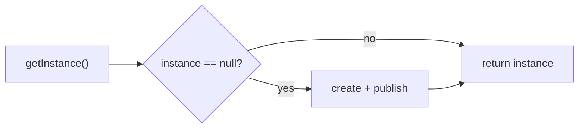

# Singleton Class
> Part of [[Java/01_Core-Java/README|Core Java]]

> A class that allows only one instance at a time, providing a single global access point. The instance is typically lazily created and shared across the application.

Common uses: caches, loggers, configuration, connection managers. Prefer modern approaches over hand-rolled singletons where possible.

## Why it Matters

Guarantee a single instance with controlled global access, saving memory and ensuring coordinated state in multi-threaded / database-backed apps.

## Diagram



## Code

> **Java 25:** Singleton patterns unchanged, `enum` singleton remains safest (serialization/reflection-proof); holder and DCL still valid but DI is preferred. Compact headers reduce holder overhead slightly.

Runnable Java 25, thread-safe singleton variants including `enum` (best practice):
```java
// Enum singleton, simplest, serialization + reflection safe (Joshua Bloch)
enum EnumSingleton {
 INSTANCE;
 void doWork() { System.out.println("EnumSingleton working"); }
}

// Bill Pugh / holder idiom, lazy, thread-safe without synchronization cost
class HolderSingleton {
 private HolderSingleton() {}
 private static class Holder { static final HolderSingleton INST = new HolderSingleton(); }
 static HolderSingleton getInstance() { return Holder.INST; }
 void doWork() { System.out.println("HolderSingleton working"); }
}
}
```

## When to use / not

| Use | Avoid |
|-----|-------|
| Truly single resource (config, registry) | When dependency injection can manage lifecycle instead |
| Need global coordination point | When testability matters, singletons hide dependencies and hinder mocking |
| Legacy codebase without DI | When you need >1 instance in tests / different classloaders |

## Trade-offs

- Single instance → memory savings; global access.
- Global mutable state → testing/mocking difficulty; classloader/serialization/reflection can break naïve singletons; hidden dependencies.

## Vs

| Approach | Lazy | Thread-safe | Serialization safe | Reflection safe |
|----------|------|-------------|------------------|-----------------|
| Eager `static final` | No | Yes | No (needs `readResolve`) | No |
| Enum | No (eager) | Yes | Yes | Yes |
| Holder idiom | Yes | Yes | Needs `readResolve` | No |

## Pitfalls

- Non-`volatile` DCL without proper publication → partially constructed instance visible to other threads.
- Forgetting `readResolve()` → deserialization creates a second instance.
- Reflection `setAccessible(true)` can call private constructor, guard against it or use `enum`.
- Holding mutable state in a singleton without synchronization → data races.

---
*Category: Core-Java • java25*

## Interview q&a

**Q1. How to make a singleton safe against reflection/serialization?**
Use `enum` singleton. For class-based, add `readResolve()` and throw in constructor if instance already exists.

**Q2. Why is singleton considered an anti-pattern by some?**
It introduces global state, hides dependencies, and complicates unit testing, DI-managed singletons (Spring `@Singleton` scope) are preferred.
How to make a singleton safe against reflection/serialization?:: Use `enum` singleton. For class-based, add `readResolve()` and throw in constructor if instance already exists. #flashcard
Why is singleton considered an anti-pattern by some?:: It introduces global state, hides dependencies, and complicates unit testing, DI-managed singletons (Spring `@Singleton` scope) are preferred. #flashcard

## Related

- [[Classes]]
- [[Java/01_Core-Java/Types/Final Class|Final Class]]
- [[Java/01_Core-Java/Types/Static Class|Static Class]]
