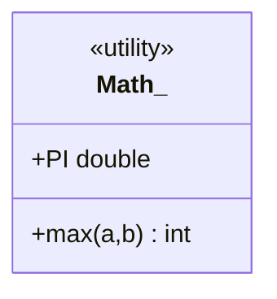

# Static Class
> Part of [[Java/01_Core-Java/README|Core Java]]

> In Java only *nested* classes can be `static`. A static nested class belongs to the outer class, not to an instance, and can be instantiated without an outer object. A top-level class cannot be `static`.

A static *member* (field/method/block) belongs to the class, not instances, accessed via `ClassName.member`.

## Why it Matters

Group class-level state/behavior and helpers that don't need an enclosing instance, while keeping them namespaced under the owning type.

## Diagram



## Code

> **Java 25:** Static nested/member classes unchanged, still `static class Inner` with no outer `this`. Use `import module java.base` and `IO.println` for demos; headers smaller via Compact Object Headers.

Runnable Java 25, static fields/blocks/methods + static nested class:
```java
class StaticDemo {
 static int total; // class-level state

 static void sum(int a, int b) {
 total = a + b;
 System.out.println("sum: " + a + "+" + b + "=" + total);
 }

 static class Nested {
 static { System.out.println("static block inside Nested"); }
 void displaySum() {
 sum(25, 75);
 System.out.println("total via Nested: " + total);
 }
}
```

## When to use / not

| Use | Avoid |
|-----|-------|
| Utility helpers / `static` factory methods | Per-instance state, use instance members |
| Constants, `static` nested Builder/Entry | State that must be instance-scoped |

## Trade-offs

- Class-level sharing; no outer instance needed; `static` import can improve call-site readability.
- Global mutable `static` state → test pollution and concurrency issues.
- Overuse of static makes mocking harder.

## Vs

| Aspect | Static Nested Class | Member Inner Class | Static Method |
|--------|-------------------|-------------------|---------------|
| Needs outer instance | No | Yes | No |
| Holds outer ref | No | Yes | N/A |
| Can access outer instance members | Via explicit instance only | Directly | Via instance only |

## Pitfalls

- `static` mutable state shared across threads/tests, synchronize or avoid mutability.
- Trying to declare a top-level `static class`, compile error.
- `static` nested class leaking outer classloader in long-lived containers.
- Initialization order surprises with interdependent `static` fields/blocks.

---
*Category: Core-Java • java25*

## Interview q&a

**Q1. Can a top-level class be `static`?**
No, `static` is meaningful only for nested classes/members. Top-level `static class` is a compile error.

**Q2. Can a static nested class access non-static outer members?**
Only through an explicit reference to an outer instance.
Can a top-level class be `static`?:: No, `static` is meaningful only for nested classes/members. Top-level `static class` is a compile error. #flashcard
Can a static nested class access non-static outer members?:: Only through an explicit reference to an outer instance. #flashcard

## Related

- [[Java/01_Core-Java/Types/Nested/Static Nested Class|Static Nested Class]]
- [[Java/01_Core-Java/Types/Nested Classes Overview|Nested Classes Overview]]
- [[Classes]]
