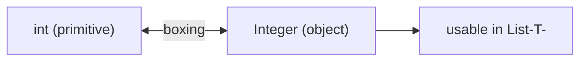

# Wrapper Class
> Part of [[Java/01_Core-Java/README|Core Java]]

> Every primitive has an object wrapper in `java.lang`. Wrappers let primitives participate in generics/collections and provide utility methods (`parseInt`, `compare`, constants).

| Primitive | Wrapper | Primitive | Wrapper |
|-----------|---------|-----------|---------|
| `boolean` | `Boolean` | `int` | `Integer` |
| `char` | `Character` | `long` | `Long` |
| `byte` | `Byte` | `float` | `Float` |

Autoboxing converts primitive → wrapper (`int` → `Integer`); unboxing does the reverse. Since Java 5 this is automatic; `valueOf` / `xxxValue()` are the underlying mechanisms (constructor forms are deprecated since Java 9).

## Why it Matters

Bridge the primitive/object divide, needed for collections, generics, streams, and null-sentinel semantics.

## Diagram



## Code

> **Java 25:** Wrappers unchanged, boxing via `valueOf`/autoboxing, `==` cache (-128..127) identical. Use `var`, pattern-matching `switch` (`switch (obj) { case Integer i -> ... }`), and prefer primitives or `OptionalInt` in hot loops.

Runnable Java 25, boxing, unboxing, parsing, and the `==` pitfall:
```java
public class WrapperClassDemo {
 public static void main(String[] args) {
 // Boxing vs autoboxing
 int num = 20;
 Integer boxed1 = Integer.valueOf(num);
 Integer boxed2 = num;
 System.out.println("int => Integer: " + num + " => " + boxed2);

 // Unboxing
 Integer val = 3;
 int unboxed1 = val.intValue();
 int unboxed2 = val;
 System.out.println("Integer => int: " + val + " => " + unboxed2 + " (via intValue " + unboxed1 + ")");
 }
}
```

## When to use / not

| Use | Avoid |
|-----|-------|
| Storing primitives in `List`/`Map`/`Optional` | Hot numeric loops, prefer primitives to avoid boxing overhead |
| Need `null` to represent absence | Performance-critical arrays, use primitive arrays |
| Using wrapper constants/methods (`Integer.MAX_VALUE`) | `==` comparison on wrappers, use `.equals` or primitives |

## Trade-offs

- Required for generics/collections; rich utility API; nullable.
- Boxing overhead (allocation + cache misses); `NullPointerException` on unboxing `null`; surprising `==` behavior.

## Vs

| Aspect | Primitive | Wrapper |
|--------|-----------|---------|
| Storage | Stack/value, no allocation | Heap object |
| Null | Never | Can be `null` |
| Generics | Not allowed | Allowed (`List<Integer>`) |

## Pitfalls

- Using `==` on wrappers, always use `.equals` or unbox first.
- Unboxing `null` → NPE.
- `new Integer(5)`, deprecated; use `valueOf` / autoboxing / `Integer.parseInt`.
- Performance: boxing inside tight loops (e.g., `Long sum` accumulator) causes per-iteration allocation.

---
*Category: Core-Java • java25*

## Interview q&a

**Q1. What is autoboxing/unboxing and when was it introduced?**
Automatic conversion between primitive and wrapper, since Java 5.

**Q2. Why does `Integer.valueOf(127) == Integer.valueOf(127)` but not for 128?**
`Integer` caches -128..127 (`IntegerCache`). Outside that range, new objects are created.
What is autoboxing/unboxing and when was it introduced?:: Automatic conversion between primitive and wrapper, since Java 5. #flashcard
Why does `Integer.valueOf(127) == Integer.valueOf(127)` but not for 128?:: `Integer` caches -128..127 (`IntegerCache`). Outside that range, new objects are created. #flashcard

## Related

- [[Java/01_Core-Java/Types/Object Class|Object Class]]
- [[Java/01_Core-Java/Types/Immutable Class|Immutable Class]], wrappers are immutable
- [[Classes]]
