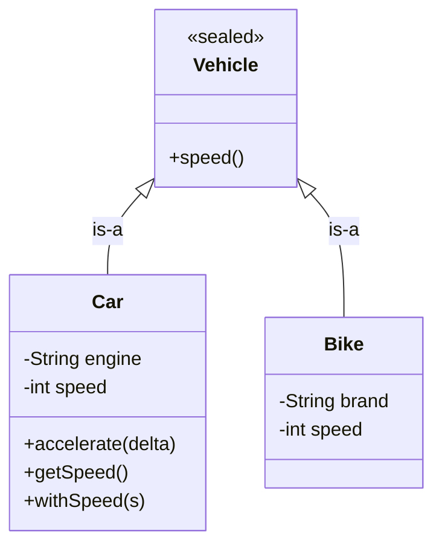

## Why it Matters

**OOP** groups **data** and the **methods** that operate on it into **objects**. Each object owns its **state** and exposes only the operations you want callers to use , so teams can work on separate objects without stepping on each other, and **representation** can change without breaking callers.

A **class** is a **blueprint** defining **fields**, methods and **constructors**. An **object** is an **instance** with its own field values and **identity**. The four ideas that recur are **abstraction**, **encapsulation**, **inheritance** and **polymorphism**.

## Diagram



## Code

```java
// Modern form: records replace verbose POJOs, sealed interfaces make hierarchies exhaustive.
record Car(String model, int speed) {
 Car {
 if (speed < 0) {
 throw new IllegalArgumentException("speed < 0");
 }
 }

 Car withSpeed(int s) {
 return new Car(model, s);
 }
}

sealed interface Vehicle permits Car, Bike {}

record Bike(String brand, int speed) implements Vehicle {}

class Demo {
 static String describe(Vehicle v) {
 return switch (v) {
 case Car(String m, int s) -> "Car " + m + " @ " + s;
 case Bike(String b, int s) -> "Bike " + b + " @ " + s;
 };
 }

 public static void main(String[] args) {
 Vehicle v = new Car("Swift", 60);
 System.out.println(describe(v));
 if (v instanceof Car(String m, int s)) {
 System.out.println(m + " " + s);
 }
 }
}
```
Legacy sketch for comparison:
```java
abstract class Vehicle {
 int speed;

 Vehicle(int s) {
 this.speed = s;
 }

 abstract void accelerate(int d);
}

class Car extends Vehicle {
 String model;

 Car(String m, int s) {
 super(s);
 this.model = m;
 }

 void accelerate(int d) {
 speed += d;
 }
}
```
> Java 25 note: **flexible constructor bodies** let you validate before the `super` call, and **pattern switch** handles sealed hierarchies without a `default` branch.

## When to use / not

Use OOP when your domain has **entities** carrying both **state and behaviour** (like `Order` or `Payment`), when you need to extend behaviour through **subtypes** or **composition**, or when encapsulation helps a team work without interference.

Skip it when the logic is a **pure transformation** with no identity, for one-off scripts where a hierarchy adds overhead, or in tight loops where **virtual dispatch** and allocation cost matters.

## Trade-offs

| Approach | Coupling | Flexibility | Rule |
|---|---|---|---|
| Reuse by copy / call (procedural) | none | low | fine for scripts |
| Reuse by `extends` (**inheritance**) | **tight** | medium | only for true **is-a** satisfying [[02_OOP/SOLID-Liskov-Substitution\|LSP]] |
| Reuse by **has-a** field + delegation (**composition**) | **loose** | high | default , swappable at runtime |

Prefer composition unless you have a true **is-a** relation that satisfies **Liskov substitution**.

## Pitfalls

- Building a deep **inheritance hierarchy** for reuse alone , prefer composition.
- Exposing every field via blind **getters/setters** with no validation.
- Reaching for OOP in **stateless** transformation code where functions suffice.

What are the four pillars of OOP?:: Abstraction, encapsulation, inheritance and polymorphism. #flashcard
What is the difference between a class and an object?:: A class is the blueprint, an object is an instance with its own state and identity. #flashcard
Why use private fields with accessors?:: To validate and to evolve representation without breaking callers. #flashcard
When should you prefer composition over inheritance?:: When reuse is not a true is-a relation or when behaviour needs to change at runtime. #flashcard

## Interview q&a

**Q1: How many pillars does OOP have and what are they?**
A: Four , abstraction, encapsulation, inheritance, polymorphism.

**Q2: What is the difference between class and object?**
A: A class is the blueprint; an object is the instance with identity and state.

**Q3: Why keep fields private and use getters or setters?**
A: To **validate**, to change representation without breaking callers, and to keep **invariants** in one place.

**Q4: When would you avoid OOP?**
A: For **stateless pipelines**, pure functions, or scripts where a class adds no benefit.

## Related

- [[02_OOP/Abstraction\|Abstraction]] • [[02_OOP/Encapsulation\|Encapsulation]] • [[02_OOP/Inheritance\|Inheritance]] • [[02_OOP/Polymorphism\|Polymorphism]]
- [[02_OOP/Classes-and-Objects\|Classes and Objects]] • [[02_OOP/Class-Relationships\|Class Relationships]]

---
*Category: Java/02_OOP*

# Object Oriented Programming

> Part of [[README|Java MOC]] • `Java/02_OOP`

## Vs , oop vs Procedural

- **Procedural**: data and the functions that act on it are separate , reusable via calls or copies, state is anyone's to mutate.
- **OOP**: data and behaviour are bundled in objects with a boundary; callers cross it through methods, so state can be validated and representation can change.
- **Functional** sits between: data is immutable and behaviour is transformed copies , closest to OOP's records.

OOP pays its way when state and identity exist; procedural/functional is simpler when they don't.
