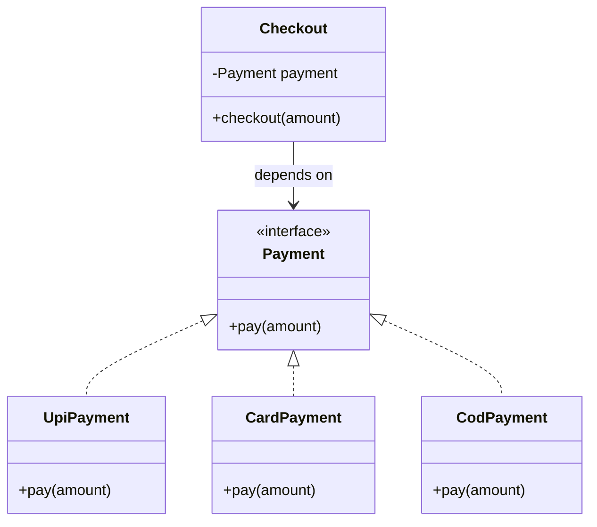

## Why it Matters

**Abstraction** means showing **what** an object does and hiding **how** it does it. Callers depend on the **contract**, not the concrete class , so implementations can be swapped (UPI ↔ card ↔ COD) without touching callers.

Think of driving: you use the accelerator and brake without knowing how combustion works. In Java you get this with **abstract classes** and **interfaces**. **Data abstraction** shows only essential details and ignores the rest; interfaces give full abstraction of the contract.

## Diagram


Abstraction layers: **client** → contract (`Payment`) → **implementations** (`UpiPayment`, `CardPayment`). The client never names a concrete class.

## Code

Abstract class version , holds **shared state**, subclasses fill in **abstract methods**:
```java
abstract class Shape {
 String color;

 Shape(String c) {
 this.color = c;
 }

 abstract double area();
}

class Circle extends Shape {
 double radius;

 Circle(String c, double r) {
 super(c);
 radius = r;
 }

 @Override
 double area() {
 return Math.PI * radius * radius;
 }
}

class Rectangle extends Shape {
 double l, w;

 Rectangle(String c, double l, double w) {
 super(c);
 this.l = l;
 this.w = w;
 }

 @Override
 double area() {
 return l * w;
 }
}

Shape s1 = new Circle("red", 2.2);
Shape s2 = new Rectangle("yellow", 2, 4);
System.out.println(s1.area());
```
Interface version , pure contract, no state:
```java
interface Payment {
 void pay(double amount);
}

class UpiPayment implements Payment {
 public void pay(double a) {
 System.out.println("UPI " + a);
 }
}

class CardPayment implements Payment {
 public void pay(double a) {
 System.out.println("card " + a);
 }
}

void checkout(Payment p) {
 p.pay(499);
}
```
Modern sealed version (Java 21+, exhaustive `switch` with no `default` needed):
```java
sealed interface Shape2 permits Circle2, Rectangle2 {
 double area();
 String color();
}

record Circle2(String color, double radius) implements Shape2 {
 public double area() {
 return Math.PI * radius * radius;
 }
}

record Rectangle2(String color, double l, double w) implements Shape2 {
 public double area() {
 return l * w;
 }
}

String describe(Shape2 s) {
 return switch (s) {
 case Circle2(String c, double r) -> "circle " + c;
 case Rectangle2(String c, double l, double w) -> "rect " + c;
 };
}
```
> Note: **abstract classes** can have **constructors** and fields; **interface** fields are `public static final`.

## When to use / not

Use abstraction when several implementations share the same contract (like `Payment` with UPI, card and COD, or `Shape` with circle and rectangle). It lets you **depend on the abstraction** and swap implementations, and it helps at **framework** or **plugin** boundaries.

Avoid it when only one **implementation** will ever exist (indirection adds noise), or when callers still check `instanceof` on the concrete type , that leaks the implementation the abstraction was hiding.

## Trade-offs

| Mechanism | State | Constructors | Inheritance | Rule |
|---|---|---|---|---|
| **Abstract class** | yes, shared fields | yes (via `super`) | single `extends` | subclasses share **state** + common code in an **is-a** hierarchy |
| **Interface** | no (only constants) | no | multiple `implements` | a **role/capability** many unrelated types implement |
| **Sealed interface** | no | no | closed `permits` set | exhaustive `switch` must catch every case |

Since Java 8, interfaces can have `default` and `static` methods; since Java 9, `private` methods , so they can evolve without breaking implementors.

## Pitfalls

- Abstracting a single implementation that will never vary , **YAGNI**.
- Leaking concretes via `instanceof` checks against the abstraction.
- Stuffing logic into interface `default` methods instead of keeping the contract lean.

How do you achieve abstraction in Java?:: With abstract class and interface. #flashcard
Can an abstract class have a constructor?:: Yes, subclasses call it via super. Constructors cannot be abstract. #flashcard
When to use abstract class vs interface?:: Abstract class for shared state and common code, interface for a role or capability. #flashcard
What happens if a subclass skips an abstract method?:: The subclass must be declared abstract, otherwise it does not compile. #flashcard

## Interview q&a

**Q1: How do you get abstraction in Java?**
A: With **abstract class** and **interface**.

**Q2: Can an abstract class have a constructor? Can a constructor be abstract?**
A: Yes, it can have a constructor, called via `super`. A constructor cannot be `abstract`, `static` or `final`.

**Q3: When to choose abstract class over interface?**
A: Abstract class when you need shared state and common code in an **is-a** hierarchy; interface for a **capability** many unrelated types can implement.

**Q4: What if a subclass does not override an abstract method?**
A: It must be declared `abstract` or compilation fails.

## Related

- [[02_OOP/Encapsulation\|Encapsulation]] • [[02_OOP/Interfaces\|Interfaces]] • [[02_OOP/Polymorphism\|Polymorphism]]
- [[02_OOP/SOLID-Open-Closed\|Open-Closed]] • [[02_OOP/SOLID-Dependency-Inversion\|Dependency Inversion]]

---
*Category: Java/02_OOP*

# Abstraction

> Part of [[README|Java MOC]] • `Java/02_OOP`

## Vs , Encapsulation vs Abstraction

- **Encapsulation** hides **data**, via `private` fields and methods.
- Abstraction hides implementation, via `interface` or `abstract` class.
- One protects **state**, the other defines **what to expose**.
