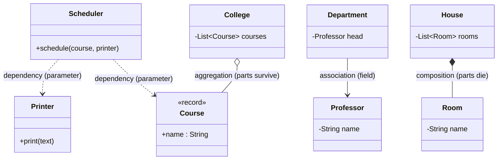

## Why it Matters

Four strengths of "uses": **dependency** (momentary use) → **association** (knows, long-term) → **aggregation** (has-a, parts outlive whole) → **composition** (owns-a, parts die with whole). **Ownership** and **lifetime** decide which one you mean , and interviewers test exactly that distinction.

## Diagram


| Relationship | Meaning | Lifetime | UML | Java form |
|---|---|---|---|---|
| **Dependency** | momentary use | none | dashed `--->` | method parameter / local |
| **Association** | knows-a, peers | independent | solid line | field reference |
| **Aggregation** | has-a, weak whole-part | parts **outlive** whole | hollow `◇,` | field, part passed in from outside |
| **Composition** | owns-a, strong whole-part | parts **die** with whole | filled `◆,` | field, part `new`ed inside owner |

- Interview one-liner: "**College** *has* Professors (aggregation , professors survive closure); **House** *owns* Rooms (composition , demolition destroys rooms)."
- Strength of coupling rises left → right in the table; prefer the **weakest** that models reality.
- Composition + [[02_OOP/SOLID-Dependency-Inversion\|DIP]]: own the lifetime but still inject the **interface** where you need testability.

## Code

```java
// All four in one file. Run: java RelationsDemo.java
import java.util.*;

record Course(String name) {} // independent part (aggregation)

class Professor {
 final String name;

 Professor(String n) {
 name = n;
 }
}

class Department { // ASSOCIATION: peer it talks to long-term
 final Professor head;

 Department(Professor h) {
 head = h;
 }
}

class College { // AGGREGATION: courses outlive the college
 final List<Course> courses;

 College(List<Course> c) {
 courses = List.copyOf(c);
 }
}

class House { // COMPOSITION: rooms die with the house
 final List<String> rooms = List.of("kitchen", "bedroom");
}

class Printer { // DEPENDENCY target
 void print(String s) {
 System.out.println(s);
 }
}

void main() {
 var dept = new Department(new Professor("Rao")); // association
 var algo = new Course("Algo"); // aggregation part, created outside
 var college = new College(List.of(algo));
 var house = new House(); // composition: rooms inside
 new Printer().print( // dependency: used, not stored
 dept.head.name + " teaches " + college.courses.get(0).name()
 + " from a house with " + house.rooms.size() + " rooms");
}
```

## When to use / not

- Dependency: the use is momentary , parameter, local, return (`schedule(Course)`).
- Association: the object must remember the other across calls , store a **field** (`Department.head`).
- Aggregation: whole-part where parts are shared or independent , pass parts **in** via constructor.
- Composition: whole-part where parts are meaningless alone , create parts **inside** the owner.

## Trade-offs

| Relationship | Coupling | Lifetime control | Rule |
|---|---|---|---|
| **Dependency** | weakest | none | default for momentary use |
| **Association** | medium | shared | peers that know each other long-term |
| **Aggregation** | strong | external | parts meaningful without the whole |
| **Composition** | strongest | internal | parts meaningless without the whole |

## Pitfalls

- Modelling everything as composition , over-owns shared parts, kills reuse.
- Association fields that are only used once , downgrade to dependency parameters.
- `new`-ing volatile collaborators inside business logic , inject the interface instead ([[02_OOP/SOLID-Dependency-Inversion\|DIP]]).

## Interview q&a

**Q1: Aggregation vs composition , give the lifetime test.**
A: Kill the whole: do the parts still make sense? `College` closes → `Course`/`Professor` objects still exist elsewhere (aggregation, pass parts in). `House` demolished → its `Room` objects are meaningless (composition, create parts inside). Code the difference: aggregation takes parts via constructor from the caller; composition `new`s them internally.

**Q2: Association vs dependency , when does a "uses" become a field?**
A: Dependency = short-lived: parameter, local, or return (`schedule(Course)`). Association = the object must remember the other across calls, so it stores a field (`Department.head`). If removing the field forces re-passing the same object to every method, it was an association.

: Aggregation vs composition , give the lifetime test.?:: A: Kill the whole: do the parts still make sense? `College` closes → `Course`/`Professor` objects still exist elsewhere (aggregation, pass parts in). `House` demolished → its `Room` objects are meaningless (composition, create parts inside). Code the difference: aggregation takes parts via constructor from the caller; composition `new`s them internally. **Q2: Association vs dependency , when does a "uses" become a field?** A: Dependency = shor... #flashcard

## Related

- [[02_OOP/SOLID-Single-Responsibility\|Single Responsibility]] • [[02_OOP/SOLID-Dependency-Inversion\|Dependency Inversion]] • [[02_OOP/SOLID-Liskov-Substitution\|Liskov Substitution]]
- [[02_OOP/Inheritance\|Inheritance]] • [[02_OOP/Encapsulation\|Encapsulation]] • [[02_OOP/00 - OOP Overview\|OOP Overview]]
- [[06_Design-Patterns/Structural/Composite\|Composite]] • [[06_Design-Patterns/Structural/Adapter\|Adapter]] • [[06_Design-Patterns/Extra/DAO Pattern\|DAO Pattern]]

---
*Category: Java/02_OOP*

# Class Relationships , Association, Aggregation, Composition, Dependency

> Part of [[README|Java MOC]] • `Java/02_OOP`

## Vs , Aggregation vs Composition (the Lifetime Test)

- **Aggregation** , *has-a*, weak: parts are passed in and **outlive** the whole (`College` closes, `Course` survives).
- **Composition** , *owns-a*, strong: parts are created inside and **die** with the whole (`House` demolished, `Room` meaningless).
- **Association** is the parent category of both , a long-term field reference; aggregation and composition are its weak/strong whole-part flavours.

Code the difference: aggregation takes the part via constructor from the caller; composition `new`s it internally.
