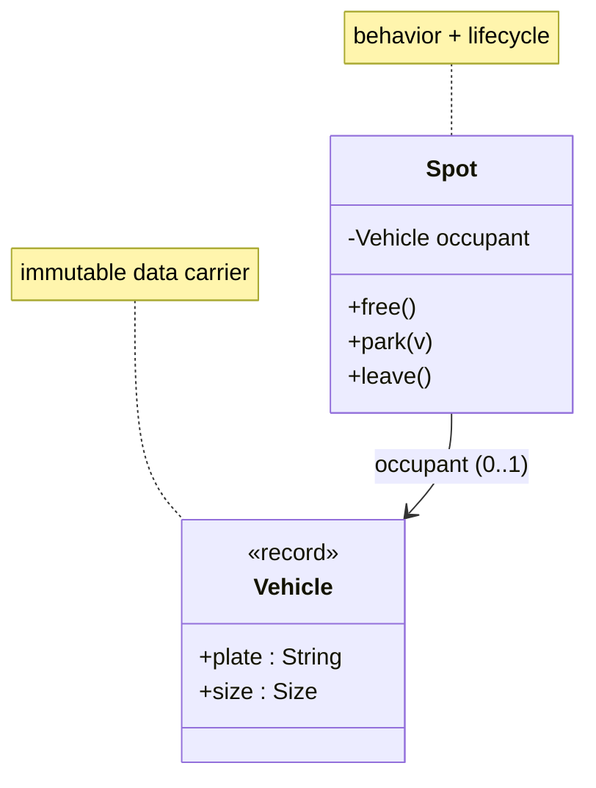

## Why it Matters

A **class** is the **blueprint** (**state** + **behavior**); an **object** is a living **instance** with its own state. Every LLD problem starts here: **nouns** become classes, **verbs** become methods. Getting this split right decides whether later principles (SRP, OCP, DIP) have anything clean to work on.

## Diagram



## Code

```java
enum Size { SMALL, LARGE }

record Vehicle(String plate, Size size) {} // data carrier: no behavior, just identity

class Spot {
 private Vehicle occupant; // encapsulated: only park/leave mutate

 boolean free() {
 return occupant == null;
 }

 void park(Vehicle v) {
 if (!free()) {
 throw new IllegalStateException("taken");
 }
 occupant = v;
 }

 void leave() {
 occupant = null;
 }
}

public class ClassesDemo {
 public static void main(String[] a) {
 var s = new Spot();
 s.park(new Vehicle("KA01AB1234", Size.SMALL));
 System.out.println(s.free()); // false
 }
}
```

## When to use / not

- **Encapsulate**: fields `private final` where possible; expose behavior, not getters for everything.
- **One class, one reason to change** ([[02_OOP/SOLID-Single-Responsibility\|Single Responsibility]]) , the moment a class has two jobs, split it.
- Prefer **records** for dumb data (`record Seat(String id, String tier) {}`); full **classes** for behavior + mutable lifecycle.
- **Static factories** (`Spot.of(...)`) beat public constructors: named, cached, subtype-returning.

## Trade-offs

| Choice | Identity | Mutability | Rule |
|---|---|---|---|
| **Record** | the data itself | immutable snapshot | `Vehicle`, `Seat`, `Ticket` |
| **Class** | lifecycle object | mutable | `Spot` occupancy, `Account` balance |
| Public constructor | simple | fixed | one obvious construction |
| **Static factory** | named/cached | flexible | multiple construction paths |

## Pitfalls

- Anemic classes: all getters, no behavior , logic leaks to callers.
- Mutable **data carriers** passed across threads without copying.
- One God class holding every noun , split by [[02_OOP/SOLID-Single-Responsibility\|SRP]] early.

## Interview q&a

**Q1: How do you find classes in an LLD interview?**
A: **Noun-verb analysis**: nouns (parking spot, ticket) are candidate classes, verbs (park, pay) are methods. Then merge synonyms, drop non-behaving nouns to fields, and assign each class one **responsibility**.

**Q2: Record vs class?**
A: **Record** when identity is the data itself and instances are immutable snapshots (`Vehicle`, `Seat`, `Ticket`). Class when there is lifecycle and mutation (`Spot` occupancy, game turns, `Account` balance).

: How do you find classes in an LLD interview?:: A: **Noun-verb analysis**: nouns (parking spot, ticket) are candidate classes, verbs (park, pay) are methods. Then merge synonyms, drop non-behaving nouns to fields, and assign each class one **responsibility**. **Q2: Record vs class?** A: **Record** when identity is the data itself and instances are immutable snapshots (`Vehicle`, `Seat`, `Ticket`). Class when there is lifecycle and mutation (`Spot` occupancy, game turns, `Account` balance). #flashcard

## Related

- [[02_OOP/Interfaces\|Interfaces]] • [[02_OOP/Encapsulation\|Encapsulation]] • [[02_OOP/SOLID-Single-Responsibility\|Single Responsibility]] • [[02_OOP/Class-Relationships\|Class Relationships]]

---
*Category: Java/02_OOP*

# Classes and Objects

> Part of [[README|Java MOC]] • `Java/02_OOP` • Course map: [AlgoMaster LLD](https://algomaster.io/learn/lld/course-introduction) fundamentals

## Vs , Class vs Object vs Reference

- **Class**: the **blueprint** , fields, methods, constructors; exists once, at compile/load time.
- **Object**: a living **instance** with its own state and identity; many per class, at runtime.
- **Reference**: the variable that points to an object (`Vehicle v = new Car(...)`) , one object, many references possible.

`new` allocates the object; the reference type decides what the compiler sees, the runtime type decides which methods run.
