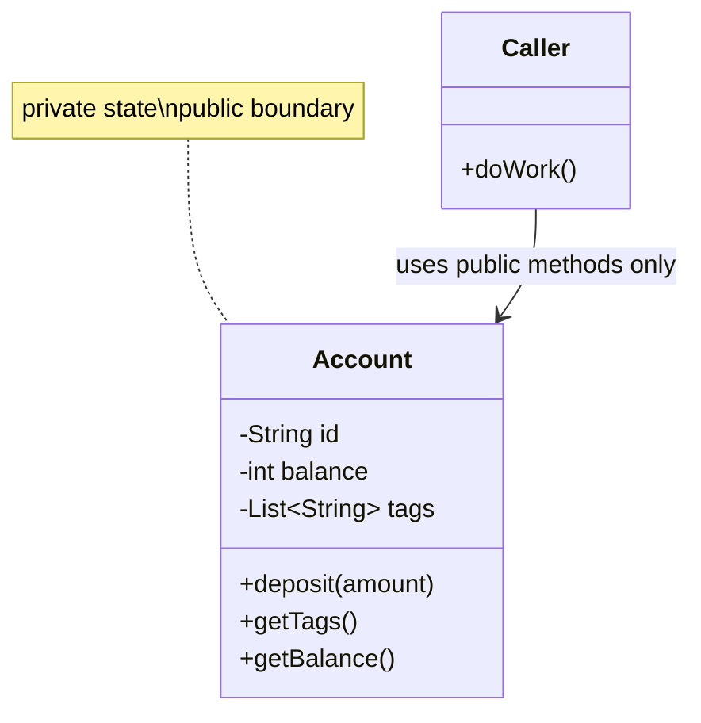

## Why it Matters

**Encapsulation** bundles **data** and **behaviour**, hiding the data. Outside code reaches **state** only through **methods** that can **validate**, log, or change **representation** , so **invariants** live in one place and callers can't silently corrupt them.

Wrapping data in a single unit and shielding it from outside access is the core idea: variables are **private**, `public` methods expose controlled access. This is often described as combining **data hiding** and **abstraction**.

## Diagram


The **boundary** is the point: callers cross only via the public edge; the private interior (fields, representation) is invisible.

## Code

Preferred modern form , record with validation in the **compact constructor**:
```java
import java.util.Objects;

record Geek(String name, int roll, int age) {
 Geek {
 Objects.requireNonNull(name);
 if (age < 0) {
 throw new IllegalArgumentException("age < 0");
 }
 if (roll <= 0) {
 throw new IllegalArgumentException("roll > 0");
 }
 }

 String display() {
 return name + " #" + roll + " " + age;
 }
}

var g = new Geek("Harsh", 51, 19);
System.out.println(g.display());
if (g instanceof Geek(String n, int r, int a)) {
 System.out.println(n + " " + r);
}
```
Legacy POJO form:
```java
class Encapsulate {
 private String name;
 private int roll;
 private int age;

 public String getName() {
 return name;
 }

 public void setName(String v) {
 name = Objects.requireNonNull(v);
 }

 public int getAge() {
 return age;
 }

 public void setAge(int v) {
 if (v < 0) {
 throw new IllegalArgumentException();
 }
 age = v;
 }
}
```
Production detail , **mutable** field needs a **defensive copy**:
```java
final class Account {
 private final String id;
 private final List<String> tags;
 private int balance;

 Account(String id, int b, List<String> tags) {
 if (b < 0) {
 throw new IllegalArgumentException();
 }
 this.id = id;
 this.balance = b;
 this.tags = new ArrayList<>(tags);
 }

 public List<String> getTags() {
 return Collections.unmodifiableList(tags);
 }

 public void deposit(int a) {
 if (a <= 0) {
 throw new IllegalArgumentException();
 }
 balance += a;
 }
}
```
Callers cannot mutate the list directly , they get an **unmodifiable view**.

## When to use / not

Always encapsulate **mutable state** , especially when **validation** is needed, when invariants span several fields, or when representation might change later.

Keep it light for **pure data carriers** with no invariants: a **record** is a good fit (still encapsulated, but concise). Private inner classes used only internally also need less ceremony.

Watch for **public mutable fields**, setters that just assign with no check, and getters returning a **mutable internal collection** without a defensive copy.

## Trade-offs

| Choice | Cost | Benefit | Rule |
|---|---|---|---|
| **Private** + behaviour methods (`deposit`) | more code | **invariants** enforced | default for mutable state |
| Blind **getter/setter** per field | less code | none , callers can break invariants | avoid; exposes representation |
| **Record** (data carrier) | no custom behaviour | concise, immutable | pure data with validation only |
| **Defensive copy** | allocation per call | caller can't corrupt internals | every mutable collection crossing the boundary |

## Pitfalls

- `public` mutable fields or leaky collection getters.
- No-arg setters that skip validation.
- Confusing data hiding (technique) with encapsulation (principle) in interviews.

How do you achieve encapsulation in Java?:: Private fields with public accessors or behaviour methods, plus validation and defensive copies. #flashcard
Is encapsulation the same as data hiding?:: Data hiding is the technique, encapsulation is the broader principle. #flashcard
When do getters and setters hurt encapsulation?:: When they expose every field with no behaviour and let callers break invariants. #flashcard
How to encapsulate a list field?:: Copy the list in the constructor and return an unmodifiable view. #flashcard

## Interview q&a

**Q1: How do you achieve encapsulation in Java?**
A: Make fields private and expose `public` getters, setters or **behaviour methods**, with validation and **defensive copies**.

**Q2: Is encapsulation the same as data hiding?**
A: Data hiding is the technique (private fields); encapsulation is the principle (bundling data + methods, hiding state).

**Q3: Do getters and setters break encapsulation?**
A: Blind getters/setters for every field do. Prefer behaviour methods like `deposit` over `setBalance`.

**Q4: How do you keep a class encapsulated when it holds a list?**
A: **Copy** on construction and return an unmodifiable view or `List.copyOf`.

## Related

- [[02_OOP/Abstraction\|Abstraction]] • [[02_OOP/Classes-and-Objects\|Classes and Objects]] • [[02_OOP/Class-Relationships\|Class Relationships]]
- [[02_OOP/SOLID-Single-Responsibility\|Single Responsibility]] • [[02_OOP/Law-of-Demeter\|Law of Demeter]]

---
*Category: Java/02_OOP*

# Encapsulation

> Part of [[README|Java MOC]] • `Java/02_OOP`

## Vs , Encapsulation and Related Ideas

- Encapsulation hides how **data is stored**, via `private` plus methods.
- Abstraction hides how it is **done**, via `interface` or `abstract` class.
- **Composition** reuses behaviour by **delegation** with a **has-a** field.

Use the first two together: one protects state, the other defines the minimal **contract**. Use composition to reuse encapsulated parts safely.

## Vs , Encapsulation vs Abstraction vs Information Hiding

- **Information hiding** (technique): `private` fields, only the methods you choose are public.
- **Encapsulation** (principle): bundle **data + behaviour** behind that boundary so **invariants** live in one place.
- **Abstraction** (principle): define the minimal **contract** , *what* an object does, hiding *how*.

Encapsulation protects **state**; abstraction defines the **contract**. Hiding is the mechanism both share.
