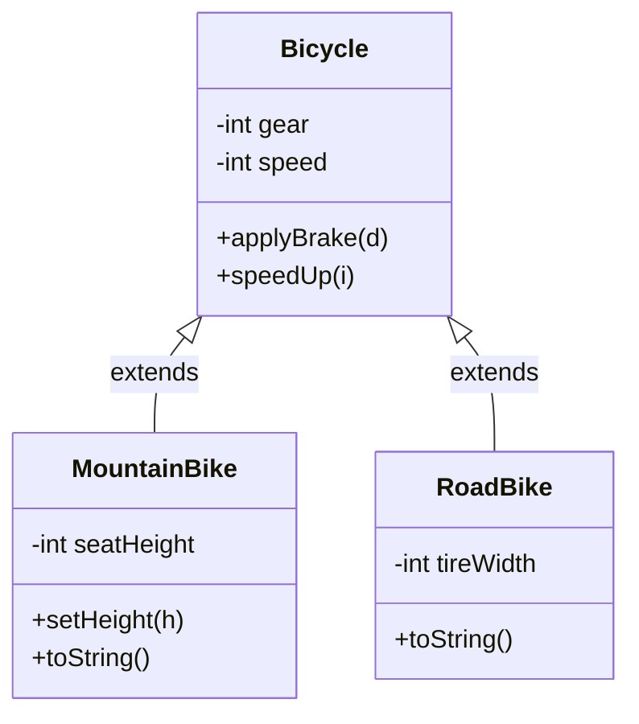

## Why it Matters

**Inheritance** lets a **subclass** acquire **fields** and **methods** from a **superclass**, then add or **override** behaviour. It creates an **is-a** relation , code written against `Bicycle` also works with `MountainBike` , so shared logic lives once in the parent.

Terms: superclass is the parent inherited from; subclass is the child that inherits and can add members; **reusability** is the side effect of sharing code.

## Diagram


One parent, many children (**hierarchical** shape , the most common). See the `Inheritance/` subnotes for [[02_OOP/Inheritance/Single Inheritance\|single]], [[02_OOP/Inheritance/Multilevel Inheritance\|multilevel]], [[02_OOP/Inheritance/Hierarchical Inheritance\|hierarchical]], [[02_OOP/Inheritance/Multiple Inheritance\|multiple]] and [[02_OOP/Inheritance/Hybrid Inheritance\|hybrid]] forms.

## Code

```java
class Bicycle {
 int gear, speed;

 Bicycle(int g, int s) {
 gear = g;
 speed = s;
 }

 void applyBrake(int d) {
 speed -= d;
 }

 void speedUp(int i) {
 speed += i;
 }
}

class MountainBike extends Bicycle {
 int seatHeight;

 MountainBike(int g, int s, int h) {
 super(g, s);
 seatHeight = h;
 }

 @Override
 public String toString() {
 return "gear " + gear + " speed " + speed + " height " + seatHeight;
 }
}

Bicycle b = new MountainBike(3, 20, 5);
b.speedUp(10);
System.out.println(b); // MountainBike toString runs — dynamic dispatch
```
Composition alternative , **has-a** instead of is-a:
```java
class Engine {
 void start() {
 System.out.println("start");
 }
}

class Car {
 private final Engine engine; // has-a

 Car(Engine e) {
 this.engine = e;
 }

 void start() {
 engine.start();
 }
}
```
> Java notes: a class `extends` one class, `implements` many interfaces. Use `super` for the parent constructor/method, `@Override` to catch mistakes; **constructors are not inherited**.

## When to use / not

Use inheritance when there is a true is-a relation and **Liskov substitution** holds (every `MountainBike` is a `Bicycle`). It fits **template method** patterns where the base defines the skeleton and subclasses fill hooks, or when a framework expects an **extension point**.

Prefer **composition** when reuse is just code sharing without is-a, when the hierarchy would go deep or unstable, or when behaviour must vary at **runtime**. Has-a with **delegation** is looser and swappable.

> **Inheritance** is not primarily for code reuse. Design for **subtyping**; reuse follows.

## Trade-offs

| Approach | Relation | Coupling | Binding | Rule |
|---|---|---|---|---|
| **Inheritance** (`extends`) | **is-a** | **tight** (fragile base class) | compile time | true is-a + **LSP** holds |
| **Composition** (**has-a** + delegation) | uses-a | **loose** | runtime-swappable | default for reuse; no diamond problem |

## Pitfalls

- Deep hierarchies , a change in a middle class ripples unpredictably (**fragile base class**).
- Inheriting for reuse where no is-a holds , breaks [[02_OOP/SOLID-Liskov-Substitution\|LSP]] (see `Square extends Rectangle`).
- Forgetting `@Override`, or trying to reduce visibility in an override.

What is inheritance?:: A subclass acquires fields and methods from a superclass and can add or override. #flashcard
When should you use inheritance?:: When there is a true is-a relation that satisfies Liskov substitution. #flashcard
Why does Java avoid multiple class inheritance?:: To avoid the diamond problem, interfaces provide multiple inheritance of type. #flashcard
What is the difference between inheritance and composition?:: Inheritance is is-a with tight coupling, composition is has-a with delegation and looser coupling. #flashcard

## Interview q&a

**Q1: What is inheritance?**
A: A mechanism where one class acquires fields and methods of another.

**Q2: Why does Java not allow multiple class inheritance?**
A: To avoid the **diamond problem** and ambiguity. Interfaces provide multiple inheritance of **type**, with `default`-method conflicts resolved explicitly.

**Q3: What is the difference between inheritance and composition?**
A: Inheritance is is-a with tight coupling; composition is has-a with delegation and looser coupling.

## Related

- [[02_OOP/Polymorphism\|Polymorphism]] • [[02_OOP/Encapsulation\|Encapsulation]] • [[02_OOP/Class-Relationships\|Class Relationships]]
- [[02_OOP/SOLID-Liskov-Substitution\|Liskov Substitution]] • [[02_OOP/SOLID-Open-Closed\|Open-Closed]]

---
*Category: Java/02_OOP*

# Inheritance

> Part of [[README|Java MOC]] • `Java/02_OOP`

## Types

- **Single**: one parent, one child.
- **Multilevel**: chain like `Animal → Dog → Puppy`.
- Hierarchical: one parent, many children.
- **Multiple**: many parents , **not allowed** for classes in Java (diamond problem); allowed for interfaces via `default` methods, use with care.
- **Hybrid**: combination, usually via interfaces + class inheritance together.

## Vs , Inheritance vs Composition

- **Inheritance** (`extends`): **is-a**, tight compile-time coupling; the child sees and depends on the parent's internals (**fragile base class**); behaviour is fixed at compile time.
- **Composition** (has-a + delegation): uses-a, loose coupling behind an injected **interface**; the delegate is **swappable at runtime**; no diamond problem.

Inherit only for a true **is-a** that satisfies [[02_OOP/SOLID-Liskov-Substitution\|LSP]]; reach for composition for everything else. **Favour composition over inheritance** , reuse without the fragility tax.
