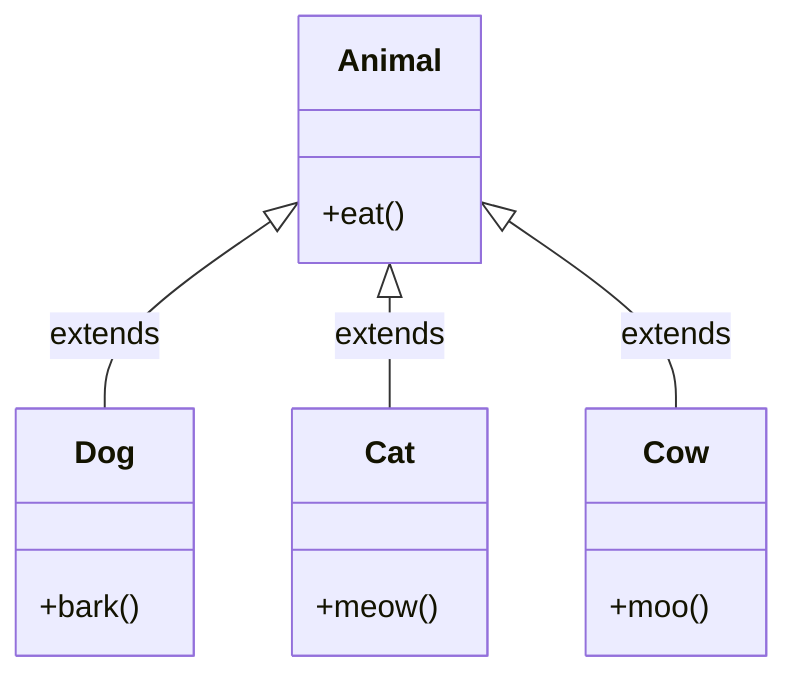

## Why it Matters

**Hierarchical inheritance** has one **superclass** with many **subclasses** , e.g. `Animal` is the parent of `Dog`, `Cat` and `Cow`. Common behaviour stays in the **parent**, specialised behaviour lives in each **child**. This is the most common, easiest-to-reason-about shape.

## Diagram



## Code

```java
class Animal {
 void eat() {
 System.out.println("eat");
 }
}

class Dog extends Animal {
 void bark() {
 System.out.println("bark");
 }
}

class Cat extends Animal {
 void meow() {
 System.out.println("meow");
 }
}

Animal a1 = new Dog();
a1.eat();
Animal a2 = new Cat();
a2.eat();
```

## When to use / not

- Use when several types share one genuine parent and differ only in specialisations (`Dog`, `Cat`, `Cow` all **are** `Animal`).
- Use at **extension points** where new variants plug in without touching the parent , pairs with [[02_OOP/SOLID-Open-Closed\|OCP]].
- NOT when siblings would need to override inherited behaviour to throw or no-op , that breaks [[02_OOP/SOLID-Liskov-Substitution\|LSP]].
- NOT when one "sibling" is really a role a class plays alongside other roles , model it as an **interface** or a composed collaborator instead.

## Trade-offs

| Aspect | Hierarchical (wide) | Multilevel (deep) |
|---|---|---|
| Growth | add a sibling , parent untouched | add a new level, chain recompiles |
| Ripple of a parent change | all siblings, predictably | all descendants, compounding |
| Reasoning | shallow and visible | hidden links, trace cost per level |
| Rule | preferred default shape | keep to 2-3 levels |

## Pitfalls

- Pushing child-specific behaviour up into the parent , it leaks into siblings that don't need it.

What is hierarchical inheritance?:: One superclass with many subclasses, like Dog and Cat extending Animal. #flashcard

## Interview q&a

**Q: What is hierarchical inheritance?**
A: One parent class with multiple child classes.

## Related

- [[02_OOP/Inheritance\|Inheritance]] • [[02_OOP/Inheritance/Multilevel Inheritance\|Multilevel Inheritance]] • [[02_OOP/Polymorphism\|Polymorphism]]

---
*Category: Java/02_OOP*

# Hierarchical Inheritance

> Part of [[02_OOP/Inheritance\|Inheritance]] • `Java/02_OOP`

## Vs , Hierarchical vs Multiple

- **Hierarchical**: one parent, many children , widening; children are siblings sharing one contract.
- **Multiple**: many parents, one child , mixing; Java forbids it for classes, allows it for **interfaces**.

Widening keeps every class one step from the parent; mixing roles is what **interfaces** are for (`Duck extends Animal implements Flyable, Swimmable`).
