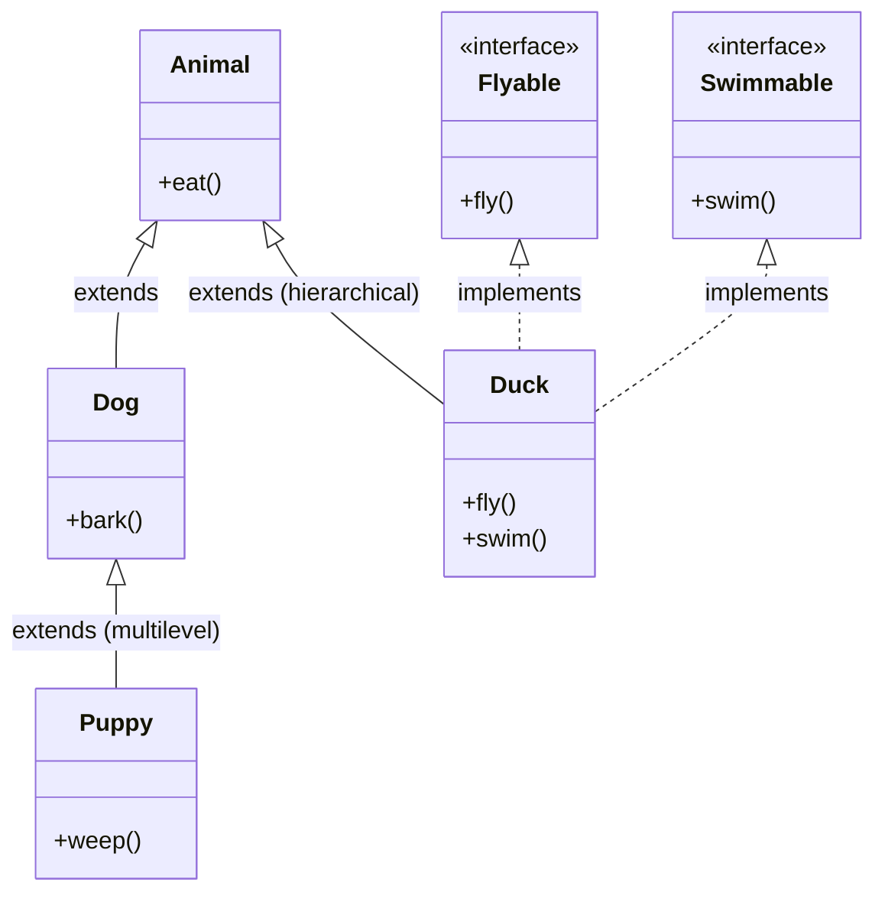

## Why it Matters

**Hybrid inheritance** mixes two or more forms , e.g. **hierarchical** plus **multilevel**, or class plus **interface** inheritance. Java supports it only through **interfaces**, not through multiple class `extends`. Use it when a type needs both an **is-a** parent and several **roles**; prefer **composition** if the mix gets hard to follow.

## Diagram



## Code

```java
interface Flyable {
 void fly();
}

interface Swimmable {
 void swim();
}

class Animal {
 void eat() {
 System.out.println("eat");
 }
}

class Duck extends Animal implements Flyable, Swimmable {
 public void fly() {
 System.out.println("fly");
 }

 public void swim() {
 System.out.println("swim");
 }
}

Duck d = new Duck();
d.eat();
d.fly();
d.swim();
```

## When to use / not

- Use when a type needs one real **is-a** parent plus several **roles** (`Duck extends Animal implements Flyable, Swimmable`).
- Use when the class hierarchy and the capability set are genuinely independent , combine without entangling them.
- NOT when the class hierarchy itself is deep , keep `extends` shallow and put variation in composed collaborators.
- NOT when a role is a **has-a** in disguise , model it as a **field** and delegate ([[02_OOP/Class-Relationships\|composition]]), not another `implements`.

## Trade-offs

| Aspect | Hybrid via interfaces | Pure single inheritance |
|---|---|---|
| Flexibility | is-a parent + N roles | one axis only |
| Coupling | mixed: tight `extends` + loose role contracts | uniformly tight |
| Ambiguity risk | low , no state from interfaces | none |
| Rule | keep one class parent, many role interfaces | simplest reasoning |

## Pitfalls

- Mixing so many parents and roles that the type's **contract** is unreadable , split or compose.

What is hybrid inheritance?:: A mix of two or more inheritance forms, like hierarchical plus multilevel. #flashcard
How does Java support hybrid inheritance?:: Through interfaces and single class inheritance combined. #flashcard

## Interview q&a

**Q1: What is hybrid inheritance?**
A: A combination of two or more **inheritance** types.

**Q2: Does Java support hybrid inheritance with classes?**
A: Only via interfaces. A class can extend one class and implement many interfaces.

## Related

- [[02_OOP/Inheritance\|Inheritance]] • [[02_OOP/Inheritance/Multiple Inheritance\|Multiple Inheritance]] • [[02_OOP/Interfaces\|Interfaces]]

---
*Category: Java/02_OOP*

# Hybrid Inheritance

> Part of [[02_OOP/Inheritance\|Inheritance]] • `Java/02_OOP`

## Vs , Hybrid vs Multiple Inheritance

- **Multiple inheritance**: two or more **parents** at the same level , forbidden for classes in Java.
- **Hybrid inheritance**: any mix of **forms** (single + multilevel + hierarchical + interfaces) , supported in Java **only** through interfaces plus one `extends`.

Every Java class is technically hybrid the moment it `implements` anything alongside `extends`; the interview-worthy version is **one class parent + many role interfaces**.
