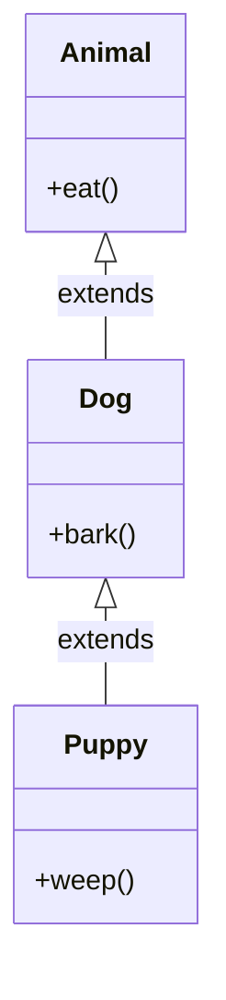

## Why it Matters

**Multilevel inheritance** chains inheritance: `Animal → Dog → Puppy`. `Puppy` inherits from `Dog`, which inherits from `Animal`. Each level can add **state** or **override** methods. Keep chains short , deep hierarchies become **fragile** when a middle class changes.

## Diagram



## Code

```java
class Animal {
 void eat() {
 System.out.println("eat");
 }
}

class Dog extends Animal {
 void bark() {
 System.out.println("bark");
 }
}

class Puppy extends Dog {
 void weep() {
 System.out.println("weep");
 }
}

Puppy p = new Puppy();
p.eat();
p.bark();
p.weep();
```

## When to use / not

- Use when each level is a genuine refinement of the level above (`Puppy` is a young `Dog`, `Dog` is an `Animal`).
- Use when a **template method** in the middle class should be specialisable one level down.
- NOT beyond 2-3 levels , an edit to a middle class ripples to every descendant and is hard to trace.
- NOT when only code reuse is wanted , prefer **composition**; a chain is compile-time coupling you cannot swap at runtime.

## Trade-offs

| Aspect | Multilevel | Composition chain |
|---|---|---|
| Shape | vertical, `A → B → C` | horizontal, delegates behind fields |
| Ripple of a middle change | every descendant recompiles/retests | one collaborator |
| Runtime flexibility | fixed at compile time | swap any delegate at runtime |
| Rule | keep to 2-3 levels, true is-a only | default when reuse is the only motive |

## Pitfalls

- Chains deeper than 2-3 levels , middle-class edits ripple unpredictably (**fragile base class**).

What is multilevel inheritance?:: A chain where a class inherits from a class that inherits from another, like Puppy extends Dog extends Animal. #flashcard

## Interview q&a

**Q: What is multilevel inheritance?**
A: A class inherits from a class that itself inherits from another class, forming a **chain**.

## Related

- [[02_OOP/Inheritance\|Inheritance]] • [[02_OOP/Inheritance/Hierarchical Inheritance\|Hierarchical Inheritance]] • [[02_OOP/SOLID-Liskov-Substitution\|Liskov Substitution]]

---
*Category: Java/02_OOP*

# Multilevel Inheritance

> Part of [[02_OOP/Inheritance\|Inheritance]] • `Java/02_OOP`

## Vs , Multilevel vs Multiple

- **Multilevel**: one parent per class, chained , **legal in Java**, grows downward.
- **Multiple**: one child with several parents , **forbidden for classes** in Java (diamond problem); only **interfaces** allow it.

Both answer "how do I combine behaviour from more than one source?" , multilevel stacks it, multiple (via interfaces) mixes roles side by side.
