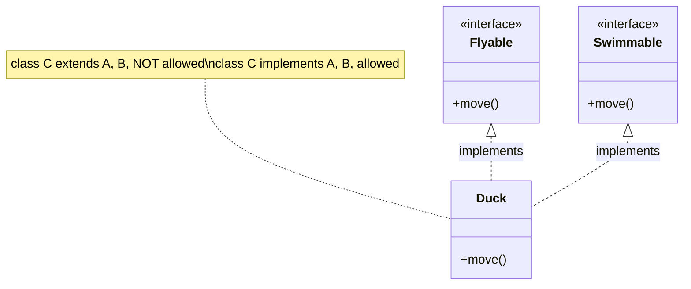

## Why it Matters

**Multiple inheritance** means one class inherits from more than one **superclass**. Java does **not** allow multiple class inheritance with `extends` because of the **diamond problem** , two parents providing the same method.

Java allows multiple inheritance of **type** through **interfaces**: a class can implement many interfaces, and interfaces can provide `default` methods. If defaults clash, the class must **resolve the conflict** explicitly.

## Diagram



## Code

```java
interface Flyable {
 default void move() {
 System.out.println("fly");
 }
}

interface Swimmable {
 default void move() {
 System.out.println("swim");
 }
}

class Duck implements Flyable, Swimmable {
 @Override
 public void move() {
 Flyable.super.move(); // resolve conflict explicitly
 }
}

Duck d = new Duck();
d.move();
```
> If you need to share code from multiple sources, prefer **composition** and delegate to helper objects.

## When to use / not

- Use when one type legitimately holds several independent **roles** , `Duck implements Flyable, Swimmable`.
- Use **role interfaces** (small, cohesive) so each capability is separable and mockable ([[02_OOP/SOLID-Interface-Segregation\|ISP]]).
- NOT to reuse code from multiple parents , share behaviour by **composing** helper objects and delegating.
- NOT when the roles are unrelated to the class's core identity , the contract becomes unreadable and the type dilutes.

## Trade-offs

| Aspect | Multiple via interfaces | Multiple via classes |
|---|---|---|
| State | none (constants only) | inherited fields from N parents |
| Ambiguity | compiler-enforced resolution | **diamond problem** |
| Java support | **allowed** | **forbidden** |
| Rule | one role per interface | not an option , use composition for code |

## Pitfalls

- Collecting unrelated `default` methods into one class , split **roles** into separate interfaces (see [[02_OOP/SOLID-Interface-Segregation\|ISP]]).

Why does Java not allow multiple class inheritance?:: To avoid the diamond problem and method ambiguity. #flashcard
How do you resolve conflicting default methods from two interfaces?:: Override the method and call InterfaceName.super.method(). #flashcard

## Interview q&a

**Q1: Why does Java not allow multiple class inheritance?**
A: To avoid ambiguity and the diamond problem. Interfaces give multiple inheritance of type with explicit conflict resolution.

**Q2: How do you handle conflicting default methods?**
A: **Override** the method in the implementing class and choose which super to call, like `InterfaceName.super.method()`.

## Related

- [[02_OOP/Inheritance\|Inheritance]] • [[02_OOP/Inheritance/Hybrid Inheritance\|Hybrid Inheritance]] • [[02_OOP/Interfaces\|Interfaces]]

---
*Category: Java/02_OOP*

# Multiple Inheritance

> Part of [[02_OOP/Inheritance\|Inheritance]] • `Java/02_OOP`

## Vs , Multiple Inheritance vs Multiple Interface Implementation

- **Multiple inheritance** (general term, classes): inherit state **and** behaviour from several parents , ambiguous; Java says no.
- **Multiple interface implementation** (Java's answer): inherit **contracts** only , no state, no diamond; conflicts resolved with `InterfaceName.super.method()`.

Java keeps the benefit (a type with many capabilities) and drops the cost (state ambiguity): **multiple inheritance of type, not of implementation**.
