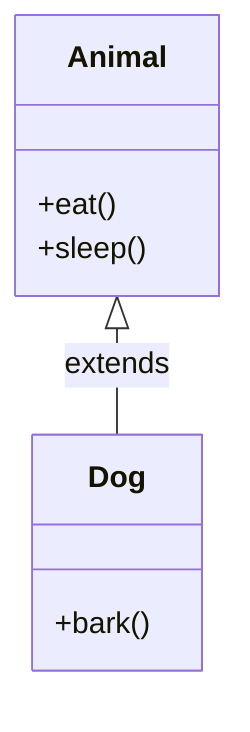

## Why it Matters

**Single inheritance** is one **subclass** inheriting from one **superclass** , the simplest form. Use it when the **is-a** relation is clear and you need to add or refine behaviour. Keep the hierarchy shallow.

## Diagram



## Code

```java
class Animal {
 void eat() {
 System.out.println("eat");
 }
}

class Dog extends Animal {
 void bark() {
 System.out.println("bark");
 }
}

Dog d = new Dog();
d.eat();
d.bark();
Animal a = d; // Dog is an Animal
```

## When to use / not

- Use when one type genuinely refines another , `Dog` **is-an** `Animal` and adds `bark()`.
- Use for the first level of a hierarchy where the parent is stable and shared behaviour is real.
- NOT when the goal is pure code reuse with no is-a relation , [[02_OOP/Class-Relationships\|composition]] is looser and swappable.
- NOT past the first refinement level , depth buys fragility, not reuse.

## Trade-offs

| Aspect | Single inheritance | Composition (has-a) |
|---|---|---|
| Relation | **is-a** | uses-a |
| Coupling | tight , child sees parent internals | loose , delegate behind a field |
| Reuse | compile-time, fixed | runtime-swappable |
| Rule | true is-a + [[02_OOP/SOLID-Liskov-Substitution\|LSP]] | default for reuse |

## Pitfalls

- Going deeper than one level without need , prefer **composition** past the first refinement.

What is single inheritance?:: One subclass extends one superclass. #flashcard

## Interview q&a

**Q: What is single inheritance?**
A: One child class `extends` one parent class.

## Related

- [[02_OOP/Inheritance\|Inheritance]] • [[02_OOP/Inheritance/Multilevel Inheritance\|Multilevel Inheritance]] • [[02_OOP/Polymorphism\|Polymorphism]]

---
*Category: Java/02_OOP*

# Single Inheritance

> Part of [[02_OOP/Inheritance\|Inheritance]] • `Java/02_OOP`

## Vs , Single vs Multilevel vs Hierarchical

- **Single**: one parent, one child , the simplest, safest shape.
- **Multilevel**: the child itself becomes a parent , a chain, each link adds fragility.
- **Hierarchical**: one parent, many children , widens instead of deepening, easier to reason about.

Single is the Java default: a class `extends` exactly one class, so depth is the only way inheritance grows.
