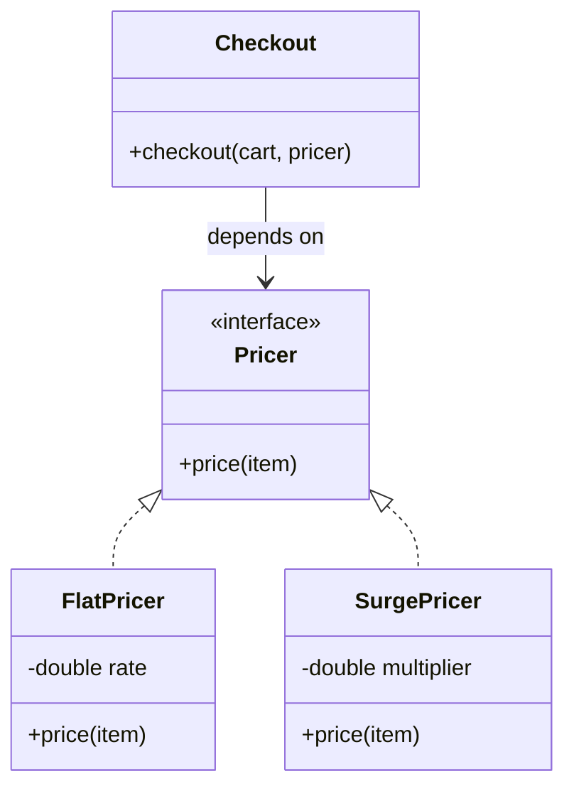

## Why it Matters

An **interface** is a **contract** for behavior: *what* an object can do, with zero commitment to *how*. It is the **seam** that makes Strategy, State, and **Dependency Inversion** possible , callers depend on the contract, providers plug in behind it.

## Diagram



## Code

```java
import java.util.*;

interface Pricer { // seam: callers never know the rule
 double price(String item);
}

record FlatPricer(double rate) implements Pricer {
 public double price(String item) {
 return rate;
 }
}

public class InterfacesDemo {
 // Depends on the contract, not the class.
 static double checkout(List<String> cart, Pricer p) {
 return cart.stream().mapToDouble(p::price).sum();
 }

 public static void main(String[] a) {
 System.out.println(checkout(List.of("idly", "coffee"), new FlatPricer(20.0))); // 40.0
 }
}
```

## When to use / not

- A class `implements` many **interfaces** but `extends` one class , composition of **types** without the diamond problem.
- Prefer `interface` + **records** for data carriers; `default` methods are for backward-compatible **evolution**, not dumping logic.
- Program to the interface at every seam (fields, params, returns) , `List`, not `ArrayList`.
- **Sealed interfaces** (`sealed interface X permits A, B`) close the set when exhaustive `switch` must catch every case.

## Trade-offs

| Mechanism | State | Implementations | Rule |
|---|---|---|---|
| **Interface** | none (constants only) | unlimited `implements` | default , pure **contract** |
| **Abstract class** | shared fields + ctor | single `extends` | subclasses share code + identity |
| **Sealed interface** | none | closed `permits` list | exhaustive dispatch must catch all |

## Pitfalls

- **Fat interfaces** forcing empty/throwing implementations , split by client need (see [[02_OOP/SOLID-Interface-Segregation\|ISP]]).
- `default` methods used as a dumping ground for logic implementors can't see.
- Depending on concrete classes at seams (`ArrayList` params) instead of the interface.

## Interview q&a

**Q1: Interface vs abstract class?**
A: Interface = pure contract, multiple allowed; abstract class = shared state + partial implementation, single inheritance. Default to interfaces; reach for abstract classes only when subclasses genuinely share code and identity.

**Q2: Why do LLD solutions start with interfaces?**
A: They name the varying **behavior** (pricing, eviction, dispatch) before any implementation exists , so new variants (see [[02_OOP/SOLID-Open-Closed\|Open-Closed]]) plug in without touching callers.

: Interface vs abstract class?:: A: Interface = pure contract, multiple allowed; abstract class = shared state + partial implementation, single inheritance. Default to interfaces; reach for abstract classes only when subclasses genuinely share code and identity. **Q2: Why do LLD solutions start with interfaces?** A: They name the varying **behavior** (pricing, eviction, dispatch) before any implementation exists , so new variants (see [[02_OOP/SOLID-Open-Closed\|Open-Closed]]... #flashcard

## Related

- [[02_OOP/SOLID-Open-Closed\|Open-Closed]] • [[02_OOP/SOLID-Dependency-Inversion\|Dependency Inversion]] • [[02_OOP/SOLID-Interface-Segregation\|Interface Segregation]] • [[02_OOP/Class-Relationships\|Class Relationships]] • [[02_OOP/Abstraction\|Abstraction]]

---
*Category: Java/02_OOP*

# Interfaces

> Part of [[README|Java MOC]] • `Java/02_OOP` • Course map: [AlgoMaster LLD](https://algomaster.io/learn/lld/course-introduction) fundamentals

## Vs , Interface vs Abstract Class

Interface = pure contract, multiple allowed; **abstract class** = shared state + partial implementation, single inheritance. Default to interfaces; reach for abstract classes only when subclasses genuinely share code and identity.
