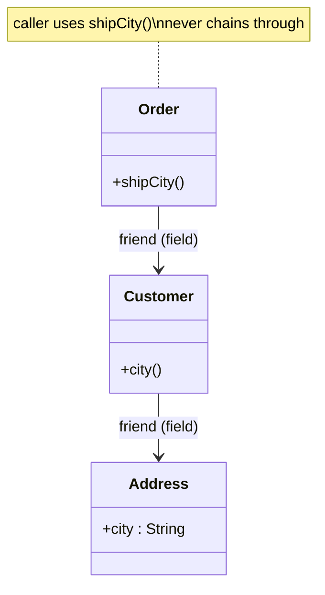

## Why it Matters

- The rule: inside method `m` of object `O`, call methods only on `O` itself, `O`'s fields, `m`'s parameters, and objects `m` instantiates. Anything else is a stranger.
- Train-wreck smell: `order.getCustomer().getAddress().getCity()` , a change to `Address` breaks code that never "knew" `Address` existed. Each dot in the chain is hidden coupling.
- Fix technique: *move the behavior to the data* , add `order.shipCity()` that delegates inward, so callers depend on one stable method, not three classes.
- Fluent builders / streams are NOT violations: `builder.setA().setB().build()` returns the same object each time (one friend, chained), not a walk through strangers. Demeter counts *types reached*, not dots.
- Don't over-apply: DTOs / value objects with getters (records, `Point(x, y)`) are data , reaching in is their purpose. Apply Demeter at behavior boundaries (services, domain objects), not inside pure data holders.
- **Why it matters.** fewer ripple breaks (change `Address` without touching order callers), narrower mocks in tests (mock one friend, not a chain), clearer ownership of behavior.
- **Common mistakes.** adding getters for everything then chaining through them; "fixing" by injecting the stranger directly (still coupling, just shorter); banning all chaining including same-object fluent APIs.
- **Self-check.** count the distinct types your method touches beyond friends , if a test needs `mock(getB()).getC()` stubbing, you've got a wreck.

## Diagram


*Wreck (`o.customer.address.city`) reaches through two strangers; the fix (`o.shipCity()`) talks to one friend.*

## Code

```java
// VIOLATION: train wreck reaches through two strangers. FIX below: tell, don't ask.
import java.util.*;
class Address { String city; Address(String c) { city = c; } }
class Customer { Address address; Customer(Address a) { address = a; } }
class Order {
 Customer customer; Order(Customer c) { customer = c; }
 String shipCity() { return customer.address.city; } // the fix lives here
}
class DemeterDemo {
 public static void main(String[] a) {
 Order o = new Order(new Customer(new Address("Bengaluru")));
 System.out.println(o.customer.address.city); // WRECK: knows Customer AND Address
 System.out.println(o.shipCity()); // FIX: knows only Order
 }
}
```

## When to use / not

- Use at **behaviour boundaries** , services and domain objects that decide or act.
- Use when a chain like `order.getCustomer().getAddress().getCity()` reaches through classes the caller never names , **move the behaviour to the data** (`order.shipCity()`).
- NOT for **DTOs / records / value objects** with getters (`Point(x, y)`) , they exist to be read; reaching in is their purpose.
- NOT for **fluent builders and streams** , `builder.setA().setB().build()` returns the same object each time (one friend, chained); Demeter counts *types reached*, not dots.

## Trade-offs

| Aspect | Tell, don't ask | Train wreck |
|---|---|---|
| Coupling | one friend's method | three classes' internals |
| Ripple of change | none for the caller | breaks code that never knew `Address` existed |
| Mocking in tests | mock one friend | stub a chain `mock(getB()).getC()` |
| Cost | a delegating method per use | none upfront |
| Rule | at behaviour boundaries | never for behavioural objects |

## Pitfalls

- Adding getters for everything and chaining through them , the wreck is still there, just shorter.
- "Fixing" by injecting the **stranger directly** , same coupling, moved one hop.
- Banning **all** chaining including same-object fluent APIs (builders, streams) , over-application that costs readability.
- Treating anemic DTOs as violations , data holders exist to be read; the law targets *behavioural* objects.

## Interview q&a

**Q1: "Isn't `order.getCustomer().getAddress()` sometimes fine?"**
A: For anemic DTOs / records , yes, data holders exist to be read. The Law targets *behavioral* objects: if you find yourself chaining to *decide or act* (`...getDiscount().apply(...)`), move that decision into the object that owns the data instead.

**Q2: How does this relate to [[SOLID-Dependency-Inversion|DIP]] and [[SOLID-Single-Responsibility|SRP]]?**
A: Same direction: depend on narrow stable interfaces, not deep object graphs. Demeter reduces *how far* you reach; DIP reduces *what* you depend on (abstraction over concrete); SRP keeps each friend small enough to be worth talking to. See [[SOLID-Summary]] for the conflict map.

: "Isn't `order.getCustomer().getAddress()` sometimes fine?"?:: A: For anemic DTOs / records , yes, data holders exist to be read. The Law targets *behavioral* objects: if you find yourself chaining to *decide or act* (`...getDiscount().apply(...)`), move that decision into the object that owns the data instead. **Q2: How does this relate to [[SOLID-Dependency-Inversion|DIP]] and [[SOLID-Single-Responsibility|SRP]]?** A: Same direction: depend on narrow stable interfaces, not deep object graphs. Demeter re... #flashcard

## Related

- [[SOLID-Summary]] • [[SOLID-Single-Responsibility]] • [[SOLID-Dependency-Inversion]]
- [[Pragmatic-Principles-DRY-YAGNI-KISS]] • [[Class-Relationships]] • [[Encapsulation]]

---
*Category: Java/02_OOP*

# Law of Demeter , Talk Only to Friends

> Part of [[README|Java MOC]] • `Java/02_OOP`

## Why

A method may call only its *friends*: itself, its fields, its parameters, and objects it creates. It must not reach *through* a friend to a stranger , `a.getB().getC().doX()` (a *train wreck*) couples you to three classes' internals instead of one. Tell, don't ask: ask the friend to do the work.

## Vs , law of Demeter vs Encapsulation

- **Encapsulation** hides an object's **own state** behind private fields and methods.
- **Law of Demeter** limits how **far** a method reaches through the object graph.
- **DIP** limits **what** you depend on (abstraction over concrete).

Same direction: narrow, stable surfaces. Encapsulation builds the boundary; Demeter stops you from reaching across several at once.
