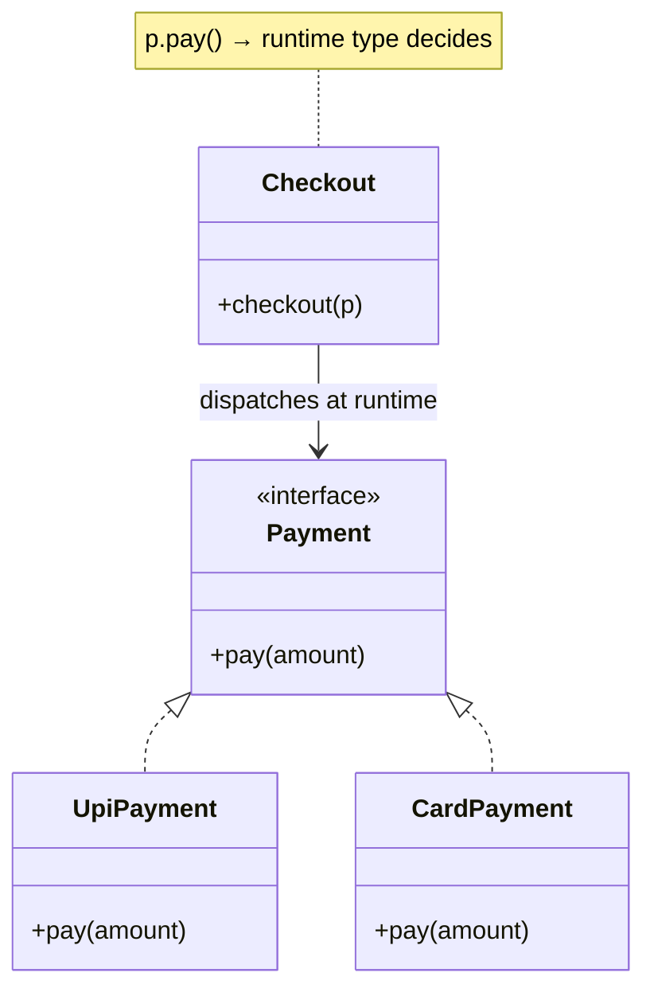

## Why it Matters

**Polymorphism** lets one **interface** have many **implementations**. The same call behaves differently depending on the actual object , so callers depend on a **supertype** and stay unaware of concrete types. New types plug in without changing existing code (**open-closed**).

Two forms in Java: **compile-time** polymorphism is **method overloading** (same name, different parameters, resolved by the compiler); **runtime** polymorphism is **method overriding** (subclass provides its own version, resolved at runtime via **dynamic dispatch**).

## Diagram


**Dispatch**: `checkout(Payment p) → p.pay()` binds to `UpiPayment.pay` or `CardPayment.pay` based on the **runtime type**, not the reference type.

## Code

Overriding , **runtime dispatch**:
```java
interface Payment {
 void pay(double amount);
}

class UpiPayment implements Payment {
 public void pay(double a) {
 System.out.println("UPI " + a);
 }
}

class CardPayment implements Payment {
 public void pay(double a) {
 System.out.println("card " + a);
 }
}

void checkout(Payment p) {
 p.pay(100); // same call, different behaviour
}

checkout(new UpiPayment());
checkout(new CardPayment());
```
Overloading , **compile time**:
```java
class Calculator {
 int add(int a, int b) {
 return a + b;
 }

 double add(double a, double b) {
 return a + b;
 }

 int add(int a, int b, int c) {
 return a + b + c;
 }
}
```
Modern dispatch with **sealed types** + **pattern switch**:
```java
sealed interface Shape permits Circle, Rectangle {}

record Circle(double r) implements Shape {}

record Rectangle(double l, double w) implements Shape {}

double area(Shape s) {
 return switch (s) {
 case Circle(double r) -> Math.PI * r * r;
 case Rectangle(double l, double w) -> l * w;
 };
}
```

## When to use / not

Use it when callers should depend on a supertype or interface and remain unaware of the concrete type. This supports the **open-closed principle**: add new types without changing existing code.

Avoid deep **override chains** that make behaviour hard to trace, and avoid **overloading** with ambiguous signatures.

## Trade-offs

| Form | Binding | Decides | Rule |
|---|---|---|---|
| **Overloading** | compile time | parameter list | return type irrelevant; avoid ambiguous signatures |
| **Overriding** | runtime (**dynamic dispatch**) | object's **runtime type** | same signature, `@Override`, **covariant** return OK, never reduce visibility, respect [[02_OOP/SOLID-Liskov-Substitution\|LSP]] |

## Pitfalls

- Overriding without `@Override` , typos silently become overloads.
- Ambiguous **overloads** (e.g. `add(null)`) that confuse the compiler and readers.
- Deep override chains where behaviour is untraceable; prefer **composition** + **strategy**.

What are the two kinds of polymorphism in Java?:: Overloading at compile time and overriding at runtime. #flashcard
How does overriding work?:: A subclass redefines a method with the same signature, the call dispatches to the runtime type. #flashcard
Can you override a static method?:: No, it is method hiding, the reference type decides. #flashcard
What is the difference between overloading and overriding?:: Overloading is same name different params in one class at compile time, overriding is same signature in a subclass at runtime. #flashcard

## Interview q&a

**Q1: What are the two types of polymorphism in Java?**
A: Compile time via overloading, runtime via overriding.

**Q2: Can you override a static or private method?**
A: No. **Static** methods are hidden, not overridden. **Private** methods are invisible to subclasses.

**Q3: What decides which overridden method runs?**
A: The runtime type of the object, not the reference type.

## Related

- [[02_OOP/Inheritance\|Inheritance]] • [[02_OOP/Abstraction\|Abstraction]] • [[02_OOP/Interfaces\|Interfaces]]
- [[02_OOP/SOLID-Open-Closed\|Open-Closed]] • [[02_OOP/SOLID-Liskov-Substitution\|Liskov Substitution]]

---
*Category: Java/02_OOP*

# Polymorphism

> Part of [[README|Java MOC]] • `Java/02_OOP`

## Vs , Overloading vs Overriding

- **Overloading** (compile-time polymorphism): same method **name**, different **parameter list**, in one class; the compiler picks the signature; return type is irrelevant.
- **Overriding** (runtime polymorphism): subclass redefines the **same signature**; dispatch picks the implementation by the object's **runtime type**; needs `@Override`, covariant return OK, visibility can't shrink.

Static methods are **hidden**, not overridden , the reference type decides. Overloading is convenience; overriding is the mechanism behind dynamic dispatch, [[02_OOP/SOLID-Open-Closed\|OCP]], and [[02_OOP/SOLID-Liskov-Substitution\|LSP]].
