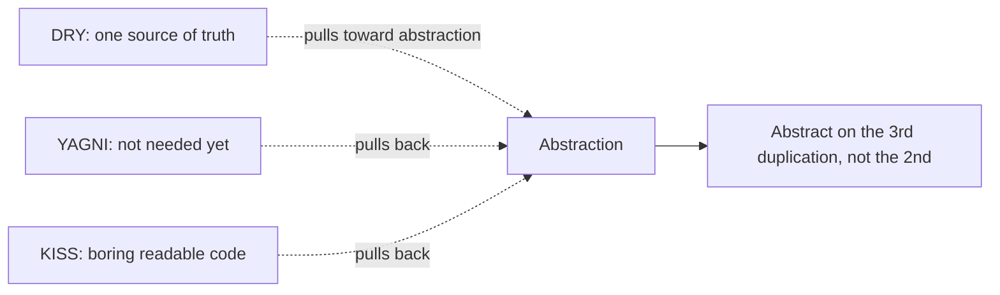

## Why it Matters

- DRY (Don't Repeat Yourself): duplicate *knowledge* (validation rule, rate formula), not duplicate *text* , coincidental similarity should stay separate until the third occurrence (Rule of Three).
- YAGNI (You Aren't Gonna Need It): unrequested flexibility (config flags, plugin hooks, generic frameworks for one caller) is a liability, not an asset. Delete speculative code.
- KISS (Keep It Simple): prefer early returns and flat code over clever streams/nesting; optimise for the reader, not the writer.
- Tension map: DRY pulls toward abstraction, YAGNI/KISS pull back , abstract on the third duplication, not the second.

## Diagram



## Code

```java
// Three violation->fix micro-examples. Run: java PragmaticDemo.java
// --- DRY: two copies of the same discount rule -> one method ---
// VIOLATION: price1 = amt > 1000 ? amt*0.9 : amt; price2 = amt > 1000 ? amt*0.9 : amt;
// FIX:
double discount(double amt) { return amt > 1000 ? amt * 0.9 : amt; }
// --- YAGNI: speculative generic engine -> delete, hardcode the one case ---
// VIOLATION: class RuleEngine<T> { void register(String n, Function<T,T> r){...} } // one caller, zero reuse
// FIX: just the method the ticket asked for:
int shipping(int km) { return km < 5 ? 0 : 49; }
// --- KISS: nested cleverness -> flat early returns ---
// VIOLATION: if (u != null) { if (u.active()) { if (u.balance() > 0) { ... } } }
// FIX:
String status(boolean exists, boolean active, int bal) {
 if (!exists) return "no-user";
 if (!active) return "inactive";
 return bal > 0 ? "ok" : "empty";
}
void main() {
 System.out.println(discount(2000)); // 1800.0 (single source of truth)
 System.out.println(shipping(3)); // 0 (no engine needed)
 System.out.println(status(true, true, 10)); // ok (flat, readable)
}
```

## When to use / not

- Use **DRY** when the same **knowledge** changes on one axis in several places (the validation rule, the rate formula).
- Use **YAGNI** as the default: build only what the current ticket needs; delete speculative flags, hooks, and generic engines.
- Use **KISS** for control flow: early returns and flat code beat clever nesting and dense streams.
- NOT when two copies change for **different reasons** , merging them creates false coupling where one ticket breaks the other.
- NOT when the duplication is coincidental , wait for the **third** occurrence (Rule of Three) before abstracting.

## Trade-offs

| Principle | Over-doing it | Under-doing it | Balance |
|---|---|---|---|
| **DRY** | premature abstraction, one change breaks many callers | copy-paste drift, fix-in-N-places | abstract on the **3rd** occurrence |
| **YAGNI** | never invest, big-ball-of-mud | speculative frameworks | build today's need; keep seams cheap |
| **KISS** | dumbed-down, no structure | clever one-liners nobody can read | optimise for the **reader** |

## Pitfalls

- **DRY**: merging copies that change for different reasons , false coupling, one ticket breaks the other.
- **DRY**: extracting "reusable" helpers called by exactly one caller , indirection with no reuse.
- **YAGNI**: reading it as "never plan" , capacity, security, and migration work is not YAGNI.
- **KISS**: confusing simple with **simplistic** , deleting structure that later change actually needs.

## Interview q&a

**Q1: "When is duplication better than DRY?"**
A: When the two copies change for different reasons (different domains, different owners) , merging them creates false coupling where one ticket breaks the other. DRY targets shared *knowledge with a shared change-axis*; wait for the third occurrence to confirm the axis is real.

**Q2: How do YAGNI and [[SOLID-Open-Closed|OCP]] coexist , one says don't build, the other says build extensible?**
A: YAGNI governs *what* to build (only today's requirement); OCP governs *how* to shape what you build (seams at genuine volatility). Write the simple code now, but keep methods small and dependencies behind interfaces so extension is cheap later , reversible decisions, not speculative frameworks.

: "When is duplication better than DRY?"?:: A: When the two copies change for different reasons (different domains, different owners) , merging them creates false coupling where one ticket breaks the other. DRY targets shared *knowledge with a shared change-axis*; wait for the third occurrence to confirm the axis is real. **Q2: How do YAGNI and [[SOLID-Open-Closed|OCP]] coexist , one says don't build, the other says build extensible?** A: YAGNI governs *what* to build (only today's requ... #flashcard

## Related

- [[SOLID-Single-Responsibility]] • [[SOLID-Open-Closed]] • [[SOLID-Interface-Segregation]] • [[SOLID-Dependency-Inversion]]
- [[Class-Relationships]] • [[02_OOP/00 - OOP Overview|OOP Overview]]
- [[06_Design-Patterns/Behavioral/Strategy|Strategy]] • [[06_Design-Patterns/Creational/Builder|Builder]]

---
*Category: Java/02_OOP*

# Pragmatic Principles , DRY, YAGNI, KISS

> Part of [[README|Java MOC]] • `Java/02_OOP`

## Why

**SOLID** tells you how to shape code; **DRY**/**YAGNI**/**KISS** tell you when to stop. DRY: every rule lives in one place. YAGNI: don't build what no ticket needs. KISS: the boring readable solution wins.

## Vs , dry vs YAGNI vs KISS

- **DRY** , every piece of **knowledge** has a single source; duplicates that share a change-axis get merged.
- **YAGNI** , don't build what no ticket needs; unrequested flexibility is a **liability**, not an asset.
- **KISS** , the boring, readable solution wins; prefer flat code and early returns over clever nesting.

**DRY** pulls toward abstraction; **YAGNI** and **KISS** pull back , the equilibrium is "abstract on the third duplication, not the second".
