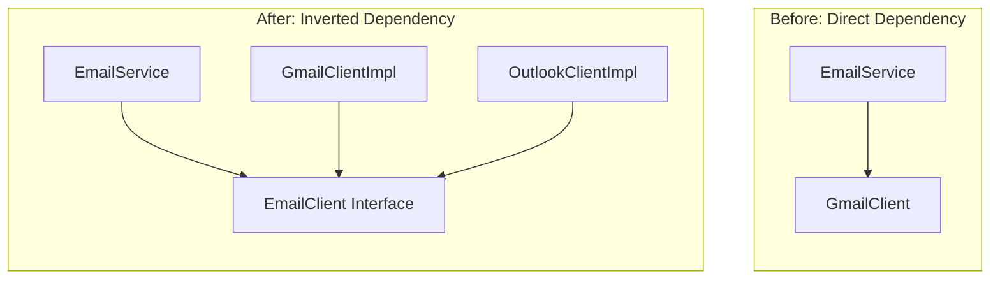

## Why it Matters

- The two rules, verbatim: (1) high-level modules should not depend on low-level modules , both should depend on abstractions; (2) abstractions should not depend on details , details should depend on abstractions.
- What's actually inverted: source-code dependency direction , the client defines the contract (`EmailClient`/`Notifier`) and implementations plug in, even though runtime control flow still runs high → low.
- Fix shape: define contract → implement per provider → inject into high-level module (DI); `main`/composition root wires the concrete choice.
- Interface lives with the CLIENT (same package as `EmailService`/`Checkout`), never in low-level territory , details adapt to policy, not vice versa.
- Why it matters: decoupling (policy survives provider churn) • extensibility (new provider = one new class, zero business-logic edits) • testability (swap in mocks/fakes) • maintainability (change lives in one wiring spot) • parallel teams (policy and providers evolve independently).
- More files is fine , the payoff (swap/test/independence) outweighs the extra interface + class cost.

## Diagram


*Source: [DIP chapter](https://algomaster.io/learn/lld/dip) , the arrow flips from implementation to abstraction.*
## Code

```java
// VIOLATION (commented): class Checkout { private final SmtpMailer m = new SmtpMailer(); } -> can't test, can't swap gateway.
// FIX: depend on Notifier, inject it. Run: java DipDemo.java
interface Notifier { void send(String to, String msg); }
class SmsNotifier implements Notifier {
 public void send(String to, String msg) { System.out.println("SMS to " + to + ": " + msg); }
}
class FakeNotifier implements Notifier { // test double
 String last;
 public void send(String to, String msg) { last = to + "|" + msg; }
}
class Checkout {
 private final Notifier notifier;
 Checkout(Notifier n) { this.notifier = n; } // inversion: Checkout owns the need
 void placeOrder(String user) { notifier.send(user, "order confirmed"); }
}
void main() {
 var fake = new FakeNotifier();
 new Checkout(fake).placeOrder("asha"); System.out.println("captured: " + fake.last);
 new Checkout(new SmsNotifier()).placeOrder("asha"); // real path, no Checkout change
}
```

## When to use / not

- Use at **volatility boundaries** , database, clock, network, external providers, payment gateways , anything that churns or must be faked in tests.
- Use when the high-level policy must survive swapping a low-level provider with one wiring-line change.
- NOT for stable **JDK types** (`ArrayList`, `String`) and leaf **value objects** , inverting them adds indirection with no payoff.
- NOT when only one implementation exists and no test-double is in sight , that interface is speculative (YAGNI).

## Trade-offs

| Aspect | Inverted (DIP) | Direct (`new` inside) |
|---|---|---|
| Swap provider | one wiring line | surgery on business logic |
| Testing | inject a fake | must boot the real resource |
| Coupling | policy owns the contract | policy depends on concretions |
| Cost | more types + a composition root | none upfront |
| Rule | at volatility boundaries | for stable, local, leaf types |

## Pitfalls

- **Single-implementation abstraction** with no second provider or test-double in sight , skip the interface.
- Interface owned by the **low-level package** , leaks provider quirks upward; the client must own the contract.
- Confusing DIP with a **DI framework** , a container wiring concretions is not inversion by itself.
- **Field injection** by default , hides dependencies and allows half-built objects; prefer **constructor injection** for `final` fields.

## Interview q&a

**Q1: DI framework (Spring/Guice) vs manual constructor injection , when which?**
A: Manual injection wins for small codebases, libraries, and tests: explicit wiring, no magic, fast startup. Frameworks pay off at scale , large object graphs, scopes/lifecycles, AOP transactions. Either way the principle is identical: constructors take interfaces, the composition root picks implementations. Don't add Spring just to avoid `new`.

**Q2: Is DIP just "use interfaces everywhere"?**
A: No , it's about *direction* of dependency. The interface is owned by the high-level policy (`Checkout` needs "a way to notify"), and details adapt to it. An interface extracted from `SmtpMailer` that mirrors SMTP quirks still couples you to SMTP. Invert first, abstract second.

**Q3: Constructor vs field injection , which and why?**
A: Constructor injection: `final` field, required dependency explicit in the signature, object always valid after construction, trivially testable (`new Checkout(fake)`). Field injection (`@Autowired` on a private field) hides the dependency, allows half-built objects, and forces reflection in tests. Prefer constructor injection; reserve field/setter injection for optional or framework-reconstituted dependencies.

: DI framework (Spring/Guice) vs manual constructor injection , when which?:: A: Manual injection wins for small codebases, libraries, and tests: explicit wiring, no magic, fast startup. Frameworks pay off at scale , large object graphs, scopes/lifecycles, AOP transactions. Either way the principle is identical: constructors take interfaces, the composition root picks implementations. Don't add Spring just to avoid `new`. **Q2: Is DIP just "use interfaces everywhere"?** A: No , it's about *direction* of dependency. The... #flashcard

## Related

- [[SOLID-Interface-Segregation]] • [[SOLID-Open-Closed]] • [[SOLID-Single-Responsibility]]
- [[06_Design-Patterns/Extra/Dependency Injection Pattern|Dependency Injection Pattern]] • [[06_Design-Patterns/Behavioral/Strategy|Strategy]] • [[06_Design-Patterns/Behavioral/Observer|Observer]]
- [[Class-Relationships]] • [[02_OOP/00 - OOP Overview|OOP Overview]]

---
*Category: Java/02_OOP*

# SOLID , Dependency Inversion Principle

> Part of [[README|Java MOC]] • `Java/02_OOP`

## Why

**Course narrative**: `EmailService` (**high-level**) `new`s `GmailClient` (**low-level**) , switching to Outlook/SendGrid means surgery on business logic. Fix: `EmailService` depends on an `EmailClient` **abstraction** it owns; providers plug in; swapping is one wiring-line change. **Depend on abstractions, not concretions** , **inject** the dependency, don't `new` it inside.

## Common Mistakes / When not to use

- Single-implementation abstraction with no second provider/test-double in sight , skip the interface; YAGNI.
- Interface owned by the low-level package (e.g. `gmail` package defines the contract) , leaks provider quirks upward; the client must own it.
- Confusing DIP with DI-framework usage , DI (manual or Spring/Guice) is the mechanism, DIP is the principle; a framework doesn't buy you inversion by itself.
- DIP vs IoC in one line: IoC is the big idea (framework/code calls you, control is handed over); DIP is one implementation of it (depend on abstractions the client owns).

## Self-check

- Can you swap the provider by changing one wiring line (composition root only, zero business-logic edits)? If not, you're still `new`-ing a concretion somewhere.

## Vs , dip vs di vs ioc

- **IoC**: the big idea , control is handed over; a framework calls your code instead of your code calling it (event loops, callbacks).
- **DIP**: the principle , high and low level both depend on **abstractions** the high level owns; dependency direction is inverted.
- **DI**: the **mechanism** , inject implementations (constructor/setter/field) rather than `new`-ing them inside.

You can use Spring (DI/IoC) and still not invert anything if the interface mirrors SMTP quirks , **invert first, abstract second**.
