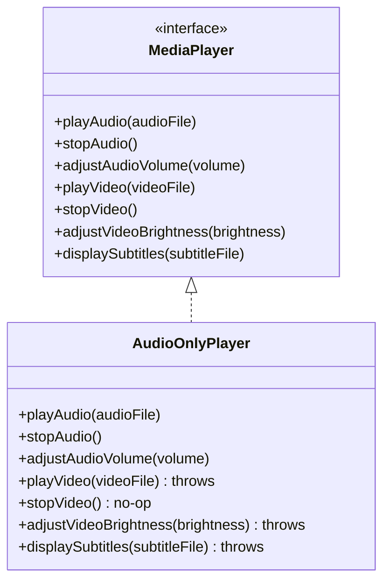

## Why it Matters

- Course narrative: fat `MediaPlayer` (~7 methods , play/stop audio + play video + subtitles + brightness…) forces `AudioOnlyPlayer` into empty methods / `throw new UnsupportedOperationException()`. That is **interface pollution**. Fragility: adding one method (e.g. `enablePictureInPicture()`) breaks *every* implementer.
- Fix: split by client need (`AudioPlayer`, `VideoPlayer`); one class composes roles , `CombinedPlayer implements AudioPlayer, VideoPlayer` (course extends this: `LoadableMedia + PlaybackControls + VolumeControl` on a single class is a feature, not a smell).
- Why it matters: **cohesion** (each interface one role); **flexibility/reusability** (mix-and-match roles); **readability** (small API surface); **testability** (mock 3 methods, not 15); **no forced LSP breaks** (no stub-throws to violate substitutability).
- Existing pain in one line: `Robot implements Worker { eat() { throw … } }`; `default` methods soften but don't fix it , clients still couple to irrelevant API. ISP pairs with DIP: depend on the narrowest interface you actually need.
- Common mistakes: one giant `Service`/`Manager` interface; splitting by *implementation* instead of by *client need*; an interface with 1 impl + 15 methods nobody calls (dead surface nobody dares remove).
- ISP → LSP: fat interfaces force the throws that break substitutability. Self-check: **does any implementer throw or leave a method empty?** , split there. Refactor legacy the moment you see empty-method implementations.

## Diagram


*Source: [ISP chapter](https://algomaster.io/learn/lld/isp) , the fat interface; fix splits it into audio/video/subtitle roles.*
## Code

```java
// VIOLATION (commented): interface Worker { void work(); void eat(); } -> Robot.eat() { throw new UnsupportedOperationException(); }
// FIX: role interfaces. Run: java IspDemo.java
import java.util.*;
interface Workable { void work(); }
interface Eatable { void eat(); }
class Human implements Workable, Eatable {
 public void work() { System.out.println("human works"); }
 public void eat() { System.out.println("human eats"); }
}
class Robot implements Workable {
 public void work() { System.out.println("robot works"); }
}
void main() {
 List<Workable> crew = List.of(new Human(), new Robot());
 crew.forEach(Workable::work); // both work, nobody forced to eat
 new Human().eat(); // only eaters see eat()
}
```

## When to use / not

- Use when implementers write **empty or throwing** stubs , that method does not belong on their interface.
- Use when different **client groups** use disjoint subsets of one interface , split per client need.
- NOT when all implementers genuinely honour every method and clients use most (e.g. `List`) , one interface is fine.
- NOT when splitting is by **implementation** instead of by client need , that creates accidental interfaces.

## Trade-offs

| Aspect | Small role interfaces | One fat interface |
|---|---|---|
| Adding a method | touches one role | edits every implementer |
| Mocking in tests | stub 3 methods | stub 15 |
| Reusability | mix-and-match roles | all-or-nothing |
| Cost | more types | one place, brittle |
| Rule | split on empty/throwing implementations | keep when everyone uses everything |

## Pitfalls

- **Fat interfaces** (`MediaPlayer` with audio + video + subtitles) forcing `AudioOnlyPlayer` into throws/no-ops.
- Splitting by **implementation** instead of by **client need** , accidental interfaces nobody can reuse.
- An interface with 1 implementation and 15 methods nobody calls , dead surface nobody dares remove.
- Treating `default` methods as a fix , they soften but don't remove the coupling clients still see.

## Interview q&a

**Q1: What is fat-interface pain, concretely?**
A: Implementers write `throw new UnsupportedOperationException()` stubs; adding one method forces edits in dozens of unrelated classes; unit tests mock methods nobody calls; a change for robot clients rebuilds/retests human-only code. Small role interfaces confine each blast radius.

**Q2: Isn't ISP just "many tiny interfaces"? When is one interface fine?**
A: When all implementers genuinely honour every method and all clients use most of them (e.g. `List`). Split when you see empty/throwing implementations or client groups using disjoint subsets , that's the signal, not interface size alone.

: What is fat-interface pain, concretely?:: A: Implementers write `throw new UnsupportedOperationException()` stubs; adding one method forces edits in dozens of unrelated classes; unit tests mock methods nobody calls; a change for robot clients rebuilds/retests human-only code. Small role interfaces confine each blast radius. **Q2: Isn't ISP just "many tiny interfaces"? When is one interface fine?** A: When all implementers genuinely honour every method and all clients use most of them... #flashcard

## Related

- [[SOLID-Dependency-Inversion]] • [[SOLID-Single-Responsibility]] • [[SOLID-Liskov-Substitution]]
- [[02_OOP/Abstraction|Abstraction]] • [[Class-Relationships]]
- [[06_Design-Patterns/Structural/Adapter|Adapter]] • [[06_Design-Patterns/Structural/Facade|Facade]] • [[06_Design-Patterns/Behavioral/Observer|Observer]]

---
*Category: Java/02_OOP*

# SOLID , Interface Segregation Principle

> Part of [[README|Java MOC]] • `Java/02_OOP`

## Why

"Clients should not be forced to depend on methods they do not use." Prefer several small role interfaces over one fat interface that forces no-op / throw-implementations.

## Vs , isp vs lsp

- **ISP**: clients should not depend on methods they do not **use** , split fat interfaces into roles.
- **LSP**: subtypes must not break the base **contract** , no forced stub-throws.

ISP **prevents** the LSP breaks: the fat interface is what forces the `throw new UnsupportedOperationException()` that violates substitutability.
