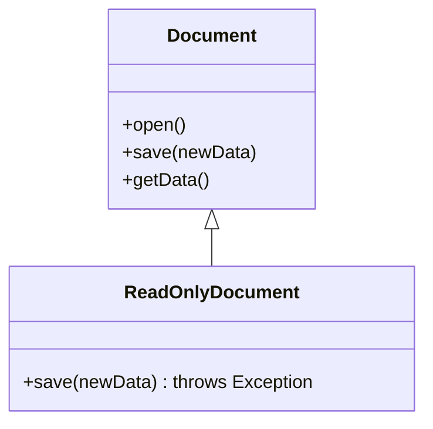
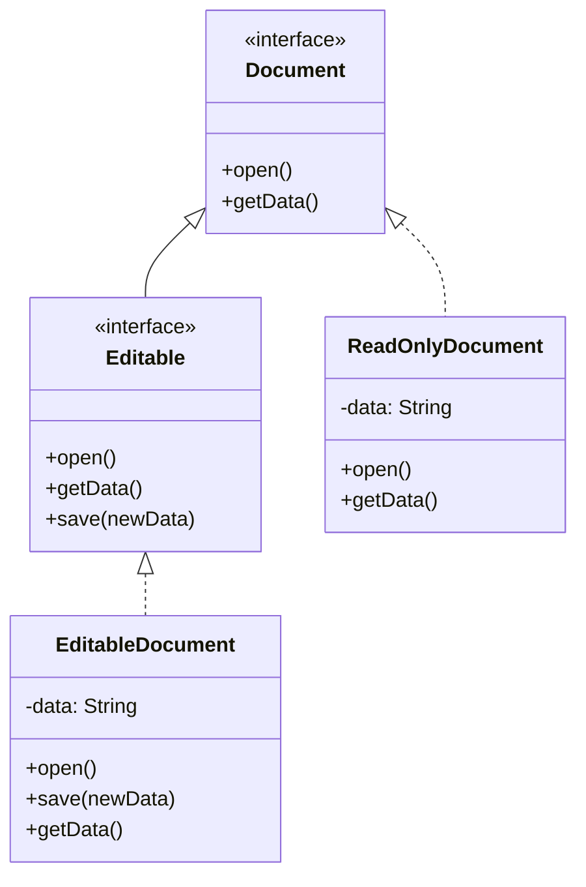

## Why it Matters

- The Problem: base `Document` promises `save()`; new `ReadOnlyDocument extends Document` overrides `save()` to throw. `DocumentProcessor` takes any `Document` and calls `save()` , blows up at runtime on the read-only subtype. Base class promised too much; fix is to split readable vs writable contracts.
- Red flags: (1) override-to-throw , subtype method throws where base never did; (2) `instanceof` checks in client code to recover behaviour (abstraction-leak smell).
- Formal rule (Barbara Liskov, 1987): "If S is a subtype of T, then objects of type T may be replaced with objects of type S without altering any of the desirable properties of the program." Plain English: client code using the base type must keep working, unchanged, with any subtype.
- Why it matters: (1) reliability , substitutable subtypes keep behaviour predictable; (2) no conditionals , clients call the base API, no `instanceof` branches; (3) maintainability , new subtypes slot in without editing clients; (4) true polymorphism , dispatch, not type-switching; (5) test reuse , base-type tests pass for every subtype.
- Classic violation: `Square extends Rectangle` overriding setters so `setWidth` also changes height , area math in existing clients silently breaks.
- Fix: don't force a false "is-a"; model `Square` and `Rectangle` as siblings behind a `Shape` interface.
- Contract checklist: contravariant args (accept at least what base accepts), covariant returns OK, preserve invariants, don't throw new checked exceptions.
- Common mistakes: (1) Square-Rectangle setter strengthening (coupling width/height the base left independent); (2) throwing `UnsupportedOperationException` from an override (e.g. read-only `save()`); (3) strengthening preconditions / weakening postconditions in an override (demanding more, delivering less).
- Self-check: can client code drop the `instanceof` and still be correct for every subtype?

## Diagram

*Violation — `save()` throws, processor explodes:*


*Fix — split the contract so every subtype is substitutable:*

*Source: [LSP chapter](https://algomaster.io/learn/lld/lsp).*
## Code

```java
// VIOLATION (commented): class Square extends Rectangle { setWidth(w){ super.setWidth(w); super.setHeight(w); } } -> area test expecting 20 gets 25.
// FIX: siblings behind Shape. Run: java LspDemo.java
interface Shape { double area(); }
record Rectangle(double w, double h) implements Shape { public double area() { return w * h; } }
record Square(double side) implements Shape { public double area() { return side * side; } }
double total(Shape[] ss) { double t = 0; for (var s : ss) t += s.area(); return t; }
void main() {
 Shape[] shapes = { new Rectangle(4, 5), new Square(5) }; // 20 + 25
 System.out.println(total(shapes)); // 45.0 — any Shape works, no instanceof
}
```

## When to use / not

- Use to decide **inheritance vs composition** before writing `extends` , if it can't substitute, don't inherit.
- Use when base-type code, tests, and collections must work unchanged for every new subtype.
- NOT when the subtype needs to **strengthen preconditions**, **weaken postconditions**, or throw where the base never did , model it as a sibling or a role interface instead.
- NOT when a "subclass" is really a **has-a** in disguise , delegate via composition.

## Trade-offs

| Aspect | True is-a (LSP-safe) | Composition fallback |
|---|---|---|
| Substitutability | guaranteed, no `instanceof` | not needed, delegate is hidden |
| Reuse | inherited, tight coupling | delegated, loose coupling |
| New subtype | slots in, clients unchanged | new delegate + one wiring change |
| Rule | identical contract, same invariants | when contracts genuinely diverge |

## Pitfalls

- **Override-to-throw** , `ReadOnlyDocument.save()` throws where base never did; split readable vs writable contracts.
- **Square-Rectangle** , coupling width/height the base left independent; silently breaks client area math.
- Strengthening preconditions / weakening postconditions in an override , demanding more, delivering less.
- `instanceof` in client code to recover subtype behaviour , the smell that the contract already broke.

## Interview q&a

**Q1: Explain the Square-Rectangle problem. Why does it violate LSP?**
A: Mathematically a square "is-a" rectangle, but behaviourally it isn't: `Rectangle` promises independent width/height, `Square` breaks that by coupling them. Client code doing `setWidth(4); setHeight(5); assert area == 20` fails with a `Square`. Fix by removing the inheritance , both implement `Shape`.

**Q2: How do you check LSP in a code review?**
A: (1) Substitute test: would all existing base-type tests pass with the subtype? (2) No new preconditions (`Objects.requireNonNull` where base allowed null), no weakened outputs, no new throws. (3) No `instanceof` in clients to recover behaviour , that's the compiler telling you the contract broke.

: Explain the Square-Rectangle problem. Why does it violate LSP?:: A: Mathematically a square "is-a" rectangle, but behaviourally it isn't: `Rectangle` promises independent width/height, `Square` breaks that by coupling them. Client code doing `setWidth(4); setHeight(5); assert area == 20` fails with a `Square`. Fix by removing the inheritance , both implement `Shape`. **Q2: How do you check LSP in a code review?** A: (1) Substitute test: would all existing base-type tests pass with the subtype? (2) No new pr... #flashcard

## Related

- [[SOLID-Open-Closed]] • [[SOLID-Interface-Segregation]] • [[SOLID-Single-Responsibility]]
- [[02_OOP/Inheritance|Inheritance]] • [[02_OOP/Polymorphism|Polymorphism]] • [[Class-Relationships]]
- [[06_Design-Patterns/Behavioral/Template Method|Template Method]] • [[06_Design-Patterns/Behavioral/Strategy|Strategy]]

---
*Category: Java/02_OOP*

# SOLID , Liskov Substitution Principle

> Part of [[README|Java MOC]] • `Java/02_OOP`

## Why

**Subtypes** must be usable wherever their **base type** is expected, without breaking correctness: no **strengthened preconditions**, no **weakened postconditions**, no surprising **exceptions**.

## Vs , lsp vs ocp

- **LSP**: subtypes must not **break** the base contract , the constraint on what a subtype may do.
- **OCP**: add behaviour without **editing** existing code , the goal for extension.
- Inheritance chosen to satisfy OCP often **breaks LSP** (Square-Rectangle, read-only file): prefer composition + Strategy for OCP; reserve inheritance for true is-a with identical contracts.

Contract checklist for a safe subtype: **contravariant** parameters (accept at least what base accepts), **covariant** returns, preserve invariants, no new checked exceptions.
