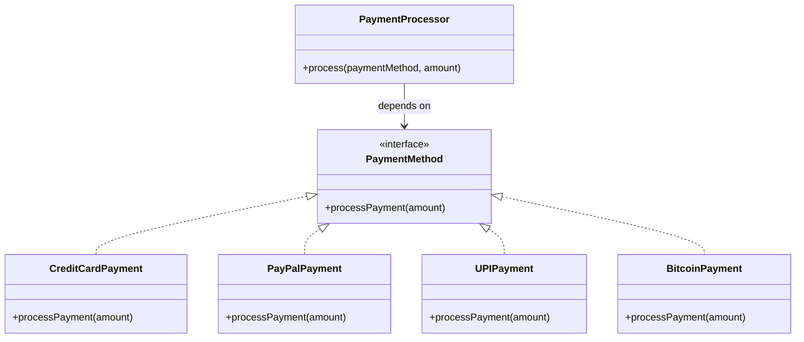

## Why it Matters

- Course danger quartet of cracking the class open each time: (1) bug injection into working methods, (2) full re-test on every change, (3) unreadable branch sprawl, (4) progressively harder scaling.
- Classic violation: `if (type == X) … else if (type == Y)` discount/shipping calculator edited for every new type.
- Fix tools: Strategy interface + registration map; polymorphism; `sealed` hierarchies with exhaustive `switch` (compiler tells you what's missing).
- Canonical fix: `PaymentProcessor` depends on a `PaymentMethod` interface , CreditCard/PayPal/UPI/Bitcoin are new classes; the processor never changes.
- `sealed` + `switch` still edits the switch per type , closed at the interface level, explicit at the dispatch site; prefer Strategy map when cases grow dynamically.
- OCP pairs with DIP: depend on the strategy interface, inject implementations.

## Diagram


*Source: [OCP chapter](https://algomaster.io/learn/lld/ocp) , adding Bitcoin = one new class, zero edits.*
## Code

```java
// VIOLATION (commented): double price(String t,double a){ if(t.equals("REG")) return a; if(t.equals("VIP")) return a*0.8; /* edit per type! */ return a; }
// FIX: add a type = add a class + one map line. Run: java OcpDemo.java
import java.util.*;
sealed interface Discount permits Regular, Vip, Student { double apply(double amt); }
record Regular() implements Discount { public double apply(double a) { return a; } }
record Vip() implements Discount { public double apply(double a) { return a * 0.8; } }
record Student() implements Discount { public double apply(double a) { return a * 0.9; } }
class Billing {
 private final Map<String, Discount> m = Map.of("REG", new Regular(), "VIP", new Vip(), "STU", new Student());
 double price(String type, double amt) { return m.getOrDefault(type, new Regular()).apply(amt); }
}
void main() {
 var b = new Billing();
 System.out.println(b.price("REG", 1000)); // 1000.0
 System.out.println(b.price("VIP", 1000)); // 800.0
 System.out.println(b.price("STU", 1000)); // 900.0
}
```

## When to use / not

- Use at **volatility hotspots** , pricing, shipping, validation rules, payment methods , where new variants arrive.
- Use when a new variant should mean **one new class + one registration line**, zero edits to working code.
- NOT for two cases that never change , a plain conditional is cheaper (see [[Pragmatic-Principles-DRY-YAGNI-KISS\|YAGNI]]).
- NOT when the axis of change is unknown , speculative strategy frameworks for imaginary variants are cost without benefit.

## Trade-offs

| Aspect | Strategy/sealed extension | Editing existing code |
|---|---|---|
| Adding a variant | new class, old code untouched | opens and re-tests working methods |
| Risk | none to tested paths | bug injection + branch sprawl |
| Cost | more types, indirection | none upfront, compounding debt |
| Rule | at real volatility hotspots | for stable, tiny case sets |

## Pitfalls

- **Switching on type** for real domain concepts instead of introducing an interface (`Discount`, `PaymentMethod`).
- Modifying tested code to bolt on variant N instead of adding a class + registration entry.
- **Speculative abstraction** , building the full strategy hierarchy before the second case exists.
- `sealed` + `switch` that still needs edits per type; prefer a **Strategy map** when cases grow dynamically.

## Interview q&a

**Q1: How do sealed classes + strategy achieve "extension without modification"?**
A: New behaviour = new `permits` record implementing `Discount` + one map entry; `Billing.price` never changes. The `sealed` hierarchy bounds the variants so an exhaustive `switch` (if used) fails compilation on missing cases instead of silently misbehaving at runtime.

**Q2: When does OCP go too far?**
A: When you build a strategy hierarchy for two cases that never change , a simple conditional is cheaper. Apply OCP at volatility hotspots (pricing, shipping, validation rules), not every branch. Predicting every axis upfront is YAGNI.

**Q3: How do you resolve the OCP vs YAGNI tension?**
A: YAGNI says don't abstract for one variant; OCP says don't edit working code for the second. Rule: first variant = plain code, second variant = extract the interface/strategy, third+ = just add classes. Abstract at the hotspot once change is real, not before.

: How do sealed classes + strategy achieve "extension without modification"?:: A: New behaviour = new `permits` record implementing `Discount` + one map entry; `Billing.price` never changes. The `sealed` hierarchy bounds the variants so an exhaustive `switch` (if used) fails compilation on missing cases instead of silently misbehaving at runtime. **Q2: When does OCP go too far?** A: When you build a strategy hierarchy for two cases that never change , a simple conditional is cheaper. Apply OCP at volatility hotspots (pri... #flashcard

## Related

- [[SOLID-Single-Responsibility]] • [[SOLID-Liskov-Substitution]] • [[SOLID-Dependency-Inversion]]
- [[Pragmatic-Principles-DRY-YAGNI-KISS]]
- [[06_Design-Patterns/Behavioral/Strategy|Strategy]] • [[06_Design-Patterns/Creational/Factory Method|Factory Method]] • [[06_Design-Patterns/Behavioral/Template Method|Template Method]]
- [[02_OOP/Polymorphism|Polymorphism]] • [[02_OOP/Inheritance|Inheritance]]

---
*Category: Java/02_OOP*

# SOLID , Open/Closed Principle

> Part of [[README|Java MOC]] • `Java/02_OOP`

## Why

Open for extension, closed for modification , Bertrand Meyer: *"Software entities should be open for extension, but closed for modification."* The paradox resolves via **abstraction**: depend on a stable interface, so a new variant = a new class, and nothing existing changes.
> Course narrative: a payment system starts with `CreditCard`, then PayPal arrives via one more `else-if`, then UPI / Bitcoin / ApplePay loom , each new method cracks `PaymentProcessor` (and `CheckoutService`'s matching branches) open again. The dread of "just one more branch" is the smell OCP fixes.

## Common Mistakes

- Switching on type for real domain concepts (payment methods, discount rules) instead of introducing a `PaymentMethod`/`Discount` interface.
- Modifying tested, working code to bolt on variant N instead of adding a new class + registration.
- Speculative abstraction for a single variant , building the whole strategy hierarchy before the second case exists (YAGNI; see [[Pragmatic-Principles-DRY-YAGNI-KISS]]).

## Self-Check

- What edits does adding Bitcoin touch? Answer: one new file (`BitcoinPayment`), zero old ones , `PaymentProcessor`/`CheckoutService` unchanged.

## Vs , ocp vs lsp vs dip

- **OCP**: extension without modification , add a class, don't edit the processor.
- **LSP**: the new subtype must **honour the contract** , otherwise the open extension silently breaks clients.
- **DIP**: the processor depends on the **abstraction**, so new implementors plug in.

They compose: DIP supplies the seam, OCP keeps it closed to edits, LSP keeps the extension honest.
