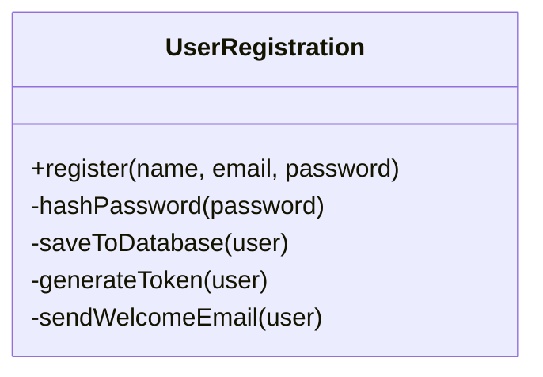

## Why it Matters

- One class = one responsibility; count reasons to change, not methods.
- God-class smells: mixed imports (`java.sql` + formatting + network), method groups that never call each other, unrelated test failures.
- Fix technique: extract class per responsibility (e.g. `Invoice` → `Invoice`, `InvoicePrinter`, `InvoiceRepository`).
- SRP enables the other SOLID principles , small cohesive classes are easier to extend, substitute, and inject.
- Don't over-split: one-method classes with a single caller are over-engineering (see [[Pragmatic-Principles-DRY-YAGNI-KISS]]).
- **Why it matters.** easier to read (one job per class), easier to test (test the password hasher without DB/email), safer to change (fewer ripple breaks).
- **Common mistakes.** confusing responsibility with method count; over-splitting into one-method classes; splitting by layer instead of by change-axis.
- **Self-check.** how many import-groups would change this class for unrelated reasons? (`java.security` vs `java.sql` vs mail/token libs = that many responsibilities.)

## Diagram


*Before: 4 responsibilities, 4 reasons to change. After the split:*
```mermaidclassDiagram
 class UserService {
 +register(name, email, password)
 }
 class PasswordHasher {
 +hash(password)
 }
 class UserRepository {
 +save(user)
 }
 class TokenService {
 +generate(user)
 }
 class EmailService {
 +sendWelcome(user)
 }
 UserService --> PasswordHasher : uses
 UserService --> UserRepository : uses
 UserService --> TokenService : uses
 UserService --> EmailService : uses
```
*Drawn from the [SRP chapter](https://algomaster.io/learn/lld/srp): one box per reason to change.*

## Code
```java
java// VIOLATION: Invoice prints itself AND saves itself (3 reasons to change).
// FIX below: one class per job. Run: java SrpDemo.java
import java.util.*;
record Item(String name, double price) {}
class Invoice { // business rules only
 private final List<Item> items = new ArrayList<>();
 void add(Item i) { items.add(i); }
 double total() { return items.stream().mapToDouble(Item::price).sum(); }
 List<Item> items() { return List.copyOf(items); }
}
class InvoicePrinter { // formatting only
 String print(Invoice inv) { return "TOTAL: " + inv.total(); }
}
class InvoiceRepo { // persistence only
 void save(Invoice inv) { System.out.println("saved, items=" + inv.items().size()); }
}
void main() {
 var inv = new Invoice(); inv.add(new Item("book", 499)); inv.add(new Item("pen", 49));
 System.out.println(new InvoicePrinter().print(inv)); // TOTAL: 548.0
 new InvoiceRepo().save(inv); // saved, items=2
```
## When to use / not

- Use when one class has **two or more reasons to change** that fire on different tickets (schema vs formatting vs provider swap).
- Use early on **god classes** , the longer they grow, the more callers entangle with them.
- NOT when splitting produces one-method classes with a single caller , that is SRP theater (see [[Pragmatic-Principles-DRY-YAGNI-KISS\|YAGNI/KISS]]).
- NOT when two method groups change together on every ticket , merging them is simpler and still single-axis.

## Trade-offs

| Aspect | Split (SRP) | God class |
|---|---|---|
| Ripple of one change | one class | unrelated callers break |
| Testability | test the hasher without DB/email | must boot everything |
| Readability | one job per class | mixed import groups |
| Cost | more files/classes | one place to look |
| Rule | split on the second divergent change | refuse to grow by accident |

## Pitfalls

- **God classes** absorbing every new feature until no one understands them; extract per change-axis while small.
- Over-splitting into single-method classes nobody reuses , false cohesion, more indirection.
- Splitting by **layer** instead of by **change-axis** (two DAOs changed by the same schema ticket = one responsibility).
- Confusing responsibility with **method count** , a 10-method cohesive class can still be single-responsibility.

## Interview q&a

**Q1: What are god-class smells, and how do you refactor one?**
A: Smells , huge class, unrelated import groups, low cohesion (method clusters sharing no state), shotgun changes. Refactor: identify change-axes, extract class per axis, inject collaborators, keep the original as a thin facade until callers migrate.

**Q2: Doesn't SRP lead to class explosion? Where do you stop?**
A: Stop when each class has one reason to change *that actually changes in your domain*. A 3-method helper used by one caller stays inline (YAGNI). Measure: if two method groups never share state and change on different tickets, split; otherwise don't.

**Q3: How do you refactor a `UserRegistration` God Class (hash + save + token + email)?**
A: Extract one class per change-axis , `PasswordHasher`, `UserRepository`, `TokenService`, `EmailService` , and keep `UserRegistration` as a thin orchestrator that injects them. Then bcrypt → argon2, JWT → opaque, schema, or provider swaps each touch exactly one class.

: What are god-class smells, and how do you refactor one?:: A: Smells , huge class, unrelated import groups, low cohesion (method clusters sharing no state), shotgun changes. Refactor: identify change-axes, extract class per axis, inject collaborators, keep the original as a thin facade until callers migrate. **Q2: Doesn't SRP lead to class explosion? Where do you stop?** A: Stop when each class has one reason to change *that actually changes in your domain*. A 3-method helper used by one caller stays... #flashcard

## Related

- [[SOLID-Open-Closed]] • [[SOLID-Liskov-Substitution]] • [[SOLID-Interface-Segregation]] • [[SOLID-Dependency-Inversion]]
- [[Class-Relationships]] • [[Pragmatic-Principles-DRY-YAGNI-KISS]]
- [[02_OOP/00 - OOP Overview|OOP Overview]] • [[02_OOP/Encapsulation|Encapsulation]]
- [[06_Design-Patterns/Behavioral/Command|Command]] • [[06_Design-Patterns/Extra/DAO Pattern|DAO Pattern]]

---
*Category: Java/02_OOP*

# SOLID , Single Responsibility Principle

> Part of [[README|Java MOC]] • `Java/02_OOP`

## Why

> "A class should have one, and only one, reason to change." , Robert C. Martin (Uncle Bob). A responsibility = a reason to change, not a method count. Think restaurant: chef, waiter, cleaner, accountant , not one person doing everything.

A class should have one reason to change , one job, one axis of responsibility. SRP splits "what changes together" from "what changes for different reasons" (persistence vs formatting vs business rules).

The classic violation is a `UserRegistration` God Class doing 4 jobs: (1) validating + hashing passwords, (2) saving the user to the DB, (3) generating auth tokens, (4) sending the welcome email. That's 4 reasons to change: bcrypt → argon2, schema change, JWT → opaque tokens, email-provider swap , one edit ripples into unrelated behavior.

## Vs , srp vs god Class

- **SRP**: one class, one **reason to change** (not one method) , cohesive, testable, safe to edit.
- **God class**: many responsibilities , mixed imports, method clusters sharing no state, unrelated test failures.

Split by **change-axis**, not method count: `Invoice` (rules) vs `InvoicePrinter` (formatting) vs `InvoiceRepo` (persistence).
