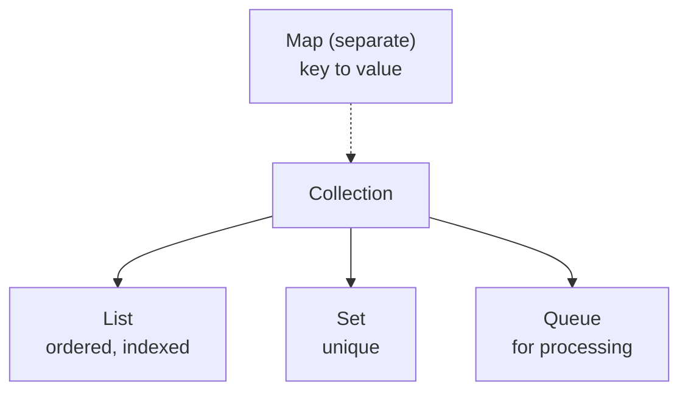

# Collection

> Part of [[README|Java MOC]] • `Java/03_Collections`
> 🎨 **Visual diagram:** Create Excalidraw drawing from template: `Cmd+P → Excalidraw: New from template → Java Diagram`

## Intent

One sentence: what problem does this solve? Define the **key term** in **bold**.

## Why it Matters

The **root interface** of the collections framework: one common protocol (`add`, `remove`, `contains`, `size`, `iterator`) for every `List`, `Set`, and `Queue`. Learn it once, and every collection behaves predictably , including **fail-fast iteration** and `stream()` access.

## Diagram



## Code / Example

```java
// Java 25: var, record, sealed, pattern matching, SequencedCollection, virtual threads, Compact Object Headers
// Collection — root interface for List/Set/Queue (Map separate)
Collection<String> c = new ArrayList<>();
c.add("a"); c.add("b");
System.out.println(c.contains("a")); // => true
System.out.println(c.size()); // => 2
c.remove("a");
for (var s : c) System.out.println(s);

Collection<String> c2 = new LinkedHashSet<>(List.of("b","a","a"));
System.out.println(c2);
```

### Concrete Example

- **Input:**
- **Output:**
- **Explanation:**

## When to Use / When NOT

| **Use When** | **Avoid When** |
|--------------|----------------|
|  |  |
|  |  |
|  |  |

## Trade-offs

| Dimension | This Approach | Alternative |
|-----------|---------------|-------------|
| Complexity | | |
| Performance | | |
| Readability | | |
| Testability | | |

## Vs Table

| | `Collection` | `Collections` |
|--|---------------|-----------------|
| Kind | Root interface | Utility class (static methods) |
| Provides | `add`, `iterator`, `size` | `sort`, `synchronizedList`, `unmodifiableList` |
| Implement | `ArrayList`, `HashSet` | Never , all methods static |

## Pitfalls

- Mutating during iteration → `ConcurrentModificationException`; use `Iterator.remove` or collect-then-remove.
- `Collection` has no `get(i)` , cast to `List` or stream with index.
- `Map` is not a `Collection` , no `add`/`iterator`; use `entrySet()`.

## Interview Q&A (Senior Depth)

**Q: Is Map a Collection?**
No, Map is key to value and has its own hierarchy.

**Q: What is the difference between Collection and Collections?**
Collection is an interface, Collections is a utility class with static methods like sort and synchronizedList.

## Flashcards (Spaced Repetition)

#flashcard
**Q:** What is the trigger keyword for Collection? :: **A:** [trigger keywords] #flashcard

#flashcard
**Q:** Time/space complexity of Collection? :: **A:** Time: O(), Space: O() #flashcard

#flashcard
**Q:** When do you NOT use Collection? :: **A:** [anti-pattern scenarios] #flashcard

#flashcard
**Q:** Core Java 25 snippet for Collection? :: **A:** `var list = new ArrayList<>(List.of(...));` #flashcard

## Practice Tasks (Tasks Plugin)

- [ ] Restate the intent from memory 📅 {date:YYYY-MM-DD, +1}
- [ ] Code the snippet without looking 📅 {date:YYYY-MM-DD, +3}
- [ ] Answer all Interview Q&A aloud 📅 {date:YYYY-MM-DD, +7}
- [ ] Review flashcards (Spaced Repetition) 📅 {date:YYYY-MM-DD, +1}

```tasks
not done
path includes {file.folder}
sort by due
limit 10
```

## Related

- [[Java/03_Collections/List/List|List]] • [[Java/03_Collections/Set/Set|Set]] • [[Java/03_Collections/Queue|Queue]] • [[Java/03_Collections/Map|Map]]
- [[Java/01_Core-Java/Generics|Generics]] (all collections are generic) • [[Java/01_Core-Java/Streams API|Streams API]] (`stream()` over collections)

Is Map a Collection?:: No, Collection is List Set Queue, Map is separate key to value. #flashcard
What does Collection define?:: Common operations like add, remove, contains, size and iterator. #flashcard
What is Collections vs Collection?:: Collection is the interface, Collections is a utility class with static helpers. #flashcard

# Collection , Java.util.Collection

> Part of [[README|Java MOC]]

> Collection is the root interface for List, Set and Queue. Map is separate. It defines common operations like add, remove, contains, size, and iterator.

## Hierarchy

```
Collection
 |-- List (ordered, indexed, duplicates allowed)
 |-- Set (unique, no index)
 |-- Queue (holds elements for processing, FIFO etc.)
Map (key to value, not a Collection)
```
Since Java 21, SequencedCollection adds getFirst, getLast and reversed for ordered collections.


---

*Category: Java/03_Collections • Part of [[README|Java MOC]] • Java 25*