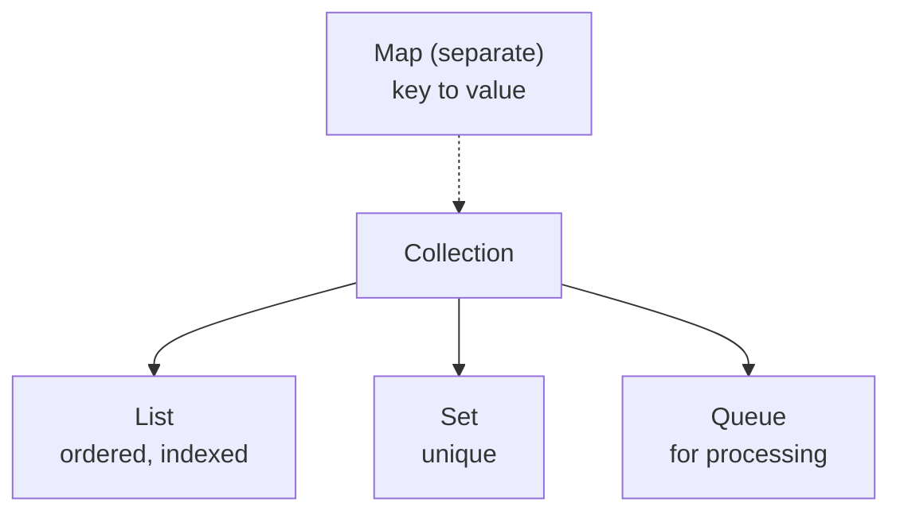

## Why it Matters

The **root interface** of the collections framework: one common protocol (`add`, `remove`, `contains`, `size`, `iterator`) for every `List`, `Set`, and `Queue`. Learn it once, and every collection behaves predictably , including **fail-fast iteration** and `stream()` access.

## Diagram



## Code

```java
// Collection — root interface for List/Set/Queue (Map separate)
Collection<String> c = new ArrayList<>();
c.add("a"); c.add("b");
System.out.println(c.contains("a")); // => true
System.out.println(c.size()); // => 2
c.remove("a");
for (var s : c) System.out.println(s);

Collection<String> c2 = new LinkedHashSet<>(List.of("b","a","a"));
System.out.println(c2);
```
For large collections, size the initial capacity to avoid rehash or resizing. For thread safety, use concurrent collections or wrap with Collections.synchronizedX.

## When to use / not

| Use | NOT |
|-----|-----|
| Need index/order/duplicates → `List` | Need key→value → `Map` (not a `Collection`) |
| Need uniqueness/membership → `Set` | Need heap priority → `PriorityQueue` semantics, not FIFO |
| Need FIFO/priority processing → `Queue` | Modifying during iteration → fail-fast throws; use `Iterator.remove` |

## Trade-offs

- One interface for `List`/`Set`/`Queue` , algorithms written to `Collection` accept all.
- `stream()`, `forEach`, bulk ops (`addAll`, `retainAll`) compose across impls.
- Fail-fast iterators punish structural mutation during traversal.
- `Map` sits outside , no unified interface for all containers.

## Vs

| | `Collection` | `Collections` |
|--|---------------|-----------------|
| Kind | Root interface | Utility class (static methods) |
| Provides | `add`, `iterator`, `size` | `sort`, `synchronizedList`, `unmodifiableList` |
| Implement | `ArrayList`, `HashSet` | Never , all methods static |

## Pitfalls

- Mutating during iteration → `ConcurrentModificationException`; use `Iterator.remove` or collect-then-remove.
- `Collection` has no `get(i)` , cast to `List` or stream with index.
- `Map` is not a `Collection` , no `add`/`iterator`; use `entrySet()`.

## Interview q&a

**Q: Is Map a Collection?**
No, Map is key to value and has its own hierarchy.

**Q: What is the difference between Collection and Collections?**
Collection is an interface, Collections is a utility class with static methods like sort and synchronizedList.

## Related

- [[Java/03_Collections/List/List|List]] • [[Java/03_Collections/Set/Set|Set]] • [[Java/03_Collections/Queue|Queue]] • [[Java/03_Collections/Map|Map]]
- [[Java/01_Core-Java/Generics|Generics]] (all collections are generic) • [[Java/01_Core-Java/Streams API|Streams API]] (`stream()` over collections)

Is Map a Collection?:: No, Collection is List Set Queue, Map is separate key to value. #flashcard
What does Collection define?:: Common operations like add, remove, contains, size and iterator. #flashcard
What is Collections vs Collection?:: Collection is the interface, Collections is a utility class with static helpers. #flashcard

# Collection , Java.util.Collection

> Part of [[README|Java MOC]]

> Collection is the root interface for List, Set and Queue. Map is separate. It defines common operations like add, remove, contains, size, and iterator.

## Hierarchy

```
Collection
 |-- List (ordered, indexed, duplicates allowed)
 |-- Set (unique, no index)
 |-- Queue (holds elements for processing, FIFO etc.)
Map (key to value, not a Collection)
```
Since Java 21, SequencedCollection adds getFirst, getLast and reversed for ordered collections.

## What it Provides

- add and addAll
- remove, removeAll, retainAll, clear
- contains and containsAll
- size, isEmpty
- iterator, spliterator, stream
- toArray

All collections are fail fast for iterators: structural change during iteration throws ConcurrentModificationException.
