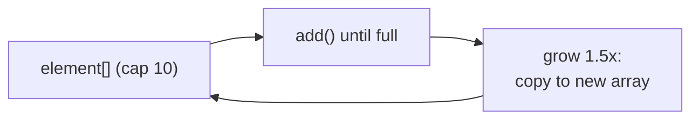

# ArrayList

> Part of [[README|Java MOC]] • `Java/03_Collections/List`
> 🎨 **Visual diagram:** Create Excalidraw drawing from template: `Cmd+P → Excalidraw: New from template → Java Diagram`

## Intent

One sentence: what problem does this solve? Define the **key term** in **bold**.

## Why it Matters

The **default `List`**: a **resizable array** with **O(1) random access**, amortised O(1) append, and 1.5x growth. Cache-friendly and compact , reach for it unless you need deque ends or concurrency.

## Diagram



## Code / Example

```java
// Java 25: var, record, sealed, pattern matching, SequencedCollection, virtual threads, Compact Object Headers
// ArrayList — resizable array, O(1) random access, 1.5x growth
var list = new ArrayList<String>();
list.add("a"); list.add("b"); list.add("c");
System.out.println(list.get(1)); // => b
list.add(1, "z");
System.out.println(list); // => [a, z, b, c]
list.remove("z");
System.out.println(list.getFirst()); // => a
System.out.println(list.reversed());

var big = new ArrayList<Integer>(10_000);

var imm = List.of("a","b","c");
```

### Concrete Example

- **Input:**
- **Output:**
- **Explanation:**

## When to Use / When NOT

| **Use When** | **Avoid When** |
|--------------|----------------|
|  |  |
|  |  |
|  |  |

## Trade-offs

| Dimension | This Approach | Alternative |
|-----------|---------------|-------------|
| Complexity | | |
| Performance | | |
| Readability | | |
| Testability | | |

## Vs Table

- vs LinkedList: ArrayList faster for get and append, LinkedList faster for deque ops
- vs Vector: ArrayList is unsynchronized, 1.5x growth, preferred
- vs CopyOnWriteArrayList: ArrayList for single thread, copy on write for many readers

## Pitfalls

- Concurrent modification during iteration throws , use `iterator.remove` or `CopyOnWriteArrayList`.
- `List.of` forbids `null`; `ArrayList` allows it , don't mix assumptions.
- Repeated growth without presizing is O(n²) churn , pass expected capacity.

## Interview Q&A (Senior Depth)

**Q: How does `ArrayList` grow?** Backed by `Object[]` (capacity 10 on first add); grows ~1.5x (`old + old/2`) with `Arrays.copyOf` , presize via `new ArrayList<>(n)` for bulk loads.

**Q: Cost of middle insert/remove?** O(n) , elements shift. `get`/`set` by index stay O(1).

**Q: `ArrayList` vs `Vector`?** `ArrayList` is unsynchronized with 1.5x growth; `Vector` is legacy synchronized with 2x growth. Prefer `ArrayList`.

## Flashcards (Spaced Repetition)

#flashcard
**Q:** What is the trigger keyword for ArrayList? :: **A:** [trigger keywords] #flashcard

#flashcard
**Q:** Time/space complexity of ArrayList? :: **A:** Time: O(), Space: O() #flashcard

#flashcard
**Q:** When do you NOT use ArrayList? :: **A:** [anti-pattern scenarios] #flashcard

#flashcard
**Q:** Core Java 25 snippet for ArrayList? :: **A:** `var list = new ArrayList<>(List.of(...));` #flashcard

## Practice Tasks (Tasks Plugin)

- [ ] Restate the intent from memory 📅 {date:YYYY-MM-DD, +1}
- [ ] Code the snippet without looking 📅 {date:YYYY-MM-DD, +3}
- [ ] Answer all Interview Q&A aloud 📅 {date:YYYY-MM-DD, +7}
- [ ] Review flashcards (Spaced Repetition) 📅 {date:YYYY-MM-DD, +1}

```tasks
not done
path includes {file.folder}
sort by due
limit 10
```

## Related

- [[Java/03_Collections/List/List|List]] • [[Java/07_DSA/Array|Array]] (growth, amortised analysis)
- [[Java/08_Modern-Java/04 Sequenced Collections|Sequenced Collections]] (`getFirst`/`reversed`)

How does ArrayList grow?:: Backed by an array that grows by about 1.5x when full. #flashcard
What is the cost of adding in the middle of an ArrayList?:: O(n) because elements shift. #flashcard
What is get by index cost in ArrayList?:: O(1). #flashcard
When should you size an ArrayList upfront?:: When you know the expected size, to avoid repeated resizing. #flashcard

# ArrayList , Java.util.ArrayList

> Part of [[Java/03_Collections/List/List|List]]

> ArrayList is the default List. It is a resizable array, ordered, allows duplicates and nulls.

## Internals

- backs with Object[] of default capacity 10 when first element added
- grows by about 1.5x when full: newCapacity = old + old/2
- stores elements contiguously, so cache friendly
- not synchronized
- since Java 21 implements SequencedCollection

## Time Complexity

- get and set by index: O(1)
- add at end: O(1) amortized, O(n) when resizing
- add or remove in middle: O(n) to shift
- contains and indexOf: O(n)
- iteration: O(n)


---

*Category: Java/03_Collections/List • Part of [[README|Java MOC]] • Java 25*