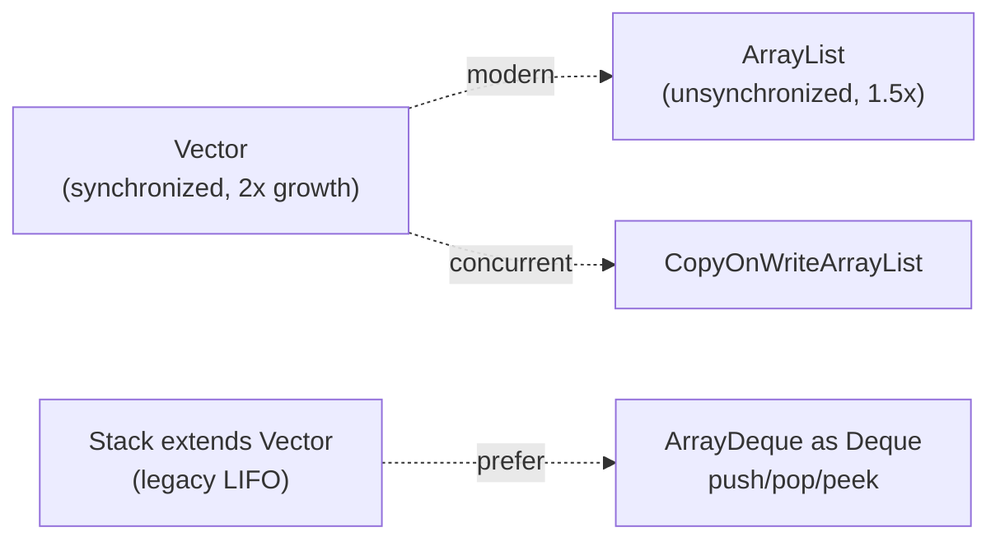

# Legacy Collections: Vector & Stack

> Part of [[README|Java MOC]] • `Java/03_Collections/List`
> 🎨 **Visual diagram:** Create Excalidraw drawing from template: `Cmd+P → Excalidraw: New from template → Java Diagram`

## Intent

**Vector** and **Stack** are **legacy synchronized collections** from Java 1.0. Know them to **migrate away** — to `ArrayList`, `ArrayDeque`, or concurrent alternatives.

## Why it Matters

- **Vector**: Per-method locking + 2x growth; superseded by `ArrayList` (unsynchronized, 1.5x growth)
- **Stack**: Extends `Vector`, inherits all issues + leaks indexed ops that break LIFO encapsulation
- Both appear in **legacy codebases**; migration is a common interview and production task
- Modern replacements: `ArrayList` (default), `CopyOnWriteArrayList` (read-heavy), `ArrayDeque` (stack/queue)

## Diagram



## Code / Example

```java
// Java 25: var, records, pattern matching
// Vector — legacy synchronized array (prefer ArrayList/CopyOnWriteArrayList)
var v = new Vector<String>();
v.add("a"); v.add("b");
System.out.println(v.get(0)); // => a

// Modern replacements
List<String> list = new ArrayList<>(List.of("a","b"));
List<String> sync = Collections.synchronizedList(new ArrayList<>(list));
List<String> cow = new CopyOnWriteArrayList<>(list);

// Stack vs Deque — legacy Stack (Vector) vs ArrayDeque for LIFO
var stack = new Stack<Integer>();
stack.push(10); stack.push(20); stack.push(30);
System.out.println(stack.peek()); // => 30
System.out.println(stack.pop());  // => 30
System.out.println(stack.search(10)); // => 3

// Modern: ArrayDeque as Deque
Deque<Integer> s = new ArrayDeque<>();
s.push(10); s.push(20); s.push(30);
System.out.println(s.peek()); // => 30
System.out.println(s.pop());  // => 30

// ArrayDeque also works as queue
Deque<String> dq = new ArrayDeque<>();
dq.addLast("queue"); dq.pollFirst();
dq.push("stack"); dq.pop();
```

### Concrete Example

- **Input:** Legacy code using `Vector` for thread-safe list, `Stack` for LIFO
- **Output:** Migrated to `ArrayList` + `Collections.synchronizedList` or `CopyOnWriteArrayList`; `ArrayDeque` for stack
- **Explanation:** `Vector` synchronizes per-method but compound actions still race. `ArrayDeque` is faster, not synchronized, and doesn't leak indexed operations.

## When to Use / When NOT

| **Use When** | **Avoid When** |
|--------------|----------------|
| - Reading legacy/`Stack`-adjacent code | - New code: `ArrayList` by default |
| - Understanding old APIs | - Thread safety via `Vector` locks: prefer `CopyOnWriteArrayList` / concurrent collections |
| - Maintaining compatibility with pre-Java 1.2 APIs | - Any greenfield development |

## Trade-offs

| Dimension | Vector/Stack | Modern Replacements |
|-----------|--------------|---------------------|
| Complexity | Legacy API, coarse sync | Cleaner APIs, explicit concurrency |
| Performance | Synchronized overhead, 2x growth | Unsynchronized (fast), 1.5x growth, array-based |
| Readability | Familiar to Java 1.0 devs | Standard modern Java |
| Testability | Hard to test sync behavior | Easy with non-sync + explicit wrapping |

## Vs Table

| Aspect | Vector | ArrayList | Stack | ArrayDeque |
|--------|--------|-----------|-------|------------|
| Backing | Array | Array | Vector (array) | Circular array |
| Thread-safe | Per-method | No | Per-method | No |
| Growth | 2x | 1.5x | 2x | Dynamic |
| Nulls | Allowed | Allowed | Allowed | Forbidden |
| Encapsulation | Full List API | Full List API | Leaks `add(0,x)` | Deque only |

## Pitfalls

- `Vector` sync is per-method: `if (!v.contains(x)) v.add(x)` still races — needs external lock
- 2x regrowth wastes more memory than `ArrayList` 1.5x
- `Stack` exposes `Vector` indexed ops (`add(0, x)`) that silently break LIFO
- `empty()` (Stack) vs `isEmpty()` (Collection) naming split — a legacy smell
- Synchronized per-op cost with no compound-action safety — still needs external locking

## Interview Q&A (Senior Depth)

**Q1. What is `Vector`?**
**A:** Legacy synchronized resizable array (2x growth), superseded by `ArrayList`.

**Q2. What replaces it?**
**A:** `ArrayList` by default; `CopyOnWriteArrayList` or `Collections.synchronizedList` for shared access.

**Q3. Is `Vector` fully thread-safe?**
**A:** No — per-method sync only; compound actions (`check-then-act`) still race.

**Q4. Why is `Stack` flawed?**
**A:** Extends `Vector`, so indexed ops (`add(0, x)`) break LIFO encapsulation; coarse synchronization adds overhead.

**Q5. What replaces `Stack` today?**
**A:** `Deque` as `ArrayDeque` with `push`/`pop`/`peek`.

**Q6. How can one class act as both queue and stack?**
**A:** `ArrayDeque` as `Deque`, `addLast` and `pollFirst` for queue, `push` and `pop` for stack.

## Flashcards (Spaced Repetition)

#flashcard
**Q:** What is Vector? :: **A:** Legacy synchronized resizable array, prefers ArrayList now. #flashcard

#flashcard
**Q:** How does Vector grow? :: **A:** Doubles capacity when full, or by the configured increment. #flashcard

#flashcard
**Q:** What replaces Vector in modern code? :: **A:** ArrayList, or CopyOnWriteArrayList or synchronizedList for thread safety. #flashcard

#flashcard
**Q:** Why is Stack flawed? :: **A:** It extends Vector and exposes indexed methods that break LIFO, plus synchronized overhead. #flashcard

#flashcard
**Q:** What replaces Stack today? :: **A:** Deque as ArrayDeque with push, pop and peek. #flashcard

#flashcard
**Q:** What does Stack.search return? :: **A:** 1 based position from the top, minus 1 if not found. #flashcard

## Practice Tasks (Tasks Plugin)

- [ ] Restate the intent from memory 📅 {date:YYYY-MM-DD, +1}
- [ ] Code the snippet without looking 📅 {date:YYYY-MM-DD, +3}
- [ ] Answer all Interview Q&A aloud 📅 {date:YYYY-MM-DD, +7}
- [ ] Review flashcards (Spaced Repetition) 📅 {date:YYYY-MM-DD, +1}

```tasks
not done
path includes {file.folder}
sort by due
limit 10
```

## Related

- [[Java/03_Collections/List/List|List]] (`ArrayList` replacement)
- [[Java/03_Collections/Queue|Queue]] (`ArrayDeque` as `Deque` for LIFO)
- [[Java/07_DSA/Stack|Stack (DSA)]] (LIFO, brackets, DFS)
- [[Java/01_Core-Java/Generics|Generics]]

---

*Category: Java/03_Collections/List • Part of [[README|Java MOC]] • Java 25*

## Problem

Legacy code uses `Vector` and `Stack` which have coarse synchronization, 2x growth, and broken encapsulation (Stack leaks indexed ops).

## Solution

Migrate to `ArrayList` (default), `CopyOnWriteArrayList` / `Collections.synchronizedList` (thread-safe), and `ArrayDeque` (stack/queue).

## When not to use

| Instead | Use |
|---------|-----|
| New code | `ArrayList` / `ArrayDeque` |
| Thread-safe list | `CopyOnWriteArrayList` / `Collections.synchronizedList` |
| LIFO stack | `ArrayDeque` as `Deque` |
| Concurrent access | `ConcurrentLinkedDeque` / `ConcurrentLinkedQueue` |
