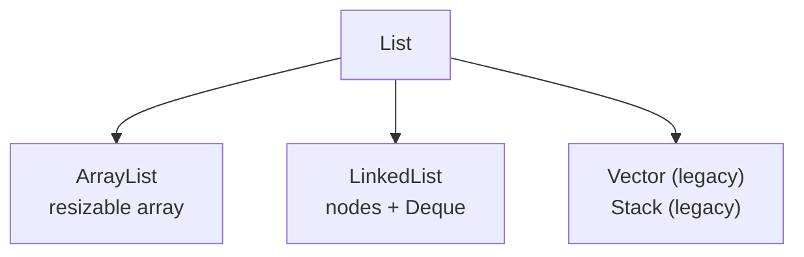

# List

> Part of [[README|Java MOC]] • `Java/03_Collections/List`
> 🎨 **Visual diagram:** Create Excalidraw drawing from template: `Cmd+P → Excalidraw: New from template → Java Diagram`

## Intent

One sentence: what problem does this solve? Define the **key term** in **bold**.

## Why it Matters

The **ordered, indexed** collection: **duplicates allowed**, positional `get`/`set`, and , since Java 21 , **`SequencedCollection`** access (`getFirst`, `getLast`, `reversed`). The default choice when order matters.

## Diagram



## Code / Example

```java
// Java 25: var, record, sealed, pattern matching, SequencedCollection, virtual threads, Compact Object Headers
// List — ordered, indexed, duplicates allowed
List<String> list = new ArrayList<>(List.of("b","a","c"));
System.out.println(list.get(1)); // => a
list.add("a");
System.out.println(list); // => [b, a, c, a]
list.set(1, "z");
System.out.println(list.getFirst()); // => b
System.out.println(list.getLast());
System.out.println(list.reversed()); // => [a, c, z, b]

var nums = List.of(1,2,2,3);
Set<Integer> dedup = new LinkedHashSet<>(nums);
```

### Concrete Example

- **Input:**
- **Output:**
- **Explanation:**

## When to Use / When NOT

| **Use When** | **Avoid When** |
|--------------|----------------|
|  |  |
|  |  |
|  |  |

## Trade-offs

| Dimension | This Approach | Alternative |
|-----------|---------------|-------------|
| Complexity | | |
| Performance | | |
| Readability | | |
| Testability | | |

## Vs Table

| | `ArrayList` | `LinkedList` | `CopyOnWriteArrayList` |
|--|-------------|----------------|--------------------------|
| `get(i)` | O(1) | O(n) | O(1) |
| Ends insert | amortised O(1) | O(1) | O(n) copy |
| Threads | no | no | safe, snapshot iteration |

## Pitfalls

- `List.of(...)` is immutable , `add` throws `UnsupportedOperationException`.
- `remove(int)` vs `remove(Object)` overloads: `list.remove(1)` removes by index, not value `1`.
- `Arrays.asList` is fixed-size , `add` fails; wrap in `new ArrayList<>(...)` for growth.

## Interview Q&A (Senior Depth)

**Q: List vs Set?**
List is ordered, indexed, allows duplicates. Set has no index, no duplicates, membership is O(1) for HashSet.

**Q: ArrayList vs LinkedList?**
ArrayList is array backed, O(1) get, O(n) insert in middle. LinkedList is node based, O(n) get, O(1) insert at ends when you have the node.

## Flashcards (Spaced Repetition)

#flashcard
**Q:** What is the trigger keyword for List? :: **A:** [trigger keywords] #flashcard

#flashcard
**Q:** Time/space complexity of List? :: **A:** Time: O(), Space: O() #flashcard

#flashcard
**Q:** When do you NOT use List? :: **A:** [anti-pattern scenarios] #flashcard

#flashcard
**Q:** Core Java 25 snippet for List? :: **A:** `var list = new ArrayList<>(List.of(...));` #flashcard

## Practice Tasks (Tasks Plugin)

- [ ] Restate the intent from memory 📅 {date:YYYY-MM-DD, +1}
- [ ] Code the snippet without looking 📅 {date:YYYY-MM-DD, +3}
- [ ] Answer all Interview Q&A aloud 📅 {date:YYYY-MM-DD, +7}
- [ ] Review flashcards (Spaced Repetition) 📅 {date:YYYY-MM-DD, +1}

```tasks
not done
path includes {file.folder}
sort by due
limit 10
```

## Related

- [[Java/03_Collections/Collection|Collection]] • [[Java/03_Collections/Set/Set|Set]] (ordered vs unique)
- [[Java/07_DSA/Array|Array]] (contiguous backing) • [[Java/08_Modern-Java/04 Sequenced Collections|Sequenced Collections]]

What defines a List?:: Ordered, indexed, allows duplicates and nulls. #flashcard
When to use ArrayList vs LinkedList?:: ArrayList for random access, LinkedList when you need frequent insert or remove at ends and deque ops. #flashcard
What did Java 21 add to List?:: SequencedCollection with getFirst, getLast and reversed. #flashcard

# List , Java.util.List

> Part of [[README|Java MOC]]

> List is an ordered collection with index access. It allows duplicates and nulls. Order is insertion order.

Since Java 21, List is a SequencedCollection, so it has getFirst, getLast, addFirst, addLast, removeFirst, removeLast, and reversed.

## Contract

- ordered by index, from 0 to size minus 1
- allows duplicates, add returns true even if duplicate
- allows nulls except where implementation forbids
- index ops like get, set, add at index, remove at index

## Implementations

- ArrayList: resizable array, 1.5x growth, fast get and set O(1), add O(1) amortized, insert or remove in middle O(n)
- LinkedList: doubly linked list, fast insert or remove at ends, slow get O(n), allows nulls, implements Deque too
- Vector: legacy synchronized resizable array, 2x growth, synchronized per method, prefer ArrayList
- Stack: legacy LIFO over Vector, prefer ArrayDeque
- CopyOnWriteArrayList: thread safe for read heavy cases, copy on write


---

*Category: Java/03_Collections/List • Part of [[README|Java MOC]] • Java 25*