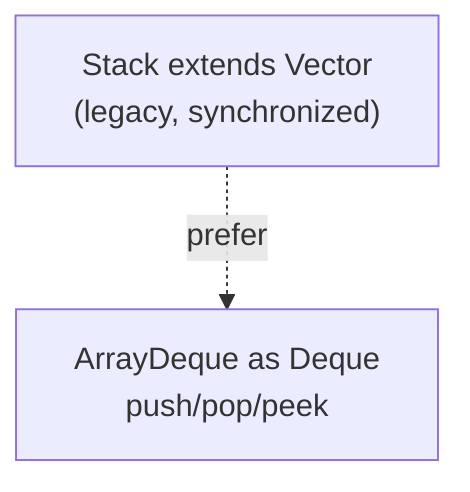

## Why it Matters

The **legacy LIFO stack** over `Vector`: a cautionary tale of **inheritance leaking encapsulation** (indexed ops break LIFO) plus **coarse synchronization**. Know it to replace it , with `ArrayDeque` as `Deque`.

## Diagram



## Code

```java
// Stack vs Deque — legacy Stack (Vector) vs ArrayDeque for LIFO
var stack = new Stack<Integer>();
stack.push(10); stack.push(20); stack.push(30);
System.out.println(stack.peek()); // => 30
System.out.println(stack.pop()); // => 30
System.out.println(stack.search(10)); // => 3
stack.add(0, 99);

Deque<Integer> s = new ArrayDeque<>();
s.push(10); s.push(20); s.push(30);
System.out.println(s.peek()); // => 30
System.out.println(s.pop()); // => 30

Deque<String> dq = new ArrayDeque<>();
dq.addLast("queue"); dq.pollFirst();
dq.push("stack"); dq.pop();
```
Rule: do not use Stack in new code. Use Deque as ArrayDeque.

## When to use / not

| Use | NOT |
|-----|-----|
| Reading legacy code that uses `Stack` | New code , use `ArrayDeque` as `Deque` (`push`/`pop`/`peek`) |
| , | Relying on indexed `Vector` ops on a stack (breaks LIFO) |

## Trade-offs

- Still seen in legacy code , worth recognizing.
- Extends `Vector`: indexed ops leak, coarse sync, slow , never use in new code.

## Vs

- backing: Stack is Vector, ArrayDeque is circular array
- thread safe: Stack yes coarse, ArrayDeque no
- encapsulation: Stack leaks indexed ops, ArrayDeque does not
- performance: ArrayDeque is faster

## Pitfalls

- `Stack` exposes `Vector` indexed ops (`add(0, x)`) that silently break LIFO.
- `empty()` (Stack) vs `isEmpty()` (Collection) naming split , a legacy smell.
- Synchronized per-op cost with no compound-action safety , still needs external locking.

## Interview q&a

**Q: Why is `Stack` flawed?** Extends `Vector`, so indexed ops (`add(0, x)`) break LIFO encapsulation; coarse synchronization adds overhead.

**Q: What replaces it?** `Deque` as `ArrayDeque` with `push`/`pop`/`peek`.

**Q: What does `search` return?** 1-based position from the top, -1 if absent.

## Related

- [[Java/03_Collections/Queue|Queue]] (`ArrayDeque` as `Deque` for LIFO) • [[Java/07_DSA/Stack|Stack (DSA)]] (LIFO, brackets, DFS)

Why is Stack flawed?:: It extends Vector and exposes indexed methods that break LIFO, plus synchronized overhead. #flashcard
What replaces Stack today?:: Deque as ArrayDeque with push, pop and peek. #flashcard
What does Stack.search return?:: 1 based position from the top, minus 1 if not found. #flashcard
How can one class act as both queue and stack?:: ArrayDeque as Deque, addLast and pollFirst for queue, push and pop for stack. #flashcard

# Stack , Java.util.Stack

> Part of [[Java/03_Collections/List/List|List]]
>
> Legacy LIFO stack that extends Vector. It is synchronized. Prefer ArrayDeque for new code.

## Internals

- extends Vector, inherits a synchronized array with 2x growth
- adds push, pop, peek, empty and search
- because it extends Vector, you can still call get and add at index, which breaks LIFO encapsulation

## Time Complexity

- push, pop, peek, empty: O(1)
- search: O(n), linear from top, returns 1 based position or minus 1
