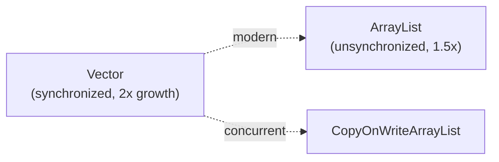

## Why it Matters

The **legacy synchronized array** (Java 1.0): per-method locking, 2x growth. Know it to migrate away , to `ArrayList`, or to **copy-on-write / concurrent** collections for shared access.

## Diagram



## Code

```java
// Vector — legacy synchronized array (prefer ArrayList/CopyOnWriteArrayList)
var v = new Vector<String>();
v.add("a"); v.add("b");
System.out.println(v.get(0)); // => a

List<String> list = new ArrayList<>(List.of("a","b"));
List<String> sync = Collections.synchronizedList(new ArrayList<>(list));
List<String> cow = new CopyOnWriteArrayList<>(list);
```
Stack extends Vector and inherits the same issues, use ArrayDeque for a stack.

## When to use / not

| Use | NOT |
|-----|-----|
| Reading legacy/`Stack`-adjacent code | New code , `ArrayList` by default |
| , | Thread safety via `Vector` locks , prefer `CopyOnWriteArrayList` / concurrent collections |

## Trade-offs

- Per-op thread safety out of the box (legacy).
- Coarse locking + 2x regrowth; superseded by `ArrayList` and concurrent collections.

## Vs

- backing: both arrays, Vector synchronized, ArrayList not
- growth: Vector 2x, ArrayList 1.5x
- performance: ArrayList faster due to no lock
- recommendation: ArrayList by default, concurrent collections for shared access

## Pitfalls

- `Vector` sync is per-method: `if (!v.contains(x)) v.add(x)` still races , needs external lock.
- 2x regrowth wastes more memory than `ArrayList` 1.5x.
- `Stack` inherits all of this , migrate both.

## Interview q&a

**Q: What is `Vector`?** Legacy synchronized resizable array (2x growth) , superseded by `ArrayList`.

**Q: What replaces it?** `ArrayList` by default; `CopyOnWriteArrayList` or `Collections.synchronizedList` for shared access.

**Q: Is `Vector` fully thread-safe?** No , per-method sync only; compound actions (`check-then-act`) still race.

## Related

- [[Java/03_Collections/List/List|List]] (`ArrayList` replacement) • [[Java/03_Collections/List/Stack|Stack]] (extends `Vector`)

What is Vector?:: Legacy synchronized resizable array, prefers ArrayList now. #flashcard
How does Vector grow?:: Doubles capacity when full, or by the configured increment. #flashcard
What replaces Vector in modern code?:: ArrayList, or CopyOnWriteArrayList or synchronizedList for thread safety. #flashcard

# Vector , Java.util.Vector

> Part of [[Java/03_Collections/List/List|List]]
>
> Legacy synchronized resizable array from Java 1.0. Ordered, indexed, allows duplicates and nulls. Prefer ArrayList for new code.

## Internals

- synchronized methods, so thread safe per operation but coarse grained
- default capacity 10, grows by 2x when full (or by increment if set)
- implements List, not SequencedCollection in Java 21

## Time Complexity

- get, set, add at end: O(1) amortized
- insert or remove in middle: O(n)
- synchronized adds overhead
