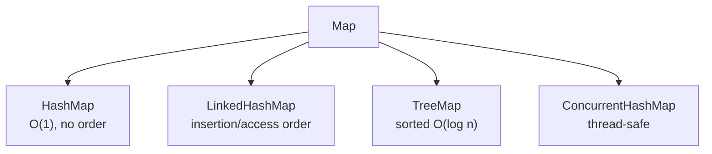

## Why it Matters

The **key→value lookup** abstraction: **unique keys**, O(1) average access with hashing, O(log n) with trees. Maps back caches, indexes, frequency tables, and configs , pick the impl by ordering and concurrency needs.

## Diagram



## Code

```java
// Map — key→value; HashMap/LinkedHashMap/TreeMap selection
Map<String,Integer> m = new HashMap<>();
m.put("a",1); m.put("b",2); m.put("a",3);
System.out.println(m.get("a")); // => 3
System.out.println(m.containsKey("b")); // => true

for (var e : m.entrySet())
 System.out.println(e.getKey() + "=" + e.getValue());

m.getOrDefault("x", 0);
m.putIfAbsent("c", 5);
m.computeIfAbsent("d", k -> k.length());

var sorted = new TreeMap<>(m);
System.out.println(sorted.firstKey()); // => a

var ordered = new LinkedHashMap<String,Integer>();
ordered.put("b",2); ordered.put("a",1);
System.out.println(ordered); // => {b=2, a=1}
```
Note: mutating a key so its hashCode changes while in a HashMap loses the entry. Keep keys immutable.

## When to use / not

| Impl | Pick when |
|------|-------------|
| `HashMap` | General lookup, no order, O(1) |
| `LinkedHashMap` | Insertion order or LRU (`accessOrder=true`) |
| `TreeMap` | Sorted keys, ranges, `ceilingKey` |
| `ConcurrentHashMap` | Shared across threads |
| `EnumMap` | Enum keys , fastest |

## Trade-offs

- O(1) average lookup; rich merge/compute API (`merge`, `computeIfAbsent`).
- One interface, many orderings: hash, insertion, sorted, concurrent.
- Mutable keys corrupt buckets , keys must be effectively immutable.
- `null` policy differs per impl (`HashMap` allows, `TreeMap`/`ConcurrentHashMap` deny).

## Vs

| | `HashMap` | `TreeMap` | `ConcurrentHashMap` |
|--|-----------|-----------|---------------------|
| Order | none | sorted by key | none |
| Cost | O(1) avg | O(log n) | O(1) avg, thread-safe |
| Null key | one | no | no |

## Pitfalls

- Mutable keys whose `hashCode` changes lose their entries , keep keys immutable (records).
- `get` returning `null` is ambiguous (absent vs mapped-to-null) , use `containsKey` or `getOrDefault`.
- `TreeMap` rejects `null` keys; `ConcurrentHashMap` rejects all `null`s.

## Interview q&a

**Q: How does HashMap work?**
Array of buckets, hash to index, collisions form a list then a tree after 8 entries, rehash when size exceeds capacity times load factor.

**Q: Can HashMap have null keys? TreeMap?**
HashMap yes one null key. TreeMap no, null cannot be compared.

**Q: HashMap vs ConcurrentHashMap?**
HashMap is not thread safe and allows nulls. ConcurrentHashMap is thread safe, denies nulls, and allows concurrent reads and writes.

## Related

- [[Java/03_Collections/Set/Set|Set]] (`HashSet` is a `HashMap`) • [[Java/07_DSA/HashMap|HashMap (DSA)]] (buckets, treeify, load factor)
- [[Java/08_Modern-Java/01 Records|Records]] (ideal immutable keys)

How does HashMap handle collisions?:: List then tree after 8 entries in a bucket, plus rehash on resize. #flashcard
Can HashMap have a null key?:: Yes one null key, TreeMap no. #flashcard
When to use LinkedHashMap?:: When you need insertion order or an LRU cache. #flashcard
When to use ConcurrentHashMap?:: When you need thread safe map access without global locking. #flashcard

# Map , Java.util.Map

> Part of [[README|Java MOC]]

> Map stores key to value pairs. Keys are unique, values can repeat. It is not a Collection.

## Implementations

- HashMap: hash table, no order, one null key, many null values, O(1) get and put, backed by buckets, default capacity 16, load factor 0.75
- LinkedHashMap: HashMap plus insertion or access order, useful for LRU
- TreeMap: red black tree, sorted by key, O(log n), no null keys, needs Comparable or Comparator
- Hashtable: legacy synchronized map, no nulls, avoid
- ConcurrentHashMap: thread safe, no nulls, segment level locking
- EnumMap: array backed for enum keys, fast

Since Java 21, LinkedHashMap implements SequencedMap with firstEntry, lastEntry and reversed.
