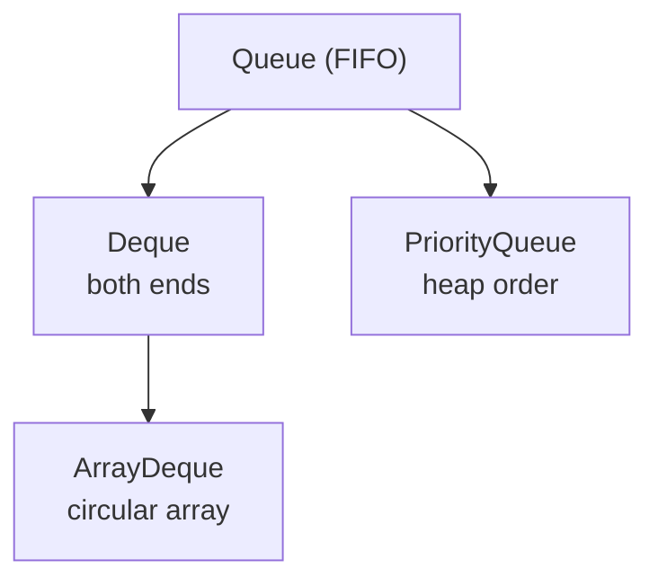

## Why it Matters

The **holds-elements-for-processing** abstraction: FIFO, **priority**, or **deque** orderings with **throwing vs special-value** method pairs (`add`/`offer`, `remove`/`poll`). Queues drive scheduling, BFS, and producer-consumer pipelines.

## Diagram



## Code

```java
// Queue/Deque — FIFO vs priority vs stack (ArrayDeque preferred)
Queue<String> q = new ArrayDeque<>();
q.offer("a"); q.offer("b"); q.offer("c");
System.out.println(q.peek()); // => a
System.out.println(q.poll()); // => a
System.out.println(q); // => [b, c]

Deque<String> stack = new ArrayDeque<>();
stack.push("a"); stack.push("b");
System.out.println(stack.pop()); // => b

Queue<Integer> pq = new PriorityQueue<>();
pq.addAll(List.of(5,1,3));
System.out.println(pq.poll()); // => 1
System.out.println(pq.poll()); // => 3

Queue<String> pq2 = new PriorityQueue<>(Comparator.comparingInt(String::length));
pq2.addAll(List.of("aaa","b","cc"));
System.out.println(pq2.poll()); // => b
```

## When to use / not

| Impl | Pick when |
|------|-------------|
| `ArrayDeque` | Plain FIFO queue or stack (default) |
| `PriorityQueue` | Priority order, top-k, scheduling |
| `ArrayBlockingQueue` | Bounded producer-consumer |
| `LinkedList` | Rarely , only when `List` + `Deque` in one object |

## Trade-offs

- Clear FIFO/priority/deque contracts with dual (throwing vs special-value) APIs.
- `ArrayDeque` is fast, compact, allocation-free per op.
- `PriorityQueue` iteration is heap-order, not sorted , only `poll()` is ordered.
- Most impls forbid `null` (`null` is the `poll()` sentinel).

## Vs

| | `ArrayDeque` | `PriorityQueue` | `LinkedList` |
|--|--------------|-----------------|--------------|
| Order | FIFO | heap priority | FIFO/deque |
| Cost | O(1) ends | O(log n) offer/poll | O(1) ends |
| Memory | circular array | heap array | nodes (heaviest) |

## Pitfalls

- `add`/`remove` throw while `offer`/`poll` return special values , pick deliberately.
- `PriorityQueue` iteration is not sorted; only repeated `poll()` yields order.
- `null` elements forbidden in `ArrayDeque`/`PriorityQueue` (`null` == empty signal).

## Interview q&a

**Q: Queue vs Deque?**
Queue is FIFO from one end, Deque allows insertion and removal from both ends and can act as queue or stack.

**Q: How does PriorityQueue order elements?**
Binary heap by natural order or comparator, head is smallest. Poll is O(log n).

**Q: Why prefer ArrayDeque over LinkedList for a queue?**
ArrayDeque is backed by an array, less memory, better locality, O(1) ops, no node allocations.

## Related

- [[Java/03_Collections/List/List|List]] (`ArrayDeque` vs `LinkedList`) • [[Java/07_DSA/Queue|Queue (DSA)]] (FIFO, circular buffer, BFS)
- [[Java/07_DSA/Heap|Heap]] (`PriorityQueue` internals)

How does ArrayDeque implement a queue?:: Circular array, offer at tail and poll at head, both O(1). #flashcard
What is the difference between poll and remove?:: Poll returns null if empty, remove throws. #flashcard
How does PriorityQueue order elements?:: Heap ordered by natural order or comparator, head is the smallest. #flashcard
When to use ArrayDeque vs LinkedList?:: Prefer ArrayDeque for queue or stack, it is faster and more compact. #flashcard

# Queue , Java.util.Queue

> Part of [[README|Java MOC]]

> Queue holds elements for processing. The usual order is FIFO, priority, or deque.

## Hierarchy

```
Collection -> Queue -> Deque
 |-- PriorityQueue (heap, natural or comparator)
 |-- ArrayDeque (circular array, also implements Deque)

BlockingQueue, TransferQueue are for concurrency.
```
Core methods have two forms. One throws, one returns a special value.

- add vs offer: insert, second returns false if full
- remove vs poll: remove head, second returns null if empty
- element vs peek: read head, second returns null if empty

Deque adds addFirst, addLast, pollFirst, pollLast, peekFirst, peekLast, and stack operations push and pop.

## Implementations

- ArrayDeque: circular array, no nulls, fastest for queue and stack, no capacity limit except memory
- LinkedList: doubly linked list, allows nulls, implements both List and Deque, but slower and heavier
- PriorityQueue: binary heap, not FIFO, sorted by priority, O(log n) offer and poll, iteration not sorted
- ArrayBlockingQueue, LinkedBlockingQueue, etc: blocking queues for producer consumer
