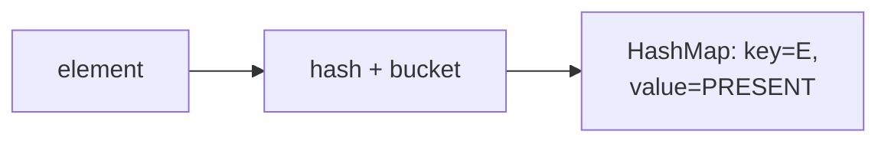

## Why it Matters

The **default `Set`**: a thin wrapper over **`HashMap`** (element as key, dummy `PRESENT` as value) with **O(1) average** add/contains. Correct `equals`/`hashCode` on elements is the whole contract.

## Diagram



## Code

```java
// HashSet — hash table, unique, one null, O(1) avg
var set = new HashSet<String>();
set.add("A"); set.add("B"); set.add("A"); set.add(null);
System.out.println(set);
System.out.println(set.contains("A")); // => true

Set<Integer> deduped = new HashSet<>(List.of(1,2,2,3));

// Record — correct equals/hashCode for HashSet membership
record User(int id, String name) {}
Set<User> users = new HashSet<>();
users.add(new User(1,"Ada"));
users.add(new User(1,"Ada"));
System.out.println(users.size()); // => 1

Set<Integer> big = new HashSet<>(10_000, 0.75f);
```
Fail fast iterator: structural change after creating an iterator causes ConcurrentModificationException on next use.

## When to use / not

| Use | NOT |
|-----|-----|
| Fast membership, dedup, visited-sets | Insertion order → `LinkedHashSet` |
| Record elements (correct `equals`/`hashCode` free) | Sorted iteration or ranges → `TreeSet` |
| Presized via `new HashSet<>(n, 0.75f)` for bulk loads | Mutable elements whose hash changes |

## Trade-offs

- Fastest membership; minimal API surface over `HashMap`.
- No order guarantees; iteration cost is O(capacity + size).
- Needs disciplined `equals`/`hashCode` (records solve this).

## Vs

- HashSet: HashMap, no order, O(1), one null, lowest memory, fastest for membership
- LinkedHashSet: LinkedHashMap, insertion order, O(1), one null, higher memory
- TreeSet: TreeMap, sorted, O(log n), no null, highest memory, supports ranges

Pick HashSet unless you need order or sorting.

## Pitfalls

- Mutating an element's hash while stored orphans it , `contains`/`remove` fail.
- Forgetting `hashCode` when overriding `equals` creates duplicates (use records).
- Iteration order unstable across runs , never snapshot-compare `toString`.

## Interview q&a

**Q: How is `HashSet` implemented?** Wrapper over `HashMap`: element as key, dummy `PRESENT` as value; rehash at load factor 0.75.

**Q: Why override `hashCode` with `equals`?** Hash picks the bucket, `equals` confirms , mismatched hashes cause duplicates and missed lookups.

**Q: `HashSet` vs `TreeSet`?** Hash: O(1), unordered, one `null`. Tree: O(log n), sorted, no `null`.

## Related

- [[Java/03_Collections/Set/Set|Set]] • [[Java/07_DSA/HashMap|HashMap (DSA)]] (buckets, rehash)
- [[Java/08_Modern-Java/01 Records|Records]] (correct keys) • [[Java/01_Core-Java/Types/Object Class|Object Class]]

How is HashSet implemented?:: Wrapper over HashMap, element is key, dummy PRESENT is value. #flashcard
When does HashSet rehash?:: When size exceeds capacity times load factor, default 0.75, then table doubles. #flashcard
Why override hashCode with equals for HashSet elements?:: Hash picks the bucket, equals confirms the match, mismatched hashes cause duplicates and missed lookups. #flashcard
Can HashSet hold null? Can TreeSet?:: HashSet yes one null, TreeSet no. #flashcard
Is HashSet iteration order insertion order?:: No, it is undefined and can change, use LinkedHashSet for insertion order. #flashcard

# HashSet , Java.util.HashSet

> Part of [[Java/03_Collections/Set/Set|Set]]
>
> Default Set. Hash table, no order, no duplicates, one null allowed. Fastest membership test. Backed by HashMap.

## Internals

- wraps HashMap with element as key and a dummy PRESENT as value
- capacity is number of buckets, default 16, load factor 0.75, rehash when size exceeds capacity times load factor
- hash to bucket index, collisions go to a list then to a tree at 8 entries
- no ordering, iteration order can change across runs

## Time Complexity

- add, contains, remove: O(1) average, O(log n) worst after treeify
- iteration: O(capacity plus size)
- addAll: O(n)
