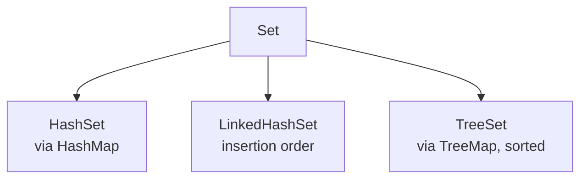

## Why it Matters

The **uniqueness + membership** abstraction: **no duplicates**, **no index**, O(1) `contains` on hashes. Backed by a `Map` internally , the right tool for dedup, visited-sets, and allow-lists.

## Diagram



## Code

```java
// Set — unique elements; HashSet/LinkedHashSet/TreeSet trades
var set = new HashSet<>(List.of("B","A","C","A"));
System.out.println(set);
System.out.println(set.add("A")); // => false
System.out.println(set.contains("B")); // => true

List<Integer> nums = List.of(1,2,2,3,3,3);
Set<Integer> unique = new HashSet<>(nums);

Set<String> ordered = new LinkedHashSet<>(List.of("B","A","C","A"));
System.out.println(ordered); // => [B, A, C]

Set<Integer> sorted = new TreeSet<>(List.of(5,1,3,1));
System.out.println(sorted); // => [1, 3, 5]

Set<Integer> a = new HashSet<>(Set.of(1,2,3));
Set<Integer> b = Set.of(2,3,4);
a.retainAll(b);
```

## When to use / not

| Use | NOT |
|-----|-----|
| Dedup, membership tests, set algebra | Indexed access or duplicates → `List` |
| `HashSet` default; `LinkedHashSet` for insertion order | Sorted/range queries → `TreeSet` |
| `EnumSet` for enums (bit vector) | Mutating elements so `hashCode` changes while stored |

## Trade-offs

- O(1) membership (hash impls); set algebra via `retainAll`/`removeAll`.
- No index; iteration order undefined unless ordered impl.
- Mutating a stored element's hash breaks the set silently.

## Vs

| | `HashSet` | `LinkedHashSet` | `TreeSet` |
|--|-----------|-----------------|-----------|
| Order | none | insertion | sorted |
| Cost | O(1) avg | O(1) avg | O(log n) |
| Null | one | one | no |

## Pitfalls

- mutating an element so hashCode or equals changes while in a HashSet loses the element, contains and remove fail
- TreeSet needs Comparable or a Comparator at construction, otherwise ClassCastException
- HashSet iteration order is not stable across runs

## Interview q&a

**Q: How does `HashSet` avoid duplicates?** Backed by `HashMap` , the element is the key, `add` delegates to map `put`.

**Q: What breaks if you mutate an element in a `HashSet`?** The hash changes, the bucket mismatches, so lookups fail.

**Q: When to use `Set` vs `List`?** `Set` for uniqueness and fast membership, `List` for order and index.

## Related

- [[Java/03_Collections/Collection|Collection]] • [[Java/03_Collections/Map|Map]] (sets are maps inside)
- [[Java/01_Core-Java/Types/Object Class|Object Class]] (`equals`/`hashCode` contract)

How does HashSet avoid duplicates?:: Backed by HashMap, element is the key, add delegates to map put. #flashcard
What breaks if you mutate an element in a HashSet?:: Hash code changes and the bucket mismatches, so lookups fail. #flashcard
When to use Set vs List?:: Set for uniqueness and fast membership, List for order and index. #flashcard
How to dedup while keeping order?:: Use a LinkedHashSet, for example new ArrayList<>(new LinkedHashSet<>(list)). #flashcard

# Set , Java.util.Set

> Part of [[Java/03_Collections/README|Collections Framework]]
>
> No duplicates, no index. Membership with contains is the main operation. Backed by a Map internally.

Since Java 21, SequencedSet adds getFirst, getLast and reversed for LinkedHashSet.

## Contract

- no duplicates, add returns false if already present
- no index, no get by position
- one null allowed in HashSet and LinkedHashSet, not in TreeSet
- equals means same size and every element contained in the other

## Methods

- add, contains, remove, size, isEmpty
- addAll, retainAll for intersection, removeAll for difference
- iterator

## Implementations

- HashSet backed by HashMap, no order, fastest, default choice. See [[Java/03_Collections/Set/HashSet|HashSet]]
- LinkedHashSet backed by LinkedHashMap, insertion order, slightly heavier
- TreeSet backed by TreeMap, sorted, range ops, O(log n). See [[Java/03_Collections/Set/TreeSet|TreeSet]] and [[Java/03_Collections/Set/Sorted Set|Sorted Set]]
- EnumSet bit vector for enums, fast
