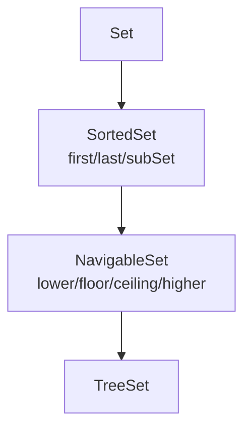

# Sorted set

> Part of [[README|Java MOC]] • `Java/03_Collections/Set`
> 🎨 **Visual diagram:** Create Excalidraw drawing from template: `Cmd+P → Excalidraw: New from template → Java Diagram`

## Intent

One sentence: what problem does this solve? Define the **key term** in **bold**.

## Why it Matters

The **sorted-view interfaces** (`SortedSet` → `NavigableSet`): range views (`subSet`, `headSet`) and nearest-match ops (`lower`, `floor`, `ceiling`, `higher`) over a `TreeSet`. Views are live, not copies.

## Diagram



## Code / Example

```java
// Java 25: var, record, sealed, pattern matching, SequencedCollection, virtual threads, Compact Object Headers
// SortedSet — sorted unique view (TreeSet/NavigableSet)
var sorted = new TreeSet<>(List.of(5,1,3,2,5));
System.out.println(sorted); // => [1, 2, 3, 5]
System.out.println(sorted.first()); // => 1
System.out.println(sorted.last()); // => 5
System.out.println(sorted.subSet(2,5)); // => [2, 3]
System.out.println(sorted.headSet(3));
System.out.println(sorted.tailSet(3));

SortedSet<String> byLen = new TreeSet<>(Comparator.comparingInt(String::length));
byLen.addAll(List.of("a","bbb","cc"));
System.out.println(byLen); // => [a, cc, bbb]

NavigableSet<Integer> nav = new TreeSet<>(List.of(10,20,30));
System.out.println(nav.lower(20)); // => 10
System.out.println(nav.floor(20));
System.out.println(nav.ceiling(25));
System.out.println(nav.higher(20)); // => 30

SortedSet<Integer> view = nav.subSet(10,30);
view.add(15);
System.out.println(nav); // => [10, 15, 20, 30]
```

### Concrete Example

- **Input:**
- **Output:**
- **Explanation:**

## When to Use / When NOT

| **Use When** | **Avoid When** |
|--------------|----------------|
|  |  |
|  |  |
|  |  |

## Trade-offs

| Dimension | This Approach | Alternative |
|-----------|---------------|-------------|
| Complexity | | |
| Performance | | |
| Readability | | |
| Testability | | |

## Vs Table

- HashSet: no order, O(1), one null
- LinkedHashSet: insertion order, O(1), one null
- SortedSet via TreeSet: sorted, O(log n), no null, supports ranges and nearest match

## Pitfalls

- `subSet`/`headSet` views are live , writes reflect both ways; copy with `new TreeSet<>(view)` for snapshots.
- Range endpoints: `subSet(from, to)` is from-inclusive, to-exclusive , off-by-one source.
- Length-based comparators collapse unequal strings , tie-break or lose elements.

## Interview Q&A (Senior Depth)

**Q: `SortedSet` vs `NavigableSet`?** `SortedSet` adds `first`/`last`/subset views; `NavigableSet` adds `lower`/`floor`/`ceiling`/`higher`, `pollFirst`/`pollLast`, `descendingSet`.

**Q: Are `subSet` views copies?** No , live backed views; changes show on both sides.

**Q: How to iterate descending?** `new TreeSet<>(Comparator.reverseOrder())` or `navigable.descendingSet()`.

## Flashcards (Spaced Repetition)

#flashcard
**Q:** What is the trigger keyword for Sorted set? :: **A:** [trigger keywords] #flashcard

#flashcard
**Q:** Time/space complexity of Sorted set? :: **A:** Time: O(), Space: O() #flashcard

#flashcard
**Q:** When do you NOT use Sorted set? :: **A:** [anti-pattern scenarios] #flashcard

#flashcard
**Q:** Core Java 25 snippet for Sorted set? :: **A:** `var list = new ArrayList<>(List.of(...));` #flashcard

## Practice Tasks (Tasks Plugin)

- [ ] Restate the intent from memory 📅 {date:YYYY-MM-DD, +1}
- [ ] Code the snippet without looking 📅 {date:YYYY-MM-DD, +3}
- [ ] Answer all Interview Q&A aloud 📅 {date:YYYY-MM-DD, +7}
- [ ] Review flashcards (Spaced Repetition) 📅 {date:YYYY-MM-DD, +1}

```tasks
not done
path includes {file.folder}
sort by due
limit 10
```

## Related

- [[Java/03_Collections/Set/Set|Set]] • [[Java/03_Collections/Set/TreeSet|TreeSet]] (the impl)
- [[Java/07_DSA/Trees|Trees]] (ordered traversal)

What is the difference between SortedSet and NavigableSet?:: SortedSet gives first last and subset views, NavigableSet adds lower floor ceiling higher and descendingSet. #flashcard
Can SortedSet hold null?:: No, null cannot be compared. #flashcard
How to get descending order?:: Use TreeSet with reverseOrder or call descendingSet. #flashcard
Are subSet views copies?:: No, they are backed views, changes show in both. #flashcard

# Sorted set , Java.util.SortedSet and NavigableSet

> Part of [[Java/03_Collections/Set/Set|Set]]
>
> Set with sorted iteration by natural order or a Comparator. No duplicates, no null, with range view operations.

## Contract

- sorted, not indexed
- no duplicates, no null
- extra ops: first, last, subSet from inclusive to exclusive, headSet, tailSet

## Hierarchy

```
Set
 -> SortedSet (first, last, comparator, subSet, headSet, tailSet)
 -> NavigableSet (lower, floor, ceiling, higher, pollFirst, pollLast, descendingSet)
 -> TreeSet (the JDK implementation)
```


---

*Category: Java/03_Collections/Set • Part of [[README|Java MOC]] • Java 25*