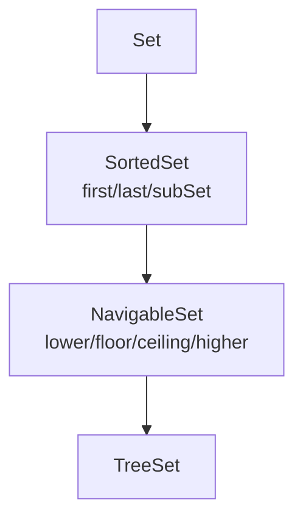

## Why it Matters

The **sorted-view interfaces** (`SortedSet` → `NavigableSet`): range views (`subSet`, `headSet`) and nearest-match ops (`lower`, `floor`, `ceiling`, `higher`) over a `TreeSet`. Views are live, not copies.

## Diagram



## Code

```java
// SortedSet — sorted unique view (TreeSet/NavigableSet)
var sorted = new TreeSet<>(List.of(5,1,3,2,5));
System.out.println(sorted); // => [1, 2, 3, 5]
System.out.println(sorted.first()); // => 1
System.out.println(sorted.last()); // => 5
System.out.println(sorted.subSet(2,5)); // => [2, 3]
System.out.println(sorted.headSet(3));
System.out.println(sorted.tailSet(3));

SortedSet<String> byLen = new TreeSet<>(Comparator.comparingInt(String::length));
byLen.addAll(List.of("a","bbb","cc"));
System.out.println(byLen); // => [a, cc, bbb]

NavigableSet<Integer> nav = new TreeSet<>(List.of(10,20,30));
System.out.println(nav.lower(20)); // => 10
System.out.println(nav.floor(20));
System.out.println(nav.ceiling(25));
System.out.println(nav.higher(20)); // => 30

SortedSet<Integer> view = nav.subSet(10,30);
view.add(15);
System.out.println(nav); // => [10, 15, 20, 30]
```

## When to use / not

| Use | NOT |
|-----|-----|
| Range views (`subSet`, `headSet`, `tailSet`) | Unordered membership , `HashSet` is faster |
| Nearest-match navigation (`lower`/`higher`) | Copies , views are live; mutate with care |
| Descending iteration via `descendingSet` | `null` keys (cannot be compared) |

## Trade-offs

- Live range views avoid copying; navigable queries in O(log n).
- Views share mutation , aliasing bugs if callers assume snapshots.
- Sorted only , no hash-speed path.

## Vs

- HashSet: no order, O(1), one null
- LinkedHashSet: insertion order, O(1), one null
- SortedSet via TreeSet: sorted, O(log n), no null, supports ranges and nearest match

## Pitfalls

- `subSet`/`headSet` views are live , writes reflect both ways; copy with `new TreeSet<>(view)` for snapshots.
- Range endpoints: `subSet(from, to)` is from-inclusive, to-exclusive , off-by-one source.
- Length-based comparators collapse unequal strings , tie-break or lose elements.

## Interview q&a

**Q: `SortedSet` vs `NavigableSet`?** `SortedSet` adds `first`/`last`/subset views; `NavigableSet` adds `lower`/`floor`/`ceiling`/`higher`, `pollFirst`/`pollLast`, `descendingSet`.

**Q: Are `subSet` views copies?** No , live backed views; changes show on both sides.

**Q: How to iterate descending?** `new TreeSet<>(Comparator.reverseOrder())` or `navigable.descendingSet()`.

## Related

- [[Java/03_Collections/Set/Set|Set]] • [[Java/03_Collections/Set/TreeSet|TreeSet]] (the impl)
- [[Java/07_DSA/Trees|Trees]] (ordered traversal)

What is the difference between SortedSet and NavigableSet?:: SortedSet gives first last and subset views, NavigableSet adds lower floor ceiling higher and descendingSet. #flashcard
Can SortedSet hold null?:: No, null cannot be compared. #flashcard
How to get descending order?:: Use TreeSet with reverseOrder or call descendingSet. #flashcard
Are subSet views copies?:: No, they are backed views, changes show in both. #flashcard

# Sorted set , Java.util.SortedSet and NavigableSet

> Part of [[Java/03_Collections/Set/Set|Set]]
>
> Set with sorted iteration by natural order or a Comparator. No duplicates, no null, with range view operations.

## Hierarchy

```
Set
 -> SortedSet (first, last, comparator, subSet, headSet, tailSet)
 -> NavigableSet (lower, floor, ceiling, higher, pollFirst, pollLast, descendingSet)
 -> TreeSet (the JDK implementation)
```

## Contract

- sorted, not indexed
- no duplicates, no null
- extra ops: first, last, subSet from inclusive to exclusive, headSet, tailSet

## Time Complexity with TreeSet

- add, contains, remove: O(log n)
- first, last: O(log n)
- subSet, headSet, tailSet: O(log n) to find plus O(k) to traverse
- lower, floor, ceiling, higher: O(log n)
