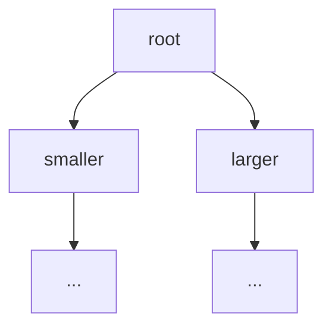

## Why it Matters

The **sorted unique set** over **`TreeMap`** (Red-Black): O(log n) ops plus range and nearest-match queries (`subSet`, `ceiling`). Comparison , not `equals` , defines duplicates here.

## Diagram



## Code

```java
// TreeSet — Red-Black tree via TreeMap, O(log n), sorted, no null
var ts = new TreeSet<>(List.of(5,1,3,2,5));
System.out.println(ts); // => [1, 2, 3, 5]
System.out.println(ts.first()); // => 1
System.out.println(ts.last()); // => 5

TreeSet<String> ci = new TreeSet<>(String.CASE_INSENSITIVE_ORDER);
ci.add("Banana"); ci.add("apple"); ci.add("APPLE");
System.out.println(ci); // => [apple, Banana]

System.out.println(ts.lower(3)); // => 2
System.out.println(ts.higher(3)); // => 5
System.out.println(ts.floor(3));
System.out.println(ts.ceiling(4));
System.out.println(ts.subSet(2,true,5,false)); // => [2, 3]

System.out.println(ts.pollFirst()); // => 1
System.out.println(ts.descendingSet());

// Custom domain type — Comparator defines TreeSet ordering
record Student(String name, int score) {}
TreeSet<Student> byScore = new TreeSet<>(Comparator.comparingInt(Student::score));
byScore.add(new Student("Ada",90)); byScore.add(new Student("Bob",85));
System.out.println(byScore.first()); // => Student[name=Bob, score=85]
```
If compare says 0 but equals says false, the set still treats it as duplicate.

## When to use / not

| Use | NOT |
|-----|-----|
| Sorted uniqueness, leaderboards, ranges | Plain membership , `HashSet` is O(1) |
| Nearest-match (`ceiling`, `floor`), `subSet` views | `null` elements or mixed incomparable types |
| Custom order via `Comparator` at construction | `equals`-inconsistent comparators (surprising dedup) |

## Trade-offs

- Sorted iteration + ranges + nearest-match in one structure.
- O(log n) everything; comparator , not `equals` , defines identity.
- No `null`; higher memory than hash sets.

## Vs

- backing: HashMap vs LinkedHashMap vs TreeMap
- order: none vs insertion vs sorted
- cost: O(1) vs O(1) vs O(log n)
- null: allowed vs allowed vs not allowed
- needs Comparable: only TreeSet
- range ops: only TreeSet

Pick TreeSet when you need sorted uniqueness or range and nearest queries, otherwise HashSet is faster.

## Pitfalls

- Comparator returning 0 dedupes even when `equals` differs , keep them consistent.
- No `Comparator` + non-`Comparable` elements → `ClassCastException` at runtime.
- `null` cannot be compared , NPE on insert.

## Interview q&a

**Q: How is `TreeSet` implemented?** Wrapper over `TreeMap` (Red-Black); `Comparator` defines order , and duplicates (compare == 0 means duplicate, even if `equals` differs).

**Q: Which ops are O(log n)?** `add`, `remove`, `contains`, `first`/`last`, `lower`/`floor`/`ceiling`/`higher`, `pollFirst`/`pollLast`.

**Q: When to prefer it?** Sorted iteration, ranges, nearest-match (leaderboards, scheduling).

## Related

- [[Java/03_Collections/Set/Set|Set]] • [[Java/03_Collections/Set/Sorted Set|Sorted Set]] (range views)
- [[Java/07_DSA/Trees|Trees]] (Red-Black backing)

How is TreeSet implemented?:: Wrapper over TreeMap, red black tree, comparator defines order and duplicates. #flashcard
How does TreeSet compare to HashSet?:: HashSet is hash table O(1) no order one null, TreeSet is tree O(log n) sorted no null. #flashcard
Can TreeSet hold null or mixed types?:: No, null fails on compare and mixed incomparable types throw ClassCastException. #flashcard
Why can TreeSet treat unequal objects as duplicates?:: It uses compare to zero for equality, not equals. #flashcard
When to prefer TreeSet?:: When you need sorted iteration, ranges or nearest match like leaderboards and interval scheduling. #flashcard

# TreeSet , Java.util.TreeSet

> Part of [[Java/03_Collections/Set/Set|Set]]
>
> Sorted unique set backed by TreeMap. No duplicates, no null, sorted iteration, O(log n). Implements NavigableSet and SortedSet.

## Internals

- wraps TreeMap with element as key and dummy PRESENT as value
- red black balanced tree, guarantees O(log n) height
- ordering by natural Comparable or a Comparator given at construction
- compare defines equality for the set, if compare returns 0 the element is treated as duplicate even if equals differs

## Time Complexity

- add, remove, contains: O(log n)
- first, last: O(log n)
- lower, floor, ceiling, higher: O(log n)
- subSet, headSet, tailSet: O(log n) plus O(k)
- iteration: O(n) sorted
- pollFirst, pollLast: O(log n)
