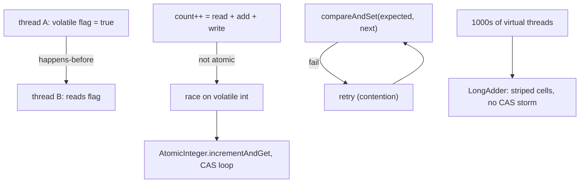

## Why it Matters

1. Visibility: Without `volatile`/synchronization, a thread may never see another thread's write (cached in register/core).
2. Atomicity without locks, `count++` is 3 steps (read-modify-write); `AtomicInteger.incrementAndGet()` is a single CAS loop, no `synchronized`, no blocking.
3. Scalability: CAS is non-blocking; under low-moderate contention it outperforms locking. `LongAdder` stripes contention further.
4. Safe publication, `volatile` / `final` / atomic publish ensures other threads see fully constructed objects.

## Diagram



## Code

## When to use / not

| Use | NOT |
|-----|-----|
| `volatile` for a stop flag / safe publication of one variable | `volatile` for `count++` , it is a read-modify-write race; use `AtomicInteger` |
| `AtomicInteger`/`AtomicReference` for lock-free counters and state machines | Multi-variable invariants , `synchronized`/`Lock` keeps the whole check-then-act atomic |
| `LongAdder` for high-contention metrics under virtual-thread fan-out | `LongAdder` when you need an exact atomic read , `sum()` is eventually consistent, use `AtomicLong` |
| `AtomicStampedReference` when values can cycle (ABA) | `VarHandle` acquire/release in app code , `volatile` is simpler and strong enough |

## Trade-offs

> I still reach for LongAdder when I see a counter shared by thousands of virtual threads, it just holds up better. Short version: volatile is for flags, atomics are for counters, locks are for invariants that touch more than one variable.

`volatile` guarantees visibility + ordering for a single variable; `java.util.concurrent.atomic` (`AtomicInteger`, `AtomicReference`, `LongAdder`, etc.) adds CAS-based atomic compound operations without locking. Together they enable lock-free algorithms on the Java Memory Model's happens-before rules.

> Java 25 note: Virtual threads do not change JMM semantics, `volatile`/`CAS` still provide the same guarantees. You can use atomics for counters/flags shared across virtual threads; for request context prefer `ScopedValue` (JEP 506) over `ThreadLocal`.

## Vs

## Pitfalls

- `volatile int count; count++`, still a race; use `AtomicInteger` or `LongAdder`.
- Assuming `LongAdder.sum()` is an atomic snapshot, it is not; concurrent increments may be missed/double-counted in the sum.
- Double-checked locking without `volatile` on the instance field → half-constructed object visible.
- ABA with `AtomicReference`, use `AtomicStampedReference` if values can cycle.
- Using `AtomicLong` for high-contention metrics with thousands of virtual threads → CAS storms; switch to `LongAdder`.
- `ThreadLocal` with virtual threads at scale → memory bloat; use `ScopedValue` (JEP 506).

## Interview q&a

**Q: What does `volatile` guarantee?** Visibility (write happens-before subsequent read) + ordering (no reordering of volatile accesses with surrounding ops). Not atomicity for `x++`.

**Q: `volatile` vs `AtomicInteger`?** `volatile int`, single read/write is visible but `volatileCount++` races (read-modify-write not atomic). `AtomicInteger` provides CAS-based `incrementAndGet()` that is atomic and visible.

**Q: What is CAS?** Hardware `compareAndSwap(expected, newVal)`, succeeds only if current == expected. Atomics loop CAS until success; under high contention `LongAdder` stripes to reduce retries.

**Q: `AtomicLong` vs `LongAdder`?** `AtomicLong`: single variable, CAS retry, `get()` is atomic snapshot. `LongAdder`: striped cells, `increment()` scales under contention, `sum()` is eventually consistent (not atomic snapshot), use for high-contention counters/metrics.

**Q: ABA problem?** CAS sees `A -> B -> A` as "unchanged" and succeeds incorrectly. Fix: `AtomicStampedReference` (value + stamp) or `AtomicMarkableReference`.

**Q: `volatile` vs `VarHandle` ordering?** `volatile` is strongest (full fence). `VarHandle` exposes weaker modes (`acquire`/`release`, `plain`, `opaque`) for experts optimising fences, rarely needed in app code.

**Q: Do virtual threads change `volatile`/CAS semantics?** No, JMM happens-before rules are unchanged. Virtual threads are just threads; `volatile`/`CAS` work identically. For context propagation prefer `ScopedValue` over `ThreadLocal`.

**Q: When does `StructuredTaskScope` replace atomics?** For *scoped* results (one request's subtasks), confine results to the scope, no shared `AtomicReference` + latch. Atomics remain for *shared long-lived* state (global counters, caches).

What does `volatile` guarantee?:: Visibility (write happens-before subsequent read) + ordering (no reordering of volatile accesses with surrounding ops). Not atomicity for `x++`. #flashcard
`volatile` vs `AtomicInteger`?:: `volatile int`, single read/write is visible but `volatileCount++` races (read-modify-write not atomic). `AtomicInteger` provides CAS-based `incrementAndGet()` that is atomic and visible. #flashcard
What is CAS?:: Hardware `compareAndSwap(expected, newVal)`, succeeds only if current == expected. Atomics loop CAS until success; under high contention `LongAdder` stripes to reduce retries. #flashcard
`AtomicLong` vs `LongAdder`?:: `AtomicLong`: single variable, CAS retry, `get()` is atomic snapshot. `LongAdder`: striped cells, `increment()` scales under contention, `sum()` is eventually consistent (not atomic snapshot), use for high-contention counters/metrics. #flashcard
ABA problem?:: CAS sees `A -> B -> A` as "unchanged" and succeeds incorrectly. Fix: `AtomicStampedReference` (value + stamp) or `AtomicMarkableReference`. #flashcard
`volatile` vs `VarHandle` ordering?:: `volatile` is strongest (full fence). `VarHandle` exposes weaker modes (`acquire`/`release`, `plain`, `opaque`) for experts optimising fences, rarely needed in app code. #flashcard
Do virtual threads change `volatile`/CAS semantics?:: No, JMM happens-before rules are unchanged. Virtual threads are just threads; `volatile`/`CAS` work identically. For context propagation prefer `ScopedValue` over `ThreadLocal`. #flashcard
When does `StructuredTaskScope` replace atomics?:: For *scoped* results (one request's subtasks), confine results to the scope, no shared `AtomicReference` + latch. Atomics remain for *shared long-lived* state (global counters, caches). #flashcard

- [136. Single Number](https://leetcode.com/problems/single-number/)
- [191. Number Of 1 Bits](https://leetcode.com/problems/number-of-1-bits/)
- [231. Power Of Two](https://leetcode.com/problems/power-of-two/)

---
*Category: Concurrency • Part of [[README|Java MOC]] • Java 25*

## Related

- [[Threads]], JMM happens-before, virtual threads, ScopedValue
- [[Locks and Synchronizers]], when CAS is insufficient (multi-variable invariants)
- [[Concurrent Collections]], `ConcurrentHashMap` bins use CAS + `synchronized`
- [[Executor Framework]], executors sharing atomic counters/metrics

# Atomics and Volatile

> Part of [[README|Java MOC]] • `Concurrency` • Java 25 (LTS)

## Core Concepts

### `volatile`, Visibility + Ordering, not Atomicity

```java
class Flag {
 private volatile boolean stop = false;
 void requestStop() { stop = true; }
 void run() { while (!stop) { /* work */ } }
}
```
- Every `volatile` write happens-before every subsequent read of the same variable.
- Prevents reordering of `volatile` accesses with surrounding reads/writes.
- Not atomic for `volatile int x; x++`, still a race.

### CAS, Compare-And-Swap

Hardware primitive: `compareAndSwap(expected, update)`, atomically sets value to `update` iff current value == `expected`; returns success/failure. All atomics are CAS loops (or intrinsics).
```
do {
 old = get();
 next = old + 1;
} while (!compareAndSet(old, next)); // retry on contention
```

### Atomic Classes

| Class | Wraps | Key ops |
|---|---|---|
| `AtomicInteger` / `AtomicLong` | `int`/`long` | `get`, `set`, `incrementAndGet`, `compareAndSet`, `getAndUpdate` |
| `AtomicReference<V>` | reference | `compareAndSet`, `getAndSet`, `updateAndGet` |
| `AtomicBoolean` | `boolean` | `compareAndSet`, `getAndSet` |
| `AtomicStampedReference` | ref + stamp | Solves ABA |
| `LongAdder` / `DoubleAdder` | striped counter | `increment`, `sum`, higher throughput under contention |
| `LongAccumulator` | striped fold | `accumulate(x)` with custom function |
| `VarHandle` (Java 9+) | any field | Low-level `compareAndSet`, `getAndAdd` with memory modes |

## Java 25 Changes

| Concern | Classic | Java 25 |
|---|---|---|
| Counter shared across platform threads | `AtomicLong` / `LongAdder` | Same, JMM unchanged; virtual threads are still threads |
| High-contention counter with virtual threads | `AtomicLong` CAS retries under contention | **`LongAdder`**, stripes across cells, `sum()` at end, preferred for virtual-thread fan-out |
| Request context | `ThreadLocal` (leak-prone with virtual threads) | `ScopedValue<String>` (JEP 506), immutable, auto-inherited, no `remove()` |
| Scoped aggregation of atomic results | `AtomicReference` + `CountDownLatch` | `StructuredTaskScope` (preview, JEP 505), no shared atomics needed for scoped results |

> StructuredTaskScope note (JEP 505, preview): When subtasks contribute to a *scoped* result (one request), prefer `StructuredTaskScope` + local variables over shared `AtomicReference`/`AtomicInteger` + latch. Atomics remain correct for *long-lived shared* counters (metrics, sequence generators) accessed by many virtual threads. Flag: `--enable-preview`.

> VarHandle note: `VarHandle` provides `compareAndSet`/`getAndAdd` with explicit memory orderings (`getAcquire`/`setRelease`). I prefer high-level atomics unless building low-level concurrency primitives.

### `volatile`Vs`synchronized`Vs`Atomic*`Vs`Lock`

| Aspect | `volatile` | `Atomic*` (CAS) | `synchronized` / `Lock` |
|---|---|---|---|
| Visibility | Yes (HB on write→read) | Yes (volatile semantics + CAS) | Yes (unlock → lock HB) |
| Atomic compound op | No (`x++` races) | Yes (`incrementAndGet`, `compareAndSet`) | Yes (mutual exclusion) |
| Blocking | Never | Never (spin-retry) | Blocks contenders |
| Ordering guarantee | Prevents reordering around volatile access | Same as volatile + atomic | Full barrier on monitor enter/exit |
| Use when | Flag, safe publication of single variable | Counters, sequence, lock-free structures | Multi-variable invariants |

### `AtomicLong`Vs`LongAdder`Vs`LongAccumulator`

| Type | Contention handling | `increment` cost (contended) | Read cost | When to use |
|---|---|---|---|---|
| `AtomicLong` | Single CAS loop | High (retries) | `get()` O(1) | Low contention, need exact atomic read-modify-write |
| `LongAdder` | Striped cells, `sum()` folds | Low (per-thread cell) | `sum()` O(cells), not atomic snapshot | High-contention counters / metrics (virtual-thread fan-out) |
| `LongAccumulator` | Striped + custom fn | Low | `get()` folds | Max/min/custom fold under contention |

### `volatile`Vs`VarHandle`(Memory Modes)

| Mode | Guarantee | API |
|---|---|---|
| `volatile` (`getVolatile`/`setVolatile`) | Full volatile HB | `Atomic*`, `VarHandle.getVolatile` |
| `acquire`/`release` | Acquire loads, release stores (weaker than volatile) | `VarHandle.getAcquire`/`setRelease` |
| `plain` | No ordering | `VarHandle.get`/`set` |
| `opaque` | No tearing, no ordering | `VarHandle.getOpaque` |

Most application code uses `volatile`/`Atomic*`; `VarHandle` modes are for library authors.

### Volatile Flag, Safe Stop Across Virtual Threads

```java
import java.util.concurrent.Executors;
import java.time.Duration;

class VolatileFlag {
 private volatile boolean stop = false;

 void runWorker() throws Exception {
 try (var exec = Executors.newVirtualThreadPerTaskExecutor()) {
 var worker = exec.submit(() -> {
 while (!stop) {
 try { Thread.sleep(Duration.ofMillis(10)); } catch (InterruptedException e) { Thread.currentThread().interrupt(); break; }
 }
 System.out.println("stopped, seen on " + Thread.currentThread());
 });
 Thread.sleep(Duration.ofMillis(100));
 stop = true;
 worker.get();
 }
 }
}
```

### AtomicInteger vs LongAdder, High-contention Counter on Virtual Threads

```java
import java.util.concurrent.*;
import java.util.concurrent.atomic.*;
import java.time.Duration;

class CounterDemo {
 private final AtomicLong atomicCount = new AtomicLong();
 void incAtomic() { atomicCount.incrementAndGet(); }

 private final LongAdder adder = new LongAdder();
 void incAdder() { adder.increment(); }
 long sumAdder() { return adder.sum(); }

 static void demo() throws Exception {
 var demo = new CounterDemo();
 int tasks = 10_000;
 try (var exec = Executors.newVirtualThreadPerTaskExecutor()) {
 var futures = java.util.stream.IntStream.range(0, tasks)
 .mapToObj(i -> exec.<Void>submit(() -> { demo.incAtomic(); demo.incAdder(); return null; }))
 .toList();
 for (var f : futures) f.get();
 System.out.println("AtomicLong=" + demo.atomicCount.get() + " LongAdder=" + demo.sumAdder());
 }
 }
}
```

### AtomicReference, Lock-free State Machine

```java
import java.util.concurrent.atomic.AtomicReference;
import java.util.concurrent.Executors;

class StateMachine {
 enum State { NEW, RUNNING, DONE }
 private final AtomicReference<State> state = new AtomicReference<>(State.NEW);

 boolean start() { return state.compareAndSet(State.NEW, State.RUNNING); }
 boolean finish() { return state.compareAndSet(State.RUNNING, State.DONE); }
 State get() { return state.get(); }

 void resetIfDone() { state.updateAndGet(s -> s == State.DONE ? State.NEW : s); }

 static void demo() throws Exception {
 var sm = new StateMachine();
 try (var exec = Executors.newVirtualThreadPerTaskExecutor()) {
 var f1 = exec.submit(sm::start);
 var f2 = exec.submit(sm::start);
 System.out.println("f1=" + f1.get() + " f2=" + f2.get() + " state=" + sm.get());
 }
 }
}
```

### Safe Publication, Volatile vs Final

```java
class SafePublication {
 private volatile Config config;

 void publish(Config c) { config = c; }
 Config get() { return config; }

 static class Holder {
 final Config cfg;
 Holder(Config c) { this.cfg = c; }
 }

 record Config(String host, int port) {}
}
```

### Scoped vs Shared, StructuredTaskScope Replaces Shared Atomics for Scoped Work

```java
import java.util.concurrent.StructuredTaskScope;
import java.time.Duration;

class Metrics {
 final LongAdder requests = new LongAdder();
 void record() { requests.increment(); }
}

class ScopedSearch {
 String search(List<String> shards) throws Exception {
 try (var scope = new StructuredTaskScope.ShutdownOnFailure()) {
 var tasks = shards.stream().map(s -> scope.fork(() -> query(s))).toList();
 scope.join();
 scope.throwIfFailed();
 return tasks.stream().map(t -> t.get()).reduce("", (a, b) -> a + b);
 }
 }
 String query(String shard) throws InterruptedException { Thread.sleep(Duration.ofMillis(50)); return "[" + shard + "]"; }
}
```