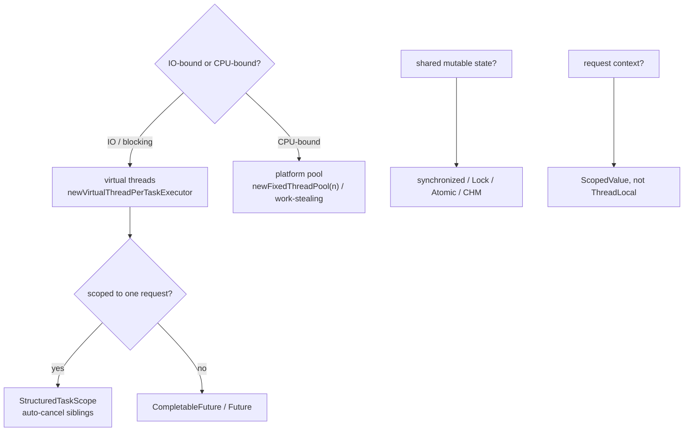
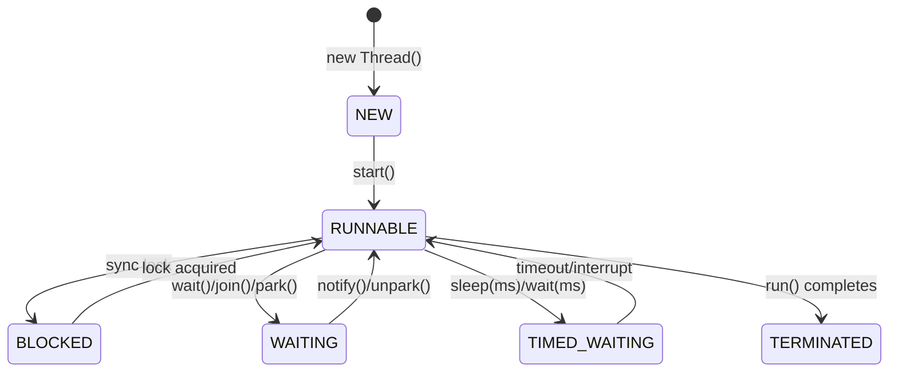

---
title: "Concurrency Cheat Sheet"
category: "Concurrency"
tags: [java, cheat-sheet, concurrency]
created: 2026-09-03
pattern: 0
difficulty: Hard
completed: false
reviewed: ""
sr-due: ""
problems-solved: []
problems-solved-dates: {}
excalidraw: ""
---## Diagram



## Code

```java
// Java 25 defaults: virtual threads, scoped context, structured fan-out
try (var exec = java.util.concurrent.Executors.newVirtualThreadPerTaskExecutor()) {
 exec.submit(() -> fetchUser(id));
 exec.submit(() -> fetchOrders(id));
}

try (var scope = new java.util.concurrent.StructuredTaskScope.ShutdownOnFailure()) {
 var u = scope.fork(() -> getUser());
 var o = scope.fork(() -> getOrders());
 scope.join().throwIfFailed();
 use(u.get(), o.get());
}

private static final java.util.concurrent.ScopedValue<String> REQ_ID =
 java.util.concurrent.ScopedValue.newInstance();
ScopedValue.where(REQ_ID, "abc").run(() -> log(REQ_ID.get()));

var chm = new java.util.concurrent.ConcurrentHashMap<String, Integer>();
chm.merge(word, 1, Integer::sum); // atomic load-or-compute
```

## When to use / not

| Use | NOT |
|-----|-----|
| Virtual threads for IO-bound fan-out (HTTP, DB, file, sleep) | Virtual threads for CPU-bound loops or JNI |
| `try-with-resources` on every executor and scope | raw `new Thread().start()`, no lifecycle |
| `ConcurrentHashMap` for shared maps | `Collections.synchronizedMap` + manual locking |
| `AtomicInteger`/`LongAdder` for counters | `volatile int count++`, still a race |
| `ReentrantLock` for timeouts/interrupts/fairness | `Lock` when `synchronized` suffices |

## Trade-offs

- One page spans lifecycle, bug classes, JMM happens-before, and the Java 25 shift.
- The 7-issue table gives the fix alongside the bug, which is the actual interview ask.
- Virtual threads do not fix lock contention or CPU-bound throughput; they only make blocking cheap.

## Vs

| Comparison | A | B | Pick |
|---|---|---|---|
| **Thread vs Runnable vs Callable** | Thread class (extend) | Runnable `run()` no return | Callable `call()` returns `Future`, throws |
| **synchronized vs Lock** | Intrinsic, auto-release, not interruptible | `ReentrantLock` explicit `lock()/unlock()`, tryLock, interruptible, fair option | Lock for timeout/try/interrupt; sync for simplicity |
| **volatile vs synchronized vs Atomic** | `volatile`: visibility, no atomicity (single var) | `synchronized`: visibility + atomicity (block) | `AtomicInteger`: CAS lock-free single var |
| **wait/notify vs Lock+Condition** | `synchronized` + `wait()/notify()` | `Lock` + `Condition.await()/signal()` | Condition: multiple wait-sets per lock |
| **Executor: Fixed vs Cached vs Single** | `newFixedThreadPool(n)` bounded queue | `newCachedThreadPool` unbounded threads | `newSingleThreadExecutor` sequential; prefer `ThreadPoolExecutor` explicit |
| **ConcurrentHashMap vs HashMap+sync** | CHM: segment/striped lock, no global lock, no null | `Collections.synchronizedMap`: global lock, allows null | Always CHM for concurrent map |
| **Virtual Threads (21+) vs Platform** | Virtual: cheap (KB), millions, blocking OK | Platform: OS thread (MB), pool-limited | Virtual for IO-bound; platform for CPU-bound/pinned |

## Pitfalls

- `count++` on a `volatile` is still a race; use `AtomicInteger` or `LongAdder`.
- Forgetting `shutdown()`/try-with-resources leaks threads and blocks JVM exit.
- `wait()` without a `while` predicate loop misses signals (spurious wakeups).
- `synchronized` on interned `String`/boxed primitives, shared hidden monitors.
- Nested locks in inconsistent order, the classic deadlock; use `tryLock(timeout)`.

## Interview q&a

**Q: `start()` vs `run()`?** `start()` creates a new call stack; `run()` is a plain method call on the current thread.

**Q: `synchronized` pins virtual threads?** Not since Java 24 (JEP 491); it did on Java 21.

**Q: `volatile` vs `AtomicInteger`?** `volatile` gives visibility only; `AtomicInteger` adds CAS atomicity for compound ops like `incrementAndGet`.

**Q: `CountDownLatch` vs `CyclicBarrier`?** Latch is one-shot, opens at 0; barrier is reusable and trips when all parties arrive.

start() vs run()?:: start() creates a new call stack; run() is a plain method call on the current thread. #flashcard
Does synchronized pin virtual threads?:: Not since Java 24 (JEP 491); it did on Java 21. #flashcard
volatile vs AtomicInteger?:: volatile gives visibility only; AtomicInteger adds CAS atomicity for compound operations. #flashcard
CountDownLatch vs CyclicBarrier?:: Latch is one-shot and opens at 0; barrier is reusable and trips when all parties arrive. #flashcard

## Related

- [[04_Concurrency/README|Concurrency MOC]] • [[Threads]] • [[Executor Framework]] • [[CompletableFuture]]
- [[Locks and Synchronizers]] • [[Atomics and Volatile]] • [[Concurrent Collections]]
- [[08_Modern-Java/05 Virtual Threads - Loom|Virtual Threads (Java 25)]] • [[08_Modern-Java/06 ScopedValue|ScopedValue]]

# Concurrency , Cheat Sheet

## Thread Lifecycle



## Executor & Concurrent Utils

| Class | Purpose | Key Method |
|---|---|---|
| **ThreadPoolExecutor** | `core, max, keepAlive, queue, factory, handler` | `submit(Callable) → Future`, `execute(Runnable)` |
| **CompletableFuture** | Async pipeline | `supplyAsync`, `thenApply`, `thenCompose`, `allOf`, `exceptionally` |
| **CountDownLatch** | One-shot gate (N → 0) | `countDown()`, `await()` |
| **CyclicBarrier** | Reusable rendezvous | `await()` trips barrier |
| **Semaphore** | Permit pool (rate limit) | `acquire()/release()` |
| **Phaser** | Dynamic barrier | `arriveAndAwaitAdvance()` |
| **BlockingQueue** | Producer-consumer | `put/take` (blocking), `offer/poll` |
| **CopyOnWriteArrayList** | Read-heavy snapshot | iteration never throws CME |

## JMM , Happens-Before (Must Cite in Interview)

`volatile write → volatile read` · `unlock → lock` · `thread start → first action in thread` · `last action → join returns` · `constructor end → final field read`

## Java 25 One-Liners

```java
// Concurrency — virtual-thread executors, locks, atomics
try (var exec = Executors.newVirtualThreadPerTaskExecutor()) {
 exec.submit(() -> fetchUser(id)); exec.submit(() -> fetchOrders(id));
}
Thread vt = Thread.ofVirtual().name("vt-").unstarted(task); vt.start();

try (var scope = new StructuredTaskScope.ShutdownOnFailure()) {
 var u = scope.fork(() -> getUser()); var o = scope.fork(() -> getOrders());
 scope.join().throwIfFailed(); use(u.get(), o.get());
}

var exec = new ThreadPoolExecutor(10, 20, 60, SECONDS,
 new LinkedBlockingQueue<>(1000), Thread.ofPlatform().factory(), new CallerRunsPolicy());

var cf = CompletableFuture.supplyAsync(() -> callAPI(), exec)
 .thenApply(this::parse).orTimeout(2, SECONDS).exceptionally(ex -> fallback(ex));

chm.computeIfAbsent(k, key -> expensive(key));
chm.merge(word, 1, Integer::sum);

var lock = new ReentrantLock(); var cond = lock.newCondition();
lock.lock(); try{ while(!ready) cond.await(); } finally{ lock.unlock(); }

var counter = new AtomicInteger(); counter.incrementAndGet();
var adder = new LongAdder(); adder.increment();
var acc = new LongAccumulator(Long::max, Long.MIN_VALUE);

private static final ScopedValue<String> REQ_ID = ScopedValue.newInstance();
ScopedValue.where(REQ_ID, "abc").run(() -> log(REQ_ID.get()));
```
> **Deadlock 4 conditions:** Mutual exclusion + Hold & wait + No preemption + Circular wait. Fix: lock ordering, `tryLock(timeout)`, deadlock detection via `jstack`.

*Category: CheatSheet*
