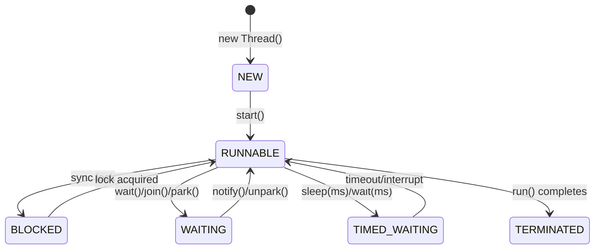

# Concurrency — Cheat Sheet

## Thread Lifecycle



## Vs Tables

| Comparison | A | B | Pick |
|---|---|---|---|
| **Thread vs Runnable vs Callable** | Thread class (extend) | Runnable `run()` no return | Callable `call()` returns `Future`, throws |
| **synchronized vs Lock** | Intrinsic, auto-release, not interruptible | `ReentrantLock` explicit `lock()/unlock()`, tryLock, interruptible, fair option | Lock for timeout/try/interrupt; sync for simplicity |
| **volatile vs synchronized vs Atomic** | `volatile`: visibility, no atomicity (single var) | `synchronized`: visibility + atomicity (block) | `AtomicInteger`: CAS lock-free single var |
| **wait/notify vs Lock+Condition** | `synchronized` + `wait()/notify()` | `Lock` + `Condition.await()/signal()` | Condition: multiple wait-sets per lock |
| **Executor: Fixed vs Cached vs Single** | `newFixedThreadPool(n)` bounded queue | `newCachedThreadPool` unbounded threads | `newSingleThreadExecutor` sequential; prefer `ThreadPoolExecutor` explicit |
| **ConcurrentHashMap vs HashMap+sync** | CHM: segment/striped lock, no global lock, no null | `Collections.synchronizedMap`: global lock, allows null | Always CHM for concurrent map |
| **Virtual Threads (21+) vs Platform** | Virtual: cheap (KB), millions, blocking OK | Platform: OS thread (MB), pool-limited | Virtual for IO-bound; platform for CPU-bound/pinned |

## Executor & Concurrent Utils

| Class | Purpose | Key Method |
|---|---|---|
| **ThreadPoolExecutor** | `core, max, keepAlive, queue, factory, handler` | `submit(Callable) → Future`, `execute(Runnable)` |
| **CompletableFuture** | Async pipeline | `supplyAsync`, `thenApply`, `thenCompose`, `allOf`, `exceptionally` |
| **CountDownLatch** | One-shot gate (N → 0) | `countDown()`, `await()` |
| **CyclicBarrier** | Reusable rendezvous | `await()` trips barrier |
| **Semaphore** | Permit pool (rate limit) | `acquire()/release()` |
| **Phaser** | Dynamic barrier | `arriveAndAwaitAdvance()` |
| **BlockingQueue** | Producer-consumer | `put/take` (blocking), `offer/poll` |
| **CopyOnWriteArrayList** | Read-heavy snapshot | iteration never throws CME |

## JMM — Happens-Before (must cite in interview)

`volatile write → volatile read` · `unlock → lock` · `thread start → first action in thread` · `last action → join returns` · `constructor end → final field read`

## Java 25 One-Liners

```java
// Concurrency — virtual-thread executors, locks, atomics
try (var exec = Executors.newVirtualThreadPerTaskExecutor()) {
    exec.submit(() -> fetchUser(id)); exec.submit(() -> fetchOrders(id));
}
Thread vt = Thread.ofVirtual().name("vt-").unstarted(task); vt.start();

try (var scope = new StructuredTaskScope.ShutdownOnFailure()) {
    var u = scope.fork(() -> getUser()); var o = scope.fork(() -> getOrders());
    scope.join().throwIfFailed(); use(u.get(), o.get());
}

var exec = new ThreadPoolExecutor(10, 20, 60, SECONDS,
    new LinkedBlockingQueue<>(1000), Thread.ofPlatform().factory(), new CallerRunsPolicy());

var cf = CompletableFuture.supplyAsync(() -> callAPI(), exec)
    .thenApply(this::parse).orTimeout(2, SECONDS).exceptionally(ex -> fallback(ex));

chm.computeIfAbsent(k, key -> expensive(key));
chm.merge(word, 1, Integer::sum);

var lock = new ReentrantLock(); var cond = lock.newCondition();
lock.lock(); try{ while(!ready) cond.await(); } finally{ lock.unlock(); }

var counter = new AtomicInteger(); counter.incrementAndGet();
var adder = new LongAdder(); adder.increment();
var acc = new LongAccumulator(Long::max, Long.MIN_VALUE);

private static final ScopedValue<String> REQ_ID = ScopedValue.newInstance();
ScopedValue.where(REQ_ID, "abc").run(() -> log(REQ_ID.get()));
```

> **Deadlock 4 conditions:** Mutual exclusion + Hold & wait + No preemption + Circular wait. Fix: lock ordering, `tryLock(timeout)`, deadlock detection via `jstack`.

*Category: CheatSheet*
